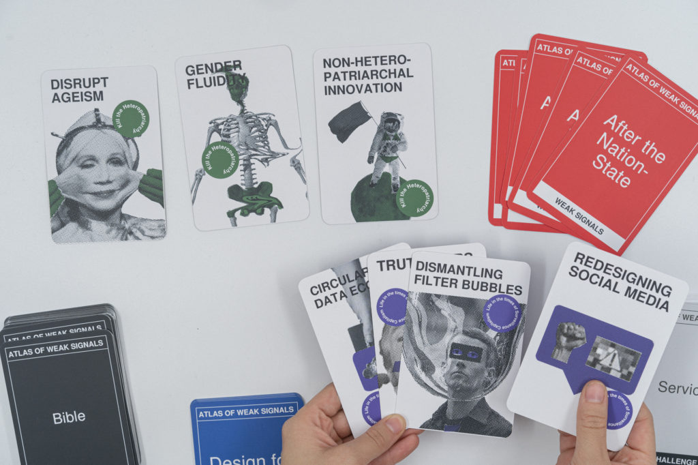

## MD01 Proyecto y Contexto

Éste módulo fue dictado por Jana Tothill Calvo, diseñadora e investigadora con un fuerte enfoque en prácticas sustentables y metodologías de diseño innovadoras.

Ellas nos presentó las siguientes herramientas y temas:

- **[AOWS (Atlas of weak signals)](https://fablabbcn.org/blog/emergent-ideas/atlas-of-weak-signals)**

El AOWS es una herramienta de diseño de futuros emergentes.

Una **señal débil** es un indicador para identificar un cambio en el futuro con poco o ningún impacto en el presente, pero con el potencial de conducir a la identificación de eventos de impacto importantes. Marcan tendencias e indican ciertas direcciones y con ello trazan escenarios futuros. Una señal débil puede definirse como una tendencia antes de que la tendencia misma se convierta en una fuente relevante de investigaciones futuras.

- **Espacio de Diseño:** Es una herramienta de navegación en la práctica del diseño para fundametar la reflexión. Y a través de la reflexión y la cartografía, aterrizar el pensamiento teórico en la práctica mediante la visualización y el debate. Sus funciones clave son: *Situar, Organizar, Darnos Narrativas, ser Performativo, ser Inspiracional.*

- **First Person Perspective:** Enfoque de diseño que sitúa a los diseñadorxs dentro de las comunidades. La exploración del futuro se convierte en una intervención de diseño en contexto, la semilla para la exploración de presentes alternativos.

## Actividad MD01 

Utilicé la plataforma MIRO para realizar el ejercicio, trabajé dentro del grupo 3:

**[Link a GRUPO3](https://miro.com/app/board/uXjVKQD2e9Y=/)**

Comencé el ejercicio **[AOWS (Atlas of weak signals)** eligiendo las **señales débiles**: **Long-termism"** y **"Non-Hetero-Patriarchal-Innovation"**. Estas dos cartas me llevaron a pensar en *un futuro donde los roles de género tradicionales se trascienden y las personas tienen libertad para elegir, y se fortalecen en y con su comunidad*. 

Analizando un poco el tema de los roles de géneros y cómo los vamos interiorizando desde la infancia, derivé en el tema de los cuidados, tareas que se asignan típicamente al rol femenino. El **cuidado como elemento base de la vida social** es invisibilizado por el sistema heteropatriarcal, sin embargo son esas mismas tareas no reconocidas que habilitan y sostienen la reproducción de la fuerza de trabajo que es indispensable para el sistema. 

Tomando el cuidado como tema central y llevándolo al **espacio común** (el barrio, la ciudad), empecé a investigar y pensar cómo recuperar esa habilidad y escalarla: cuidar de mi, de mi casa, de mi familia, de mis vecinxs, de mi barrio, de mi ciudad, de las cosas, de los animales, del ambiente, del planeta. 

*"Cada vez somos más conscientes del falso mito de considerarnos seres autosuficientes. Somos eco e interdependientes y, por eso, es ahora el momento de transitar a otros futuros imaginables. Necesitamos utilizar otras metodologías, valores, conocimientos diferentes a los que nos han traído hasta la insostenibilidad que estamos experimentando hoy como sociedad" (Victoria Vázquez, profesora de Teoría de la Educación de la Universidad de Valencia, se refiere a la Pedagogía y la Ética del Cuidado).*

Cómo **áreas de oportunidad**, elegí en una primera instancia **"Ciudades"**, un poco por mi formación pero también pensando en la ciudad cómo un ámbito colectivo dónde accionar. Además, tomé las cartas **"Design for Social Innovation"** y **"Co-creation"**, como **recursos de diseño**, y **"Maker Education"** y **"Digital Fabrication"** que identifiqué más con el aspecto tecnológico.

*De alguna forma busco trascender la idea de ciudad productiva, por una que reconozca a sus ciudadanxs como personas multidimensionales, y propicie los ámbitos y espacios para el desarrollo personal y comunitario, que a mi entender son indivisibles.* 

Como **conceptos detonantes**, elegí **"Material Literacy"** que complementé con **"Tools Literacy"**, **"Local Materials Recirculation"** y **"Craftivism"**. En particular no conocía el término Craftivism y me interesó su componente DIY y social.

Con todo esto sobre el espacio de diseño, redacté los enunciados de "continuidades actuales" y "presentes alternativos".

En particular, **me interesa trabajar** el diseño de un sistema de ensamblaje para generar equipamiento DIY para espacios comunitarios o públicos, que incorpore materiales reutilizados y reciclados y sea de bajo costo. Me imagino que el armado de ese equipamiento (mobiliario, sombra, espacio de reunión, etc), sea en si mismo una instancia de trabajo colectivo para aprender sobre materiales y uso de herramientas, y que los espacios generados sirvan para apropiarse del espacio público con propuestas lúdicas y de disfrute, para encuentro e intercambio entre vecinxs.

Acá dejo las capturas de los frames de Miro.

## **Reflexiones**

*La propuesta del ejercicio me sorprendió y me pareció muy motivadora. Personalmente me detuve mucho en las dos primeras cartas, buscando referencias y leyendo todo lo que pude en estos días. Después me di cuenta que fui decantando hacia ideas dentro de los temas que siento tengo conocimiento o interés.*
*Me pregunto cuál sería el resultado haciendo este ejercicio en grupo, me imagino que llevaría más tiempo llegar a una idea de proyecto pero conjugaría los conocimientos e intereses de varias personas.*