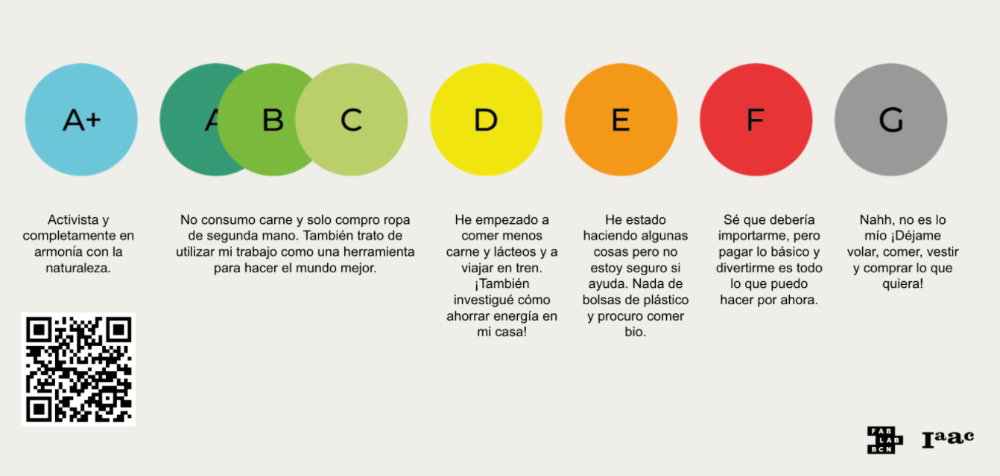
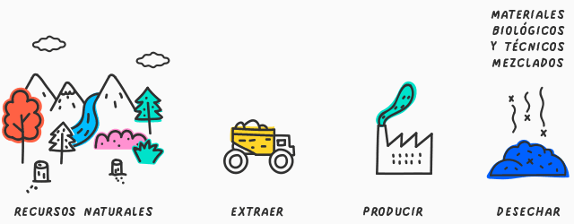
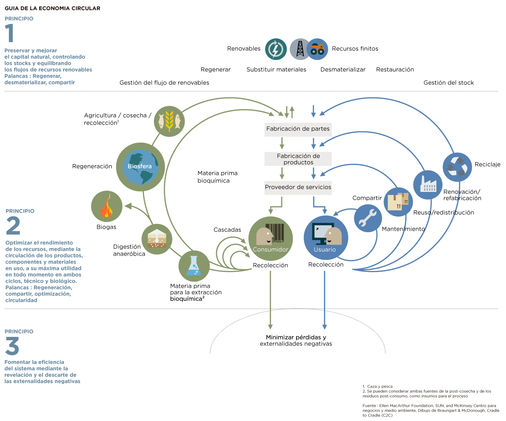
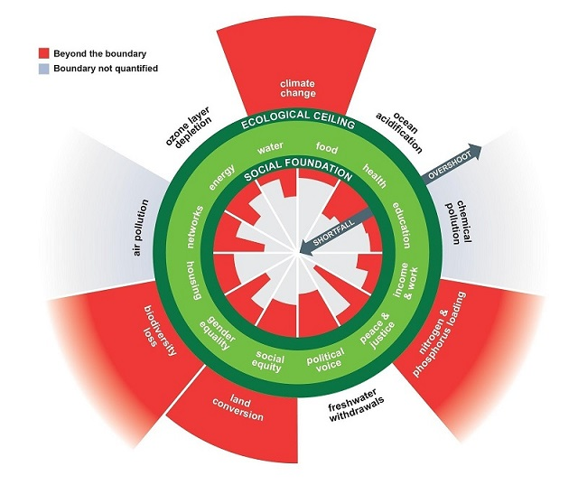

## MI02 Desarrollo sostenible y economía circular

El módulo fue dictado por **[Paola Zanchetta](https://distributeddesign.eu/talent/paola-zanchetta/)**, Investigadora y Diseñadora de Hardware Open Source.

En el inicio Paola nos planteó la pregunta: ¿Qué tan sostenible es tu estilo de vida? y nos invitó a ubicarnos en una escala de colores.
En base a esta propuesta discutimos que implica un estilo de vida sostenible y estrategias para incorporar en nuestras acciones cotidianas.

## Conceptos

**Economía Lineal:**

Consiste en la extracción o recolección de materias primas, que se utilizan para fabricar productos y partes. 
Los productos finales se comercializan a través de una red de distribución. Los consumidores compran y utilizan los diferentes productos. La mayoría de las veces, una vez que los productos llegan al final de su vida útil, se desechan. A lo largo de este proceso, se consume energía y se generan residuos en cada paso.

El presente modelo económico de "extraer, producir, desechar" está llegando ya al límite de su capacidad física. 

**Economía Circular:** 

Según la Fundación Ellen MacArthur (creada para promover la economía circular), se trata de una economía que es, por diseño o intención, reparadora y en la que los flujos de material son de dos tipos bien separados: los ciclos biológicos, y los ciclos técnicos.

La economía circular busca redefinir qué es el crecimiento, con énfasis en los beneficios para toda la sociedad. 

Esto implica disociar la actividad económica del consumo de recursos finitos y eliminar los residuos del sistema desde el diseño. 

Respaldado por una transición a fuentes renovables de energía, el modelo circular crea capital económico, natural y social y se basa en tres principios:

- Eliminar residuos y contaminación desde el diseño
- Mantener productos y materiales en uso
- Regenerar sistemas naturales

*Imagen: diagrama mariposa de Fundación Ellen MacArthur, que ilustra los conceptos de economía circular.*

El video **[Repensando el progreso](https://www.youtube.com/watch?v=RstFV_n6wRg)**, realizado por la misma Fundación, explora cómo un cambio de visión nos permite rediseñar toda la economía.

**Doughnut Economics:** 

Estudio de Kate Raworth, que plantea una alternativa al pensamiento económico dominante y propone las condiciones para una economía sostenible. En este libro de 2017, aboga por reformular los fundamentos de la ciencia económica.7​ En lugar de centrarse en el crecimiento de la economía, se centra en un modelo en el que se pueda garantizar que todos los habitantes de la tierra tengan acceso a las necesidades básicas, como una alimentación y educación adecuadas, siempre que protejamos nuestros ecosistemas para no limitar las oportunidades de las generaciones futuras.

**LCA (Life Cycle Assessment) / [ACV (Análisis de ciclo de vida)](https://es.wikipedia.org/wiki/An%C3%A1lisis_de_ciclo_de_vida):** 

Es una herramienta de diseño que investiga y evalúa los impactos ambientales de un producto o servicio durante todas las etapas de su existencia: extracción, producción, distribución, uso y fin de vida (reutilización, reciclaje, valorización y eliminación/disposición de los residuos/desechos).

Para ilustrar este concepto en clase, hicimos el ejercicio de analizar el ciclo de vida de un trozo de madera usado en Fab Lab Barcelona.

**Hotspots:**

Por el Principio de Pareto, aprox. el 80% de los resultados provienen del 20% del esfuerzo o acciones.

Identificando ese 20% que genera el 80% del impacto en el ciclo de vida podemos concentrar el análisis en esos puntos "calientes" o "hotspots".

Por lo gral. ese 20% corresponde a:

- Extracción 
- Procesamiento
- Transporte

**Proyecto de Referencia:** [Inter Matter](https://www.intermatter.nl/)

ACV en base a hotspots de materiales locales (basado en Países Bajos), desarrollado de forma open source, y registrado en escala de colores en idemat.app.

## Principios de Diseño Circular

En la segunda clase, trabajamos sobre los Principios de Diseño Circular:

- Diseño para desmontar

[Falsework](https://falsework.eu/)

[Space10](https://space10.com/projects/the-algae-dome)

[Streev Connects](https://www.streev.de/)

[OpenStructures](https://www.openstructures.net/)

- Menos es más

[MO de Movimiento](https://modemovimiento.com/)

[Low-tech Magazine](https://solar.lowtechmagazine.com/)

[Foldscope](https://foldscope.com/)

- Redondo no es circular

[Four Brothers](https://www.architonic.com/en/project/mun-design-studio-four-brothers-chair/5103832)

- Materiales con menos impacto

Librerías de materiales sostenibles:

[Materiom](https://materiom.org/)
[Materfad](https://www.fad.cat/materfad/es)
[Inter Matter](https://www.intermatter.nl/)
[Future Materials Bank](https://www.futurematerialsbank.com/materials/)
[Biobased Materials](https://biobasedmaterials.org/)
[Material ConneXion](https://www.materialconnexion.com/)
[Material District](https://materialdistrict.com/)

- Pensamiento sistémico (basado en valor)

## Ejercicios

**[Link a espacio de trabajo en Miro](https://miro.com/app/board/uXjVKjpb7U4=/)**.

**Ejericicio 1: Círculos de Influencia**

¿Cómo podemos pasar de un enfoque reactivo a un enfoque proactivo?

Me pregunto:

- ¿Dónde estoy?
- ¿Qué se hacer y qué me gusta hacer?
- ¿Qué hago en mi trabajo?
- ¿Quién influye en mi trabajo?
- ¿A quién influyo en mi trabajo?

¿Qué cambios puedo hacer dentro de mi proyecto para potenciar la economía circular dentro del contexto local?

En el círculo exterior, mapeo los elementos que no dependen de mí.

**Ejericicio 2:**

1. Reflexiona sobre el color de tu proyecto, en términos de principios de diseño circular. El círculo exterior será del color del estado actual, el círculo interior del color que te gustaría alcanzar en el futuro.
2. Selecciona tus "acciones circulares", basándote en los principios de Diseño Circular. Enfócate en los hotspots de tu proyecto.
3. Revisa el mapeo de los círculos de influencia.

## Reflexiones

*Me gustó mucho el enfoque de Paola en las clases, y los ejercicios que nos propuso, haciéndonos entender la importancia de las decisiones individuales y el impacto que generan en nuestra comunidad y entorno, extendiéndose a todo el planeta.* 
*Valoro mucho que además de transmitir los conceptos con claridad, Paola nos plantea ejercicios que nos hacen cuestionar nuestras acciones cómo personas y cómo profesionales, generando un pensamiento crítico y promoviendo las discusiones y el intercambio.* 
*¡Me encantan sus clases!* 
