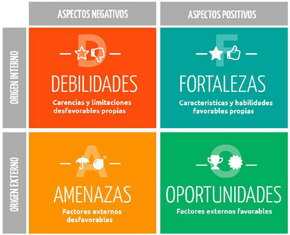

## MI03 Emprendimiento

El módulo de Emprendimiento estuvo dentro del **[Programa de Emprendimientos](https://utec.edu.uy/es/innovacion/programa-de-emprendimientos/)** y tuvo 2 instancias:

1. Curso Online autogestinado en la plataforma EDU "Actitud Emprendedora", con cuestionarios y participación en el foro.

Los temas principales fueron:

- Herramientas para el autoconocimiento

    - Tipo de personalidad
        **[Test de Personalidad](https://www.16personalities.com/es/test-de-personalidad)**

        **[Herramienta](https://drive.google.com/drive/u/0/folders/1hck57Cb8FktXYXRKZdwMfBlkILAFOruL)** de autococimiento emprendedor

    - Características del Comportamiento Emprendedor (CCE)
        **[Test CCE](https://edu2.utec.edu.uy/assets/courseware/v1/e8c51dd6240f620f34b80e011fb8ffa4/asset-v1:UTEC+AEM_UTEC+2024_S2+type@asset+block/TEST_CCE_UTEC_ARIAL.xlsx)**

    - Tipos de Inteligencia
        **[Test de las inteligencias múltiples](https://www.psicoactiva.com/test/educacion-y-aprendizaje/test-de-las-inteligencias-multiples/)**

    - Análisis FODA
    
      

2. Curso Online sincrónico "Generación de Ideas de Negocio", estuvo a cargo del profesor Ricardo Rodríguez.

Los conceptos trabajados fueron:

- *Emprendedor*: para ser emprendedor basta con empender, el emprendedor identifica oportunidades y consigue recursos para aprovecharlas.

- *Creatividad*: todas las personas son creativas. Es la capacidad de crear​ nuevas ideas o conceptos, o nuevas asociaciones entre ideas y conceptos conocidos, que habitualmente producen soluciones originales. La creatividad puede y debe ejercitarse.

- *Innovación*: es un proceso que introduce novedades y que se refiere a modificar elementos ya existentes con el fin de mejorarlos, aunque también es posible en la implementación de elementos totalmente nuevos.Puede ser un nuevo producto, proceso o método organizativo.

- Barreras de la Creatividad:
    - Externas: Sistema educativo, cultural y familiar.
    - Internas: Bloqueos mentales perceptivos, emocionales y culturales.

- *Técnicas de Generación de Ideas*:

    - Brainstorming
    - 4x4x4
    - 6 Sombreros
    - Brainwriting
    - Método SCAMPER
    - Método 635
    - Sinéctica
    - Evaluación PNI

- *Validación*: para validar una idea de negocio, debemos trabajar sobre 3 puntos fundamentales: Mercado, Recursos y Equipo emprendedor.

- ***[LEAN Canvas](https://innokabi.com/lienzo-lean-canvas-el-lienzo-de-los-emprendedores/)***: es una herramienta que se utiliza en la fase inicial de creación de una empresa, y su objetivo es validar de forma clara y visual el modelo de negocio.

Durante las clases realizamos varios ejercicios.

Entrega del curso:

   

   **[Cuestionario](https://docs.google.com/document/d/1byc-NZ4ywK-nUrBN02PSAswvHqSza2_fn7nGaU__zns/edit?tab=t.0/)**
   

## Reflexiones

*Las clases sincrónicas me parecieron muy interactivas y me dejaron buenas herramientas para aplicar. Me parece una temática interesante y pertinente en la actualidad. Sin embargo, sentí que este módulo está un poco disociado de la temática de la especialización en general y no suma en ese sentido, si no que quita tiempo que podría dedicarse a profundizar en otros temas.* 
