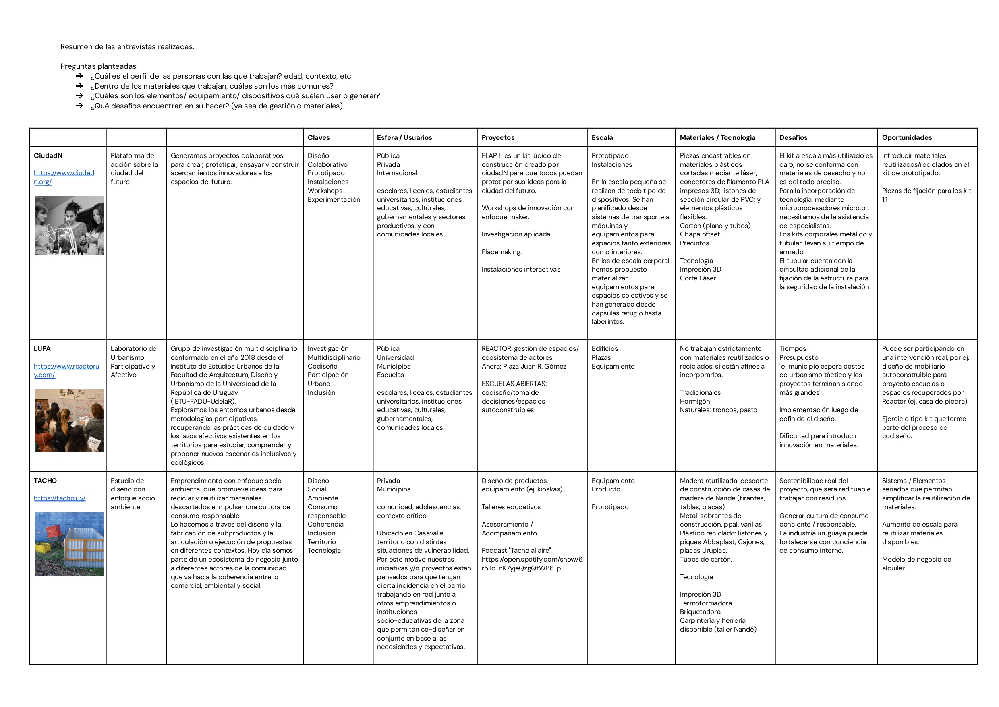

---
hide:
    - toc
---

# Contexto y objetivos

## Contexto

Comencé identificando actores locales que trabajan sobre las temáticas de interés para mi proyecto: espacio público, codiseño, participación, sustentabilidad.

Me contacté con 3 proyectos: 

**Agustina de [CiudadN](https://www.ciudadn.org/)**

**Noelia de [LUPA](https://www.reactoruy.com/)**

**Matías de [TACHO](https://tacho.uy/)**

Les hice una entrevista para recabar información:

De estas entrevistas pude extraer algunos lineamientos de cómo seguir:

**Desafíos**

- Generar cultura de consumo consciente / responsable.
- Dificultad para introducir innovación en materiales.
- Tiempos de implementación / armado de los diseños.
- Mucha variedad y calidad de materiales de descarte disponibles.

**Oportunidades**

- Introducir materiales reutilizados/reciclados.
- Diseño de kit que forme parte del proceso de codiseño.
- Sistema / Elementos seriados que permitan simplificar la reutilización de materiales.

Luego de las reuniones con Agustina, Noelia y Matías, y teniendo en cuenta lo que venía trabajando en los módulos de Diseño e Innovación y mi propia experiencia, me propuse:

**Objetivos**

- Establecer relaciones de confianza a través del hacer
- Conectar con y apropiarse de espacios comunes
- Compartir recursos e información
- Optimizar uso y flujos de materiales
- Generar proyectos sostenibles 
- Ser responsables del cuidado de lo construído

**Decisiones**

**Reúso**: Trabajar en base a placas de maderas de descarte de diferentes formatos y espesores, especialmente placas tipo compensado en base a resinas que no se deberían quemar (para evitar generar gases tóxicos).
Las piezas diseñadas y fabricadas no serán de un solo uso.

**Reciclaje**: incorporar plástico reciclado (PEAD y PP).

**Abierto**: Diseño de moldes que sean fácilmente replicables y que se puedan realizar con materiales reutilizados o económicos.
El proceso de diseño y los resultados serán accesibles desde mi web de EFDI, incluyendo 
un manual para replicar la fabricación.

**Comunitario**: el proyecto se enfoca en brindar un insumo para la fabricación colectiva.

*Más que un resultado cerrado, quiero generar un punto de inicio, un excusa para activar procesos.*

## Referencias:

- [Precious Plastic](https://www.preciousplastic.com/)
- [Victor Papanek](https://elasombrario.publico.es/papanek-pionero-del-diseno-social-y-sostenible/)
- [Enzo Mari](https://ateliers.esad-pyrenees.fr/web/pages/culturenum/ethique/enzo-mari-autoprogettazione.pdf)
- [Malom projekt](https://www.facebook.com/malomprojekt)
- [Plàstic Preciós La Safor](https://www.facebook.com/plasticprecioslasafor)
- [Paola Zanchetta Muñoz](https://distributeddesign.eu/talent/paola-zanchetta/)
