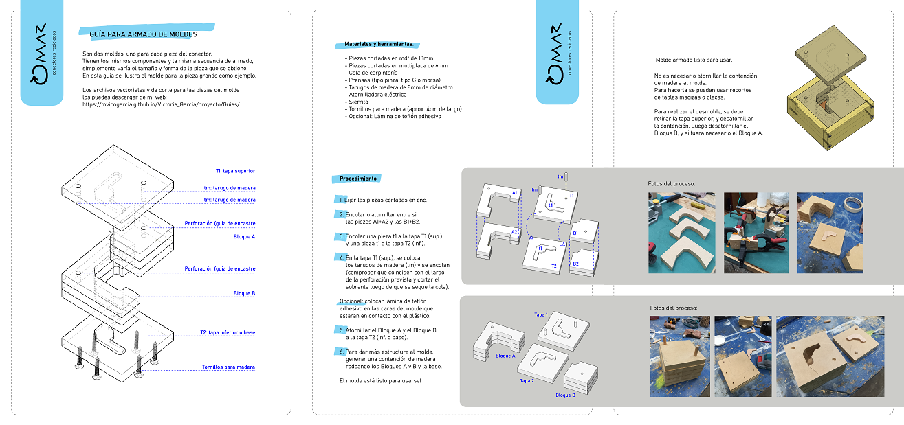
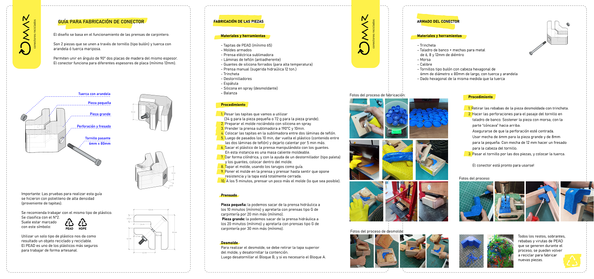
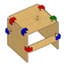
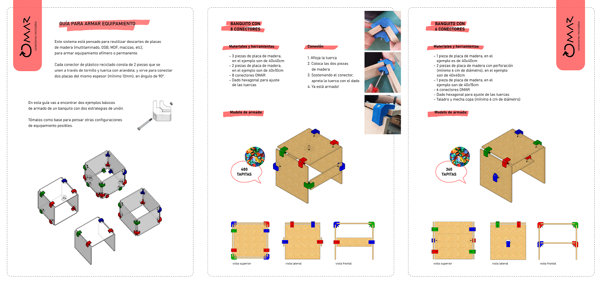

---
hide:
    - toc
---
En ésta sección encontrarás el paso a paso y los materiales que necesitas para replicar este proyecto ;)

**[Cómo hacer los moldes](https://drive.google.com/file/d/1b0JqS9Fdvn0cBmjlGBO8-Pjs6C_eTU-e/view?usp=drive_link)**

**[Descargar archivos vectoriales moldes](https://drive.google.com/file/d/1Hw_IUKTYbBiqGcHl0Zttv3H8hpmUacNr/view?usp=drive_link)**

**[Descargar archivos de corte para cnc](https://drive.google.com/drive/folders/1XYgZxli9mBeimtkZXH1mR-BFumYxReyt?usp=drive_link)**

*Nota: Los archivos de corte para cnc están armados para fresa de 3,175 mm de diámetro*.

**[Cómo fabricar los conectores](https://drive.google.com/file/d/1xcBaP-jZxpnHqut9iD6R41gH-emJ6iC1/view?usp=drive_link)**

**[Cómo armar un banquito](https://drive.google.com/file/d/12iivy3iOX32kuoqkHaQ9wx0RuLJyacv_/view?usp=drive_link)**

