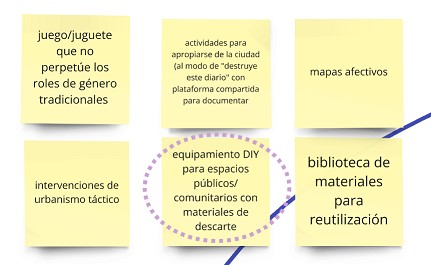

---
hide:
    - toc
---

# Ideas Iniciales

A través de los Módulos de Diseño e Innovación, fui explorando diferentes temas y conceptos.

En el Módulo **[MD01 Proyecto y Contexto](https://mvicogarcia.github.io/Victoria_Garcia/diseno/md01/)**, con la propuesta de **[Atlas of Weak Signals](https://fablabbcn.org/blog/emergent-ideas/atlas-of-weak-signals)**, investigué sobre las temáticas que me fueron surgiendo en torno a las cartas y generando conexiones con mis intereses y proyectos personales.

Los **temas** que me interesa trabajar son:

- Espacios Comunitarios
- Uso de herramientas de fabricación
- Reúso y Reciclaje

Así surgieron algunas **ideas de proyecto:**

De éstas ideas decidí seguir adelante con: *Equipamiento DIY para espacios públicos/ comunitarios con materiales de descarte*.

Me planteo **preguntas disparadoras:**

- ¿Hacer (un objeto) puede ser la excusa para generar conexiones entre vecinxs?
- ¿Pequeños proyectos comunes pueden activar transformaciones comunitarias y personales?
- ¿Podemos aprender a valorar los recursos aprendiendo cómo funcionan los materiales?

**Yo creo que si.**

## Referencias / Inspiración:

- [Club de Reparadores x Uruguay](https://www.instagram.com/clubdereparadoresuy/?hl=es)
- [Basurama](https://basurama.org/)
- [Makea tu vida](https://www.makeatuvida.net/)
- [DIY Citizenship](https://direct.mit.edu/books/edited-volume/3410/DIY-CitizenshipCritical-Making-and-Social-Media)
- [Izaskun Chinchilla - La ciudad de los cuidados](https://www.youtube.com/watch?v=sS733L8EunM)
- [The Care Manifesto](https://www.uhn.ca/Research/Research_Institutes/The_Institute_for_Education_Research/Events/Documents/Care-Manifesto-Readings.pdf)
- [Craftivism](https://commonslibrary.org/craftivism-a-manifesto-methodology/)
