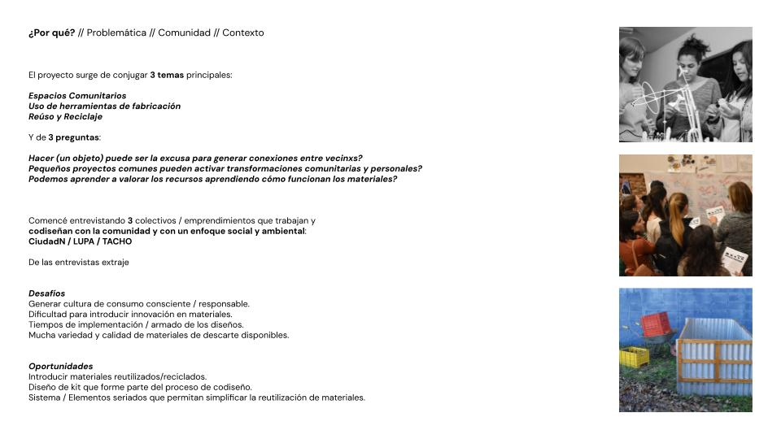
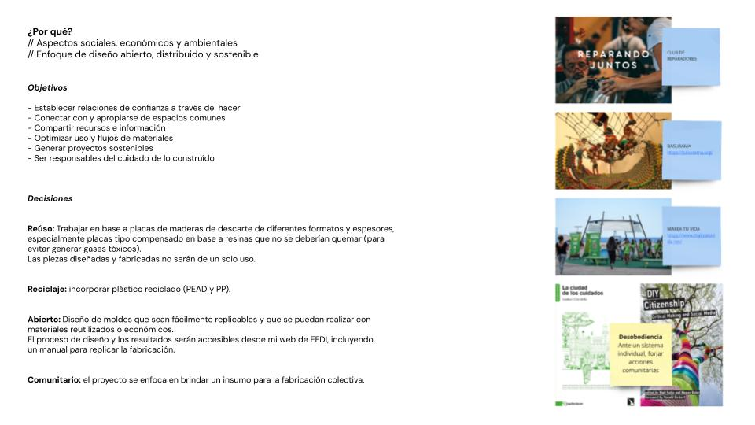
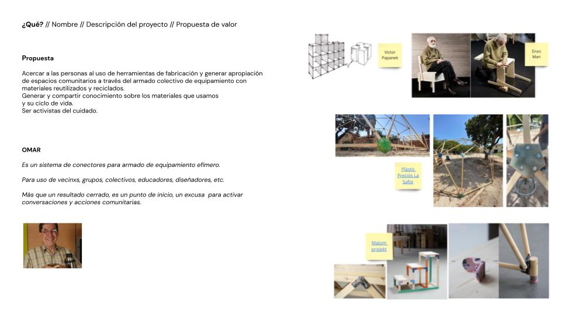
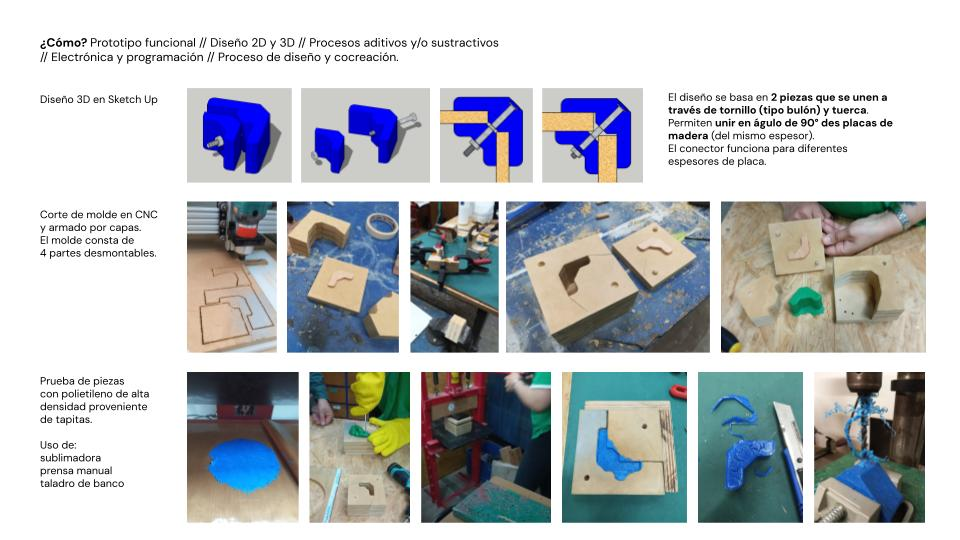
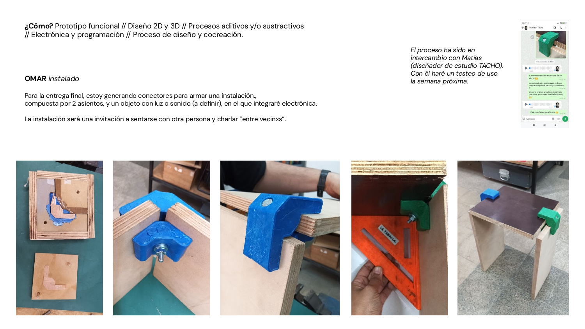

---
hide:
    - toc
---

# Preentrega 

Presentaciones el miércoles 27 de noviembre.

Lineamientos:

5 Slides - 5 min máximo + un prototipo (avance de prototipo hasta el momento, si no hay avance todavía puede ser un prototipo de baja resolución, algo que represente el prototipo final)

**¿Por qué?**

- Problemática
- Comunidad/contexto
- Explica de qué manera has considerado los aspectos sociales, económicos y ambientales para dar respuesta a problemáticas locales.
- Explica cómo has incorporado un enfoque de diseño abierto, distribuido y sostenible.

**¿Qué?**

- Nombre
- Descripción del proyecto
- Propuesta de valor

**¿Cómo?**

- Describe cómo es tu prototipo, funcional y cómo integraste diseño 2D y 3D, procesos aditivos y/o sustractivos, electrónica y programación en tu propuesta.
- Proceso de diseño y cocreación

**[Presentación](https://docs.google.com/presentation/d/1a736h0QH2O5K0M-QN5dt9mUO8XE_7ft97YC734lW-QA/edit?usp=sharing)**

