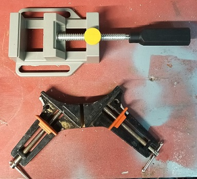

---
hide:
    - toc
---

# Proceso

## Propuesta de Valor

*Acercar a las personas al uso de herramientas de fabricación y generar apropiación de espacios comunitarios a través del armado colectivo de equipamiento con materiales reutilizados y reciclados.*

*Generar y compartir conocimiento sobre los materiales que usamos y su ciclo de vida.*

*Ser activistas del cuidado.*

El enfoque del proyecto es el diseño de un sistema de conectores reciclados y reutilizables para armado de equipamiento efímero, pensado para el uso de colectivos de vecinxs, grupos, educadores, diseñadores, etc.

## Lineamientos para el diseño

**Reúso**: Trabajar en base a placas de madera de descarte de diferentes formatos y espesores, especialmente placas tipo compensado en base a resinas que no se deberían quemar (porque generan gases tóxicos). Las piezas diseñadas y fabricadas serán de gran resistencia y con una extensa vida útil.

**Reciclaje**: incorporar plástico reciclado, especificamente plástico de un solo uso. 

**Abierto y accesible**: Diseño de moldes que sean fácilmente replicables y que se puedan realizar con materiales reutilizados o económicos.
El proceso de diseño y los resultados serán accesibles desde mi web de EFDI.

**Fácil montaje y desmontaje**: Las piezas diseñadas serán de fácil desmontaje para poder ser reparadas, reutilizads o recicladas al final de su vida útil.

**Comunitario**: el proyecto se enfoca en brindar un insumo para la fabricación colectiva.

*Más que un resultado cerrado, quiero generar un punto de inicio, un excusa para activar procesos.*

## Diseño del Conector

El diseño se basa en el funcionamiento de las prensas de carpintero:

Son 2 piezas que se unen a través de tornillo (tipo bulón) y tuerca con arandela ó tuerca mariposa.
Permiten unir en ángulo de 90° dos placas de madera del mismo espesor.
El conector funciona para diferentes espesores de placa (mínimo 12mm).

El diseño macizo de las piezas no responde a una exigencia estructural, sino a que se puedan fabricar con moldes y procedimientos sencillos, y puedan consumir la mayor cantidad posible de plástico de un sólo uso.

*Modelo 3D del conector, en la segunda imagen se ven las dos piezas separadas.*

*Corte del modelo, uniendo dos placas de 12 y 18mm.*

*Medidas de las piezas.*

*Vista del modelo, donde se ven las perforaciones para el pasaje del tornillo, y fresado para la cabeza. Estas perforaciones se hacen con taladro luego de desmoldadas las piezas.*

[Modelo Sketchup para descargar](https://drive.google.com/file/d/1_ErjLMD-E-XXQpQrF93tBzpMjBmFZzFE/view?usp=drive_link)

## Diseño del Molde

Siguiendo la idea de reutilizar materiales y que los moldes se puedan hacer con materiales accesibles, diseñé los moldes para ser cortados en mdf con router CNC.

Son dos moldes, uno para cada pieza, que siguen la misma lógica: 

- Se componen de dos partes que van atornilladas a la base (tapa 2 o inferior), y una tapa (tapa 1 o superior) con tarugos de madera (tm) que funcionan como guías de encastre.

- Los dos bloques que forman las caras del molde (A y B) se generan con 3 piezas de mdf de 18mm, que suman una altura de 54mm. En mi prueba encolé estas piezas pero podrían ir atornilladas entre si.

- En las tapas inferior y superior se adhiere una pieza de 6mm de espesor para lograr una altura interior de 42mm. Esta pieza es un poco más pequeña que la silueta del diseño, para que el cierre no sea tan apretado.
- No preví un escape de material porque no es un molde para inyección.
- Las dimensiones del molde las pensé teniendo en cuenta la retracción del plástico una vez frío (calculé un 5%).

[Archivos vectoriales para descargar](https://drive.google.com/file/d/1Hw_IUKTYbBiqGcHl0Zttv3H8hpmUacNr/view?usp=drive_link)

[Archivos de corte para cnc para descargar](https://drive.google.com/drive/folders/1XYgZxli9mBeimtkZXH1mR-BFumYxReyt?usp=drive_link)

*Nota: Los archivos de corte para cnc están armados para fresa de 2mm de diámetro*.

[Instrucciones para armar los moldes](https://drive.google.com/file/d/1rICdAamgpiDT0fOWu7ucVrmlH7wkE7XY/view?usp=drive_link)

## Prototipo y pruebas

### Armado del molde

**Materiales y herramientas utilizados:**

- Recortes de mdf de 18mm
- Recortes de multiplaca de 6mm
- Router CNC con fresa de 2mm de diámetro
- Cola de carpintería
- Prensas (tipo pinza, G y morsa)
- Tarugos de madera de 8mm de diámetro
- Atornilladora eléctrica
- Tornillos para madera (aprox. 4cm de largo)
- Lámina de teflón adhesivo

**Procedimiento:**

- Generé los archivos de corte para CNC en base a los diseños vectoriales.
- Hice los cortes en un cnc de 80x80 con fresa de 2mm de diámetro, sobre mdf de 18mm y multiplaca de 6mm.

- Luego lijé las piezas cortadas para armar las diferentes partes de los moldes. 

- Encolé las piezas y coloqué los tarugo (guías de encastre). Las dejé prensadas secando de un día para otro. Luego de secas, les di un lijado manual para emparejar la superficie.

- Atornillé las diferentes partes del molde.

- Luego de la primera prueba con el plástico, hice algunas modificaciones: 
    - Coloqué lámina de teflón adhesiva en los lugares más propensos a que se pegue el plástico, que fueron en las aristas más cerradas.
    - Vi que la presión de la prensa hacía que el molde se abriera un poco, por eso agregué una contención exterior de madera. 

### Pruebas con plástico reciclado

**Materiales y herramientas utilizados:**

- Tapitas de PEAD 
- Los moldes armados en el paso anterior
- Prensa eléctrica sublimadora (también se puede utilizar horno eléctrico, pero no es recomendable luego usarlo para comida)
- Láminas de teflón (como antiadherente para la prensa)
- Guantes de silicona forrados (para alta temperatura)
- Prensa hidraúlica manual de 12 Toneladas 
- Trincheta
- Destornilladores
- Espátula
- Silicona en spray (como desmoldante)
- Balanza

Para las pruebas Utilicé polietileno de alta densidad (proveniente de tapitas, plástico de un solo uso). Se  clasifica con el N°2 y suele estar marcado con este número dentro de un triángulo de flechas, con las siglas PEAD o HDPE.

Elegí usar un solo tipo de plástico para garantizar que se genere un objeto reciclable. 

El polietileno de alta densidad se consigue y se identifica fácilmente, hay disponibilidad de colores, y tiene un rango amplio de temperatura en el que se puede trabajar sin que se generen emisiones dañinas para la salud o el ambiente (entre los 140 y 220 °C aprox.).

**Procedimiento:**

- Calculé la cantidad de plástico de acuerdo a la densidad, me dió aprox. 40 g para la pieza pequeña y 80 g para la grande. Luego de las pruebas lo ajusté a 34 g y 72 g respectivamente.
- Preparé el molde rociándolo con silicona en spray.

- Pesé la cantidad de plástico (tapitas) a utilizar en la balanza.
- Prendí la prensa sublimadora a 180°C y 10min.
- Coloqué las tapitas en la sublimadora entre dos láminas de teflón. 
- Luego de pasados los 10 min, dí vuelta el plástico (contenido entre las dos láminas de teflón) y lo dejé por 5 min más.

- Saqué el plástico de la prensa manipulándolo con los guantes. En esta instancia es una masa caliente moldeable. 
- Le di forma cilíndrica, y con la ayuda de un destornillador (tipo paleta) y los guantes, lo coloqué dentro del molde y le puse la tapa, usando los tarugos como guía.

- Puse el molde en la prensa y prensé hasta que sentí que me oponía mucha resistencia y la tapa estaba totalmente cerrada.

- Pasados 30 minutos liberé la prensa y desmoldé la pieza.

- El resultado de la superficie fue más rugoso de lo que esperaba. En la segunda prueba subí la temperatura de la prensa a 190°C y obtuve mejores resultados de terminación.

*Pieza desmoldada / Prueba a 180°C y a 190°C.*

### Armado del conector

**Materiales y herramientas utilizados:**

- Tricheta
- Taladro de banco + mechas para metal de 6, 8 y 12mm de diémtro
- Morsa 
- Calibre
- Tornillos tipo bulón con cabeza hexagonal de 6mm de diámetro x 80mm de largo, con tuerca y arandela
- Dado hexagonal de la misma medida que la tuerca

**Procedimiento:**

- Retiré las rebabas de la pieza desmoldada con trincheta.

- Luego hice las perforaciones para el pasaje del tornillo en taladro de banco, con mecha de 6mm. Sostuve la pieza con una morsa.

En la primera prueba, la perforación quedó torcida, por lo que al probar el conector, no se generó el ángulo de 90° que buscaba.
Esto lo pude solucionar parcialmente agrandando la perforación en la pieza pequeña a un diámetro de 8mm.

- En la segunda prueba, di vuelta la pieza en la morsa para hacer la perforación, lo que me dió menos margen de error. 
De todas formas, al ser un proceso manual y las piezas no ser exactas, es necesario hacer una perforación de 8mm en la pieza pequeña para lograr la conexión de 90°.

*Posición correcta para perforar / "Fresado" para la cabeza del tornillo / Armado y comprobación de ángulo / Primera prueba de pieza armada con 2 conectores.*

## Evaluación y próximos pasos

El proceso en general es relativamente sencillo, pero requiere de algunos insumos y herramientas específicos, lo que puede generar que no sea tan accesible como me propuse al inicio.

Las piezas obtenidas son resistentes y estéticamente agradables, principalmente por los colores y combinaciones que se pueden hacer.

En cuanto a la forma, el en porceso de enfriado se genera una retracción importante, que se nota en las irregularidades que presentan las piezas terminadas. Sin embargo, esto no impide que funcionen correctamente.

El proceso de fabricación de las piezas lleva un tiempo considerable. En las pruebas que hice, el menor tiempo posible para fabricar un conector completo es de 95 minutos, incluyendo el tiempo de prensado.

Los moldes soportan varios reúsos. En mi caso realicé 12 conectores y los moldes siguen en buenas condiciones para seguir siendo usados. Tuve que cambiar la pieza de 6mm en el sexto reúso.

Las rebabas y virutas que se generan durante el proceso se pueden volver a reciclar en una nueva pieza.

Para fabricar 1 conector se usan aprox. 60 tapitas.

**Identifiqué algunas mejoras a hacer para una siguiente versión:**

- Cambiar el diseño del molde usando tornillos pasantes en lugar de encolar las piezas. De ésta forma sería más fácil reemplazar piezas si fuese necesario.
- Se puede reducir el tamaño de las piezas, que están notoriamente sobredimensionadas para la función que cumplen. El límite de la reducción de tamaño estaría dado por el correcto llenado del molde y no tanto por la resistencia de la pieza.
- Se puede agegar textura en las partes internas de las piezas, que quedan en contacto con las piezas de madera a unir.

Modelo versión 2:

