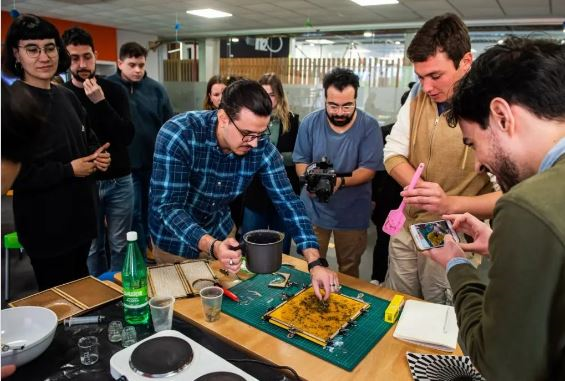
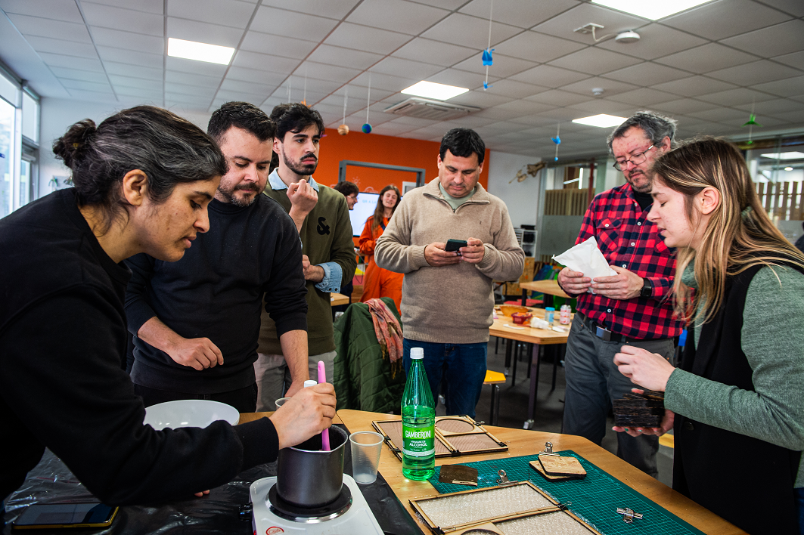
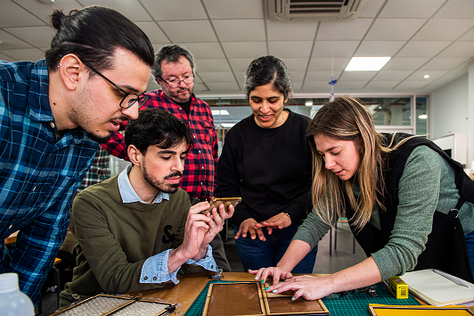
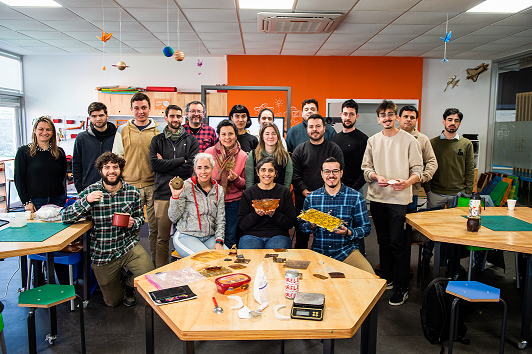

## Biomateriales

Ésta fue una clase presencial en salón del LATU, en Montevideo.

La primera parte de la clase fue una charla a cargo de Joseán Vilar, de [NAIFACTORY LAB](https://naifactorylab.com/).

Nos comentó sobre su trayectoria personal y profesional, y sobre los materiales que desarrollan y sus aplicaciones en arquitectura efímera, escenografías, señalética, etc.

La segunda parte de la clase estuvo a cargo de María Clara Freyre, docente de UTEC, encargada del LabA Paysandú.

## Conceptos 

BIOMATERIALES = BIOLOGÍA + NATURALEZA + DISEÑO

**Pasos para la creación de un biomaterial:**

- Preparación
- Elaboración
- Secado

**Componentes principales:**

- **Biopolímero**: son aquellos que aglutinan a los demás ingredientes, o sea, tenemos la gelatina, el agar agar, y la resina de pino y el alginato de sodio.
- **Plastificante**: su cantidad determina que el material sea más flexible o más rígido, generalmente utilizamos glicerina o cera.
- **Aditivo**: todos los residuos alimenticios o flora que hayamos recolectado, y tratado para que estén completamente secos y triturados. Materia orgánica, tintes y fibras.
- **Solvente**: disuelven el biopolímero para que lo podamos integrar a los demás materiales. Utilizamos agua o alcohol dependiendo del biopolímero. El diluyente es un componente activo durante la fabricación pero que luego desaparece mediante evaporación.

**Consideraciones de Seguridad:**

- Tener las mismas consideraciones de seguridad que se tienen al momento de manipular líquidos y cacerolas calientes, utilizar guantes si fuese necesario para evitar quemarse.
- Limpiar la superficie de trabajo con alcohol antes de comenzar a trabajar y al terminar. 
- Evitar utilizar los utensilios y herramientas destinados a la alimentación, o destinarlos luego a la fabricación de materiales.

**Materias primas y componentes:**

- Tendremos preparados los desechos alimenticios ya **secos y triturados**. Una vez recolectados los aditivos mantenerlos en envases separados y cerrados por un máximo de 2 días, y secarlos los antes posible en un horno a 70°C con el ventilador encendido, durante unas 2 a 4 horas - o hasta que ya estén secos - abriendo periódicamente la puerta para que salga la humedad.
- Una vez secos se puede guardar en frascos por separado para luego triturar. Ya triturados se pueden separar de acuerdo a su “granulometría” con tamices de diferente densidad de malla. Así, podemos tener por ej. cáscara de naranja en formato de gránulos, o en formato de polvo. 

**Moldes y superficies de secado:**
- Los moldes pueden ser de madera, plástico, metálicos, de acuerdo al biomaterial que estemos generando y la teminación deseada.
- Tener en cuenta que los bioplásticos se adhieren a los materiales porosos, puede ser una ventaja según lo que queremos lograr.
- Antes de comenzar verificaremos con un nivel que la superficie de trabajo esté nivelada, y ubicamos los moldes en la zona más plana para evitar que los líquidos se “escapen del molde” mientras se vierte la mezcla.
- La resina de pino se diluye con alcohol, forramos el molde con papel de cocina para evitar que se adhiera.
- Los biomateriales "copian" la textura del molde o superficie.
- Para las recetas basadas en Gelatina que resulta en una superficie pegajosa, vamos a utilizar el textil (goretex) por el lado más liso. Esto se puede reemplazar por otros plásticos, como polietileno. De esta forma la mezcla se adhiere a la superficie, dado que las gelatinas tienden a deformarse durante su proceso de secado si contienen poca glicerina. 
- Si queremos que la superficie del material resultante tenga texturas, esto se puede lograr fácilmente buscando un textil o plástico texturado, como los envoltorios de burbujas en los empaques, o algunas superficies de silicona para la cocina. Para gelatina también podemos utilizar otros tipos de moldes, con superficies de vidrio, espejo o plásticos; como envases acrílicos o tupperware. 
- Para las recetas basadas en Agar Agar y Alginato de Sodio, que reducen mucho su tamaño durante el proceso de secado, vamos a utilizar el textil (goretex) por el lado más rugoso. De esta forma, la mezcla se adhiere a la superficie y pierde el agua disminuyendo su espesor, en vez de disminuir su superficie (que es lo que sucede si vaciamos este tipo de mezclas en superficies muy lisas como un plástico, un vidrio o un espejo). 

Para esto también es importante que el marco de borde sea de madera, ya que es clave la adherencia en el borde, incluso mejor si lo sobrepasamos levemente con la mezcla. Como materiales alternativos a la tela goretex, - totalmente impermeable - podemos utilizar otros tipos de telas con texturas - semi-permeables - en base a algodón y poliéster por ejemplo, para evitar que se nos escape el líquido al momento del vaciado, pero al ser semi-permeables permiten que la muestra libere humedad tanto por su superficie superior como por la inferior. 
- Para las recetas basadas en Resina de Pino (o colofonia) utilizaremos los moldes de madera maciza forrados con papel de horno. El papel de horno evita que la resina se pegue directamente a la madera y nos permite desmoldar la pieza con la inmediatez que hemos visto en el Bootcamp.

Advertencia : Si se va a utilizar algún utensilio que podamos encontrar en nuestra cocina, será muy importante lavar muy bien luego de usar, e idealmente evitar volver a usar para fines de alimentación, más bien incorporarlo a los materiales de fabricación, con una marca o algo que evite que volvemos a cocinar alimentos con él.

**Eviatr el crecimiento de hongos:**

Para evitar la floración y crecimiento de hongos en nuestros materiales, agregaremos a las mezclas en base a gelatina y Agar Agar una pequeña cantidad de vinagre, o bien gotitas de aceites esenciales. En general el vinagre no tiene mayor incidencia en el resultado de las muestras, más allá del olor que emite durante el cocinado y secado. Este olor desaparece con el tiempo. Las gotitas de aceites esenciales por su parte, dan un agradable aroma a las muestras, sin embargo, algunas veces estos aceites pueden cambiar los tintes de las muestras o bien alterar su consistencia al momento de preparación en la olla, experimentar con ello.

Una vez que la muestra ha sido vertida en su molde y comienza el proceso de secado lo ideal es dejarlas en un ambiente temperado de una temperatura media entre 22 y 25 grados centígrados. Durante la primavera y el verano esto no será difícil de lograr en un recinto que reciba sol directo durante gran parte del día, aunque nos aseguraremos de secar en la sombra evitando que el sol llegue directo, especialmente sobre las muestras de gelatina. Durante el invierno lo ideal será secar en una superficie próxima a un calefactor o radiador, donde la temperatura será estable.

Si aún así afloran hongos o moho, estos se pueden controlar con alcohol en spray y limpiando con un cotonete, o bien con vinagre.

**Secado y desmolde:**

- Desmolde de gelatina: Varía en función del material del molde. Para lograr volumetría, trasladar a un molde con volumen, luego de la gelificación y previo a la deshidratación.

- Desmolde agar agar: Una vez la pieza se haya secado (cuando la tocamos y ya no la sentimos fría, sino a temperatura ambiente) podemos sacarla del molde. Para esto tomamos las piezas, y retiramos las pinzas que posicionan el marco sobre la base, luego intentamos despegar un borde del marco, utilizando un cutter para ayudarnos si fuese necesario. Y buscamos un borde del que podamos tirar homogéneamente la superficie para evitar que se rasgue.
Es muy común que los bordes se hayan rasgado un poco, o que se hayan despegado y no estén del todo conformados. Lo que podemos hacer en ese caso es cortarlos para obtener planchas homogéneas.

A evitar: Si tenemos como resultado una pieza de cierto grosor, como se puede lograr con gelatina y café lo que se recomienda es una vez desmoldado dejar aun más días de secado aplastada por elementos de cierto peso, como libros, pero cubiertos por un papel del horno o algo impermeable que evite que se estropeen los libros con la humedad que las piezas continuarán liberando, y voltear cada 6 horas aprox.

## Material open source

[Materiom](https://materiom.org/)

[Bioplastic Cook Book](ttps://issuu.com/nat_arc/docs/bioplastic_cook_book_3)

## Proyectos de Referencia

[Repulp](https://blog-espritdesign.com/crowdfunding/crowdfunding-la-tasse-a-base-de-dechets-dagrumes-par-repulp-59520)

[Notpla](https://www.notpla.com/)

[Karu Biodiseño](https://www.instagram.com/somoskaru/?hl=es-la)

[Suzane Lee](https://www.dezeen.com/2014/02/12/movie-biocouture-microbes-clothing-wearable-futures/)

[Coffee Kreis](https://www.kickstarter.com/projects/coffeekreis/the-kreis-cup-giving-coffee-a-second-life)

[Cynthia Nudel](https://cynthianudel.com/)

[Spyros Kizis](https://www.thegreekfoundation.com/design/artichair-by-spyros-kizis)

[Hempcrete](https://elplanteo.com/hempcrete-hormigon-de-canamo/)

## Recetas realizadas en clase práctica

### Bioplástico en base a Gelatina

**Receta:**

- 200 ml de agua
- 1 cucharada pequeña de vinagre
- 5 a 15 ml de glicerina
- 40 gr de gelatina
- 20 gr a 40 gr de aditivos.

**Instrucciones:**

Agregar el agua, el vinagre y la glicerina a la olla en frío, revolver para que se incorpore y dejar calentar a fuego medio. Agregar de a poco la gelatina y revolver para disolver hasta que suelte un hervor. Bajar la temperatura y agregar los aditivos o colorantes y revolver. Dejar reposar y que entibie, cuando la mezcla se pegue a los dedos, verter.

### Biocompuesto en base a Resina

**Receta:**

- 50 gr de colofonia
- 15 ml de alcohol
- 5 gr de cera carnauba
- 40 gr / 60 gr de aditivos según cual use.

**Instrucciones:**

Preparar los moldes con papel de horno. Agregar la colofonia y el alcohol en la olla cuando esté fría, encender a fuego medio bajo y tapar la olla. Esperar a que esté todo derretido sin revolver. Una vez que esté derretido, agregar la cera carnauba y revolver. Agregar el o los aditivos, incorporar toda la mezcla hasta que esté uniforme y densa. Volver a tapar para que derrita todo junto. Una vez que la mezcla está homogénea verter en el molde y aplastar con fuerza. Dejar enfriar en el molde antes de desmoldar.

Para limpiar : volver a poner alcohol en la olla y dejar hervir nuevamente en el hornillo. Retirar la resina con papel de cocina, repitiendo la operación cuanta veces sea necesario hasta que la olla y los utensilios estén limpios.

### Biocerámica en base a Aginato de Sodio

**Receta:**

- 4 gr de alginato de sodio
- 200 ml de agua
- 8 ml de vinagre
- 15 - 20 gr de aditivo cáscaras de huevo

**Instrucciones:**

Mezclar el agua con el alginato de sodio, procesar con mixer para mezclar bien. Reservar en heladera 24hs.
Mezclar las cáscaras de huevo con la preparación de alginato de sodio y agua, evitando que se formen burbujas. Una vez mezclado, colocar con cuchara sobre el molde y acomodar, y luego verter suavemente por encima el vinagre. Comenzará a reaccionar y coagularse. Luego de 15 minutos separar la mezcla del molde suavemente para dejar espacio para que el vinagre penetre por los lados. Esperar una hora. Luego sacar la muestra del molde y darle la vuelta para permitir que el vinagre llegue al otro lado del biocompuesto. Dejar reposar por una hora más.

Por último, lavar el mismo debajo de la canilla para eliminar el vinagre.

### Bioplástico en base a Agar agar

**Receta:**

- 200 ml de agua
- 7,5 gr de agar agar
- 12 ml de glicerina
- 10 gr a 15 gr de aditivos.

**Instrucciones:**

Agregar el agua, y el agar agar a la olla en frío y disolver. Agregar la glicerina. Revolviendo siempre, calentar a temperatura baja durante 2 minutos. Subir la temperatura paulatinamente cada 2 minutos. Agregar los aditivos o colorantes. La mezcla debiese cambiar su textura entre el minuto 6 y 8. Se vierte en ese momento apenas comienza a parecerse a una crema liquida.

**Imágenes**

## Reflexiones

*Fue una buena oportunidad para conocernos personalmente con los demás compañeros del grupo, y hacer pruebas prácticas siempre resulta muy motivador. En mi caso ya había tenido alguna experiencia con biomateriales, y la clase me brindó un marco teórico con el que no contaba. La charla a cargo de Joseán fue muy inspiradora, tanto su trayectoria personal como los materiales que han logrado generar con su equipo. Me dieron muchas ganas de seguir investigando y aprendiendo sobre biomateriales.*