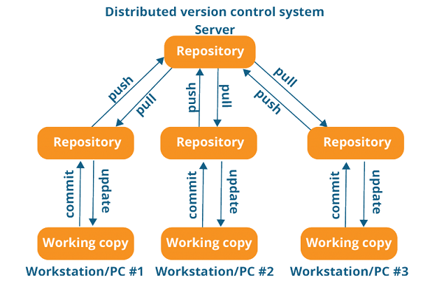
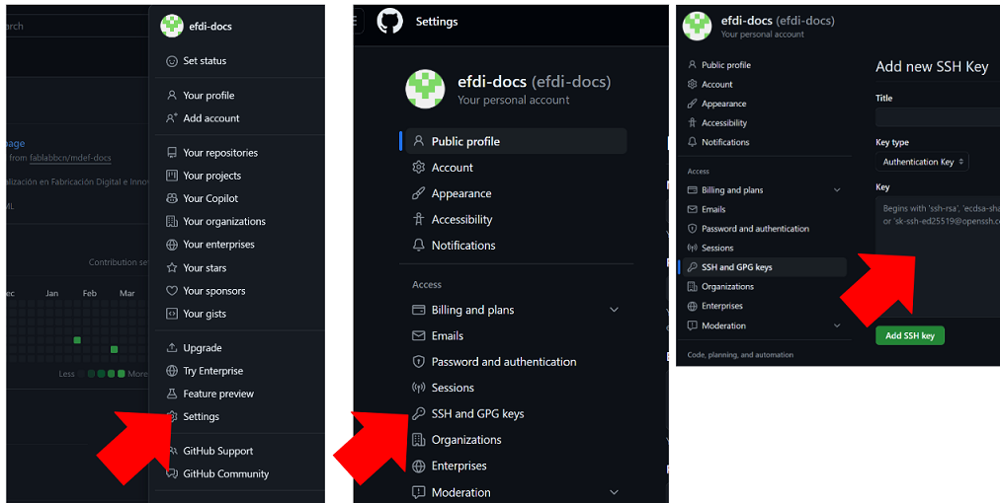
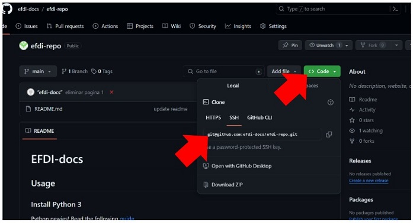
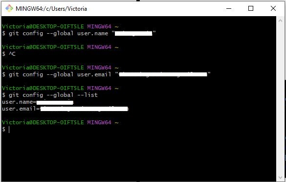
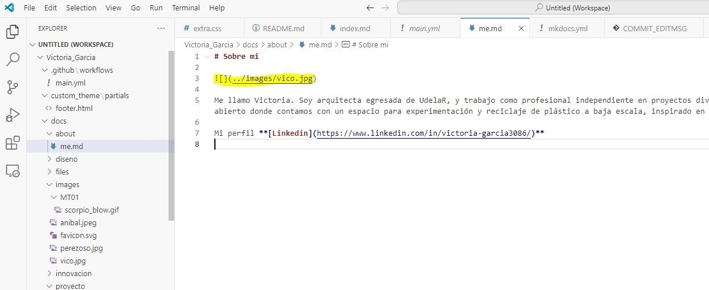
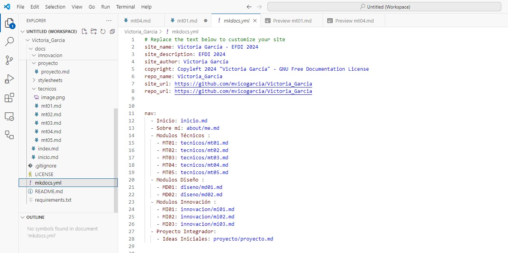
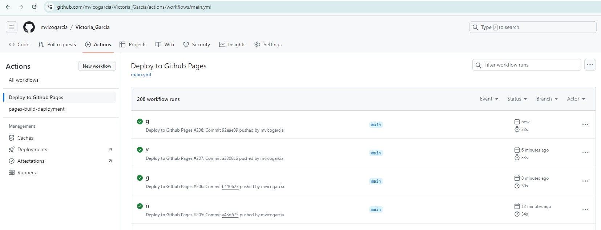

## MT01 Introducción a herramientas digitales
En este módulo nos centramos en recursos o herramientas digitales necesarios para la creación de contenido digital para la documentación y comunicación del proceso realizado a lo largo de la EFDI y el proyecto final.

###**Control de versiones**

El control de versiones o **[VCS](https://git-scm.com/book/en/v2/Getting-Started-About-Version-Control)** es un sistema que registra los cambios en un archivo o conjunto de archivos a lo largo del tiempo. Permite revertir los archivos seleccionados a un estado anterior, comparar cambios, ver quién hizo una modificación por última vez, quién introdujo un problema y cuándo, y más. 

Ventajas:

- Trabajo colaborativo
- Almacenamiento de versiones
- Restaurar cambios
- Descubrir qué cambió
- Realización de copias de seguridad

**Sistemas de control de versiones centralizados (CVCS)**

Estos sistemas tienen un único servidor central que almacena todos los archivos versionados. Cada usuario extrae archivos desde este servidor central para trabajar en ellos.

**Sistemas de control de versiones distribuidos (DVCS)**

 

En estos sistemas, los usuarios realizan clones completos del repositorio del servidor central. Esto proporciona una copia de seguridad completa de todos los datos y permite a los usuarios trabajar de manera autónoma sin depender de una conexión constante con el servidor central.

####**GIT**

En este curso vamos a usar **[GIT](https://git-scm.com/video/what-is-version-control)**.
Es un sistema de control de versiones distribuido. Se destaca por realizar una copia de seguridad de todos sus archivos, incluso si no han sido modificados desde la última versión, como si fuera una captura de pantalla del momento a lo largo del tiempo. Si no se realizan modificaciones, no almacena una copia completa del archivo, sino que guarda un enlace al archivo idéntico anterior que ya estaba almacenado, lo que ahorra espacio de almacenamiento.

####**GITHUB**

Es una plataforma en línea que utiliza el sistema de control de versiones GIT. Proporciona un espacio donde los desarrolladores pueden colaborar en proyectos de software y gestionar el control de versiones de su código fuente. Algunas de las características clave de Github:

- Repositorios: Los proyectos se almacenan en repositorios, que pueden ser públicos (accesibles por cualquiera) o privados (restringidos a ciertos colaboradores).
- Control de versiones:  Utiliza Git para realizar un seguimiento de los cambios en el código fuente. 
- Colaboración: Los equipos pueden trabajar juntos en proyectos, realizar solicitudes de extracción (pull requests), revisar código y gestionar problemas o errores.
- Seguimiento de Problemas y organización de tareas en Proyectos.
- Github Pages: Permite a los usuarios publicar sitios web directamente desde su repositorio.
- Integración Continua: Configurar flujos de trabajo de integración continua para automatizar pruebas y despliegues.

####**[¿Cómo funcionan Git y Github juntos?](https://docs.github.com/es/get-started/start-your-journey/about-github-and-git)**

Al cargar archivos en Github, los almacenas en un "repositorio de Git". Esto significa que al realizar cambios (o "commit") en los archivos de Github, Git se iniciará automáticamente para realizar un seguimiento y administrar los cambios.

###**Software para edición de página web**

Todos los sitios web que visitamos constan de dos elementos principales: un dominio web y un servidor web (hosting).

#### ¿Qué es un Dominio?

El dominio de un sitio web es esencialmente el equivalente a una dirección física. 

Se forma a partir de dos elementos principales: el nombre del sitio web (Facebook) y la extensión del dominio (.com). Cuando una empresa (o una persona) compra un dominio web, puede especificar a qué servidor apunta el nombre de dominio.

#### ¿Qué es un Hosting?

Es un servicio en línea que te permite publicar un sitio o aplicación web en Internet. Cuando te registras en un servicio de hosting, básicamente alquilas un espacio en un servidor donde puedes almacenar todos los archivos y datos necesarios para que tu sitio web funcione correctamente.

#### Diseño web 

Para la edición de la página puedes utilizar diferentes códigos o lenguajes (HTML/CSS/Markdown) y diferentes programas de edición. Nosotros nos basaremos en Markdown (efdi-template) y Visual Studio Code (programa de edición). 

Al crear una página web, se utiliza en primer lugar el [lenguaje HTML](https://developer.mozilla.org/es/docs/Learn/Getting_started_with_the_web/HTML_basics) para definir los contenidos, es decir, para designar la función de cada elemento dentro de la página: párrafo, titulo, texto destacado, tabla, lista de elementos, etc.

Una vez creados los contenidos, se utiliza el [lenguaje CSS](https://blog.hubspot.es/website/que-es-css) para definir el aspecto de cada elemento: color, tamaño y tipo de letra del texto, separación horizontal y vertical entre elementos, posición de cada elemento dentro de la página, etc.

#### Markdown

[Markdown](https://docs.github.com/es/get-started/writing-on-github/getting-started-with-writing-and-formatting-on-github/basic-writing-and-formatting-syntax) es un lenguaje de marcado ligero que trata de conseguir la máxima legibilidad y facilidad de publicación tanto en su forma de entrada como de salida, inspirándose en muchas convenciones existentes para marcar mensajes de correo electrónico usando texto plano. 

**[Tutoriales para aprender a utilizar Markdown](https://www.markdowntutorial.com/es)**

**[Guía Markdown](https://www.markdownguide.org/basic-syntax/)**

**[Cheatsheet](https://github.com/adam-p/markdown-here/wiki/Markdown-Cheatsheet)**

#### MkDocs

[MkDocs](https://fabacademy.org/2019/docs/FabAcademy-Tutorials/week01_principles_practices_project_management/mkdocs.html) es una herramienta de código abierto utilizada para generar documentación estática a partir de archivos escritos en Markdown. Permite a los desarrolladores y escritores crear documentación de proyectos de una manera simple y eficiente.

#### Visual Studio Code

[Visual Studio Code](https://code.visualstudio.com/) es un editor de código fuente desarrollado por Microsoft para Windows, Linux y macOS. Incluye soporte para la depuración, control integrado de Git, resaltado de sintaxis, finalización inteligente de código, fragmentos y refactorización de código. Es gratuito y de código abierto.

**[Tutoriales Visual Studio Code](https://code.visualstudio.com/docs)**

## Actividad MT01

El objetivo de esta semana es crear mi propio sitio web, dónde documentaré el trabajo de cada módulo.

- Desarrollar la sección "About me"
- Documentar las herramientas utilizadas
- Trabajar con los tutoriales de GIT y GITHUB

Para completar la tarea, utilicé los tutoriales disponibles en Plataforma EDU.
Utilicé GITHUB como hosting, Git como control de versiones, y Visual Studio como software de edición.

**1**. Crear una cuenta en **[Github](https://github.com/)**

Al resgistrar el nombre de usuario, tener en cuenta que quedará visible en el link de la página web.

**2**. Instalar y setear **[Git](https://gitforwindows.org/)** en la PC

- Abrir la terminal (GITBASH), en la PC 
- Usar el mismo nombre de usuario que en GITHUB
- git config –global user.name “username”
- git config –global user.name “tu_mail”
- Para verificar la configuración escribir en la Terminal: git config –-global –-list

**3**. Generar una SSH KEY **[Git](https://docs.github.com/es/authentication/connecting-to-github-with-ssh/adding-a-new-ssh-key-to-your-github-account)** en la PC

Es un protocolo que permite establacer una conexión segura entre la PC y GITHUB.

- Verificar en la terminal si ya tenemos una SSH Key, escribiendo en la terminal:  cat ~/.ssh/id_rsa.pub
- Crear la SSH KEY: ssh-keygen -t rsa -C “mail”
- Volver a hacer la verificación
- Copiar la SSH KEY escribiendo en la terminal: clip < ~/.ssh/id_rsa.pub
- Pegar la SSH KEY en la cuenta de Github (en la web). [Más información](https://docs.github.com/es/authentication/connecting-to-github-with-ssh/adding-a-new-ssh-key-to-your-github-account).
 

**3**. Realizar el [Fork](https://docs.github.com/es/pull-requests/collaborating-with-pull-requests/working-with-forks/fork-a-repo) del template para crear tu repositorio remoto en Github.

- Abrir el [efdi-template](https://fablabbcn.github.io/efdi-template/)
- Dirigirse a Name: Github Repo, y presionar Fork
- En owner debe estar tu usuario de Github
- Nombrar al repo con tu Nombre_Apellido

Una vez creado el fork, se crea un repositorio remoto con un template del sitio web listo para editar.

**4**. Crear un repositorio local o clon en tu PC

- Crear una carpeta en tu PC (se recomienda en el escritorio)
- Acceder a la carpeta creada desde Gitbash: puede ser en la terminal, navegando con el comando cd ó abrir directamente desde la carpeta creada con el botón derecho del mouse y la opción "open gitbash here".
- Copiar el link del repositorio remoto en Github (clone using SSH KEY), se encuentra en el menú CODE:

- Clonar el repo remoto en mi PC usando: git clone + el link copiado

**5**. Activar el link del sitio web en Github

Una vez editada la página web en el repositorio local (PC), con el editor de código (Visual Studio Code), se deben subir los cambios al repositorio remoto de Github (por la terminal GIT o por VS), y activar el link en Github.

Para editar el código en Visual Studio Code, se debe agregar la carpeta dónde están los archivos de la página web al espacio de trabajo. En el menú "File", elegir la opción "Add Folder to Workspace".

Cada vez que se realizan cambios, para actualizar la página:

- Salvar los cambios (Ctrl + S)
- Ir a **"Source Control"**, poner un nombre al cambio, hacer **"Commit"** y **"Sync Changes"**. Es importante poner nombre antes de hacer el commit.
- Verificar que los cambios se reflejan en la página web y/o Github

Algunas capturas del proceso:

*Configuración GitBash*

*Edición de la sección "About me"*

*Edición de MKDOCS en VS*

 

*Actualización de web en Github*

 

Notas:

- Sin querer descubrí que el comando Ctrl+Mayús+v me abre una preview de lo que estoy editando.
- Cuando no se ven las imágenes cargadas en la web, puede ayudar limpiar el caché.
- Favicon: edité el [favicon](https://es.wikipedia.org/wiki/Favicon) desde la carpeta de mi PC, usando [Inkscape](https://inkscape.org/es/).
- Herramientas online para convertir archivos de video: (https://cloudconvert.com/mkv-to-gif), (https://www.online-convert.com/es/)

## **Reflexiones**

*Este trabajo práctico fue mi primer acercamiento al diseño de una página web. Pude seguir los tutoriales de EDU sin problema, pero hasta que no empecé a editar la web, no había podido conectar lo visto en las clases teóricas con la aplicación práctica. Fui haciendo varias pruebas de cambios pequeños para ir entendiendo cómo se reflejan en la página. Me ayudó que la web ya tiene un formato y contenido precargados, para entender como colocar títulos, subtítulos, texto e imágenes.*
