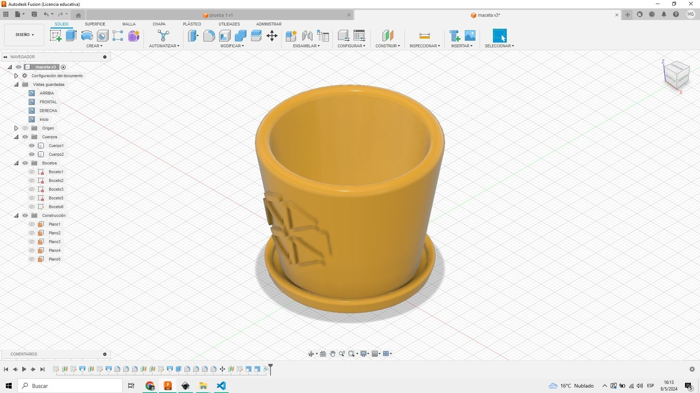
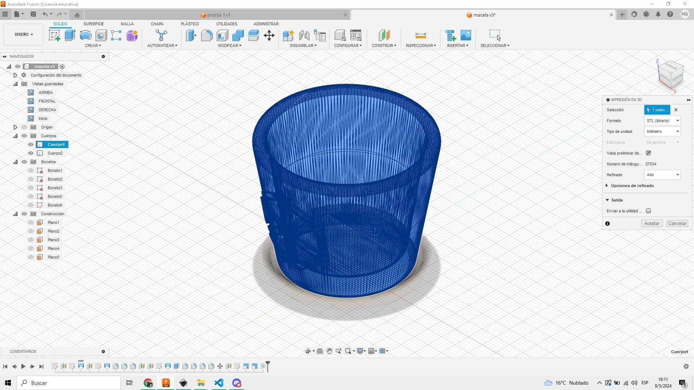
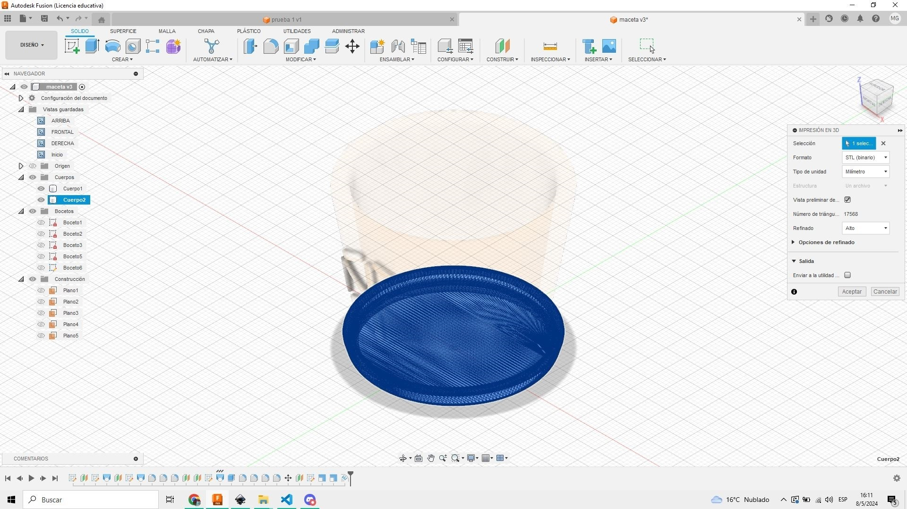
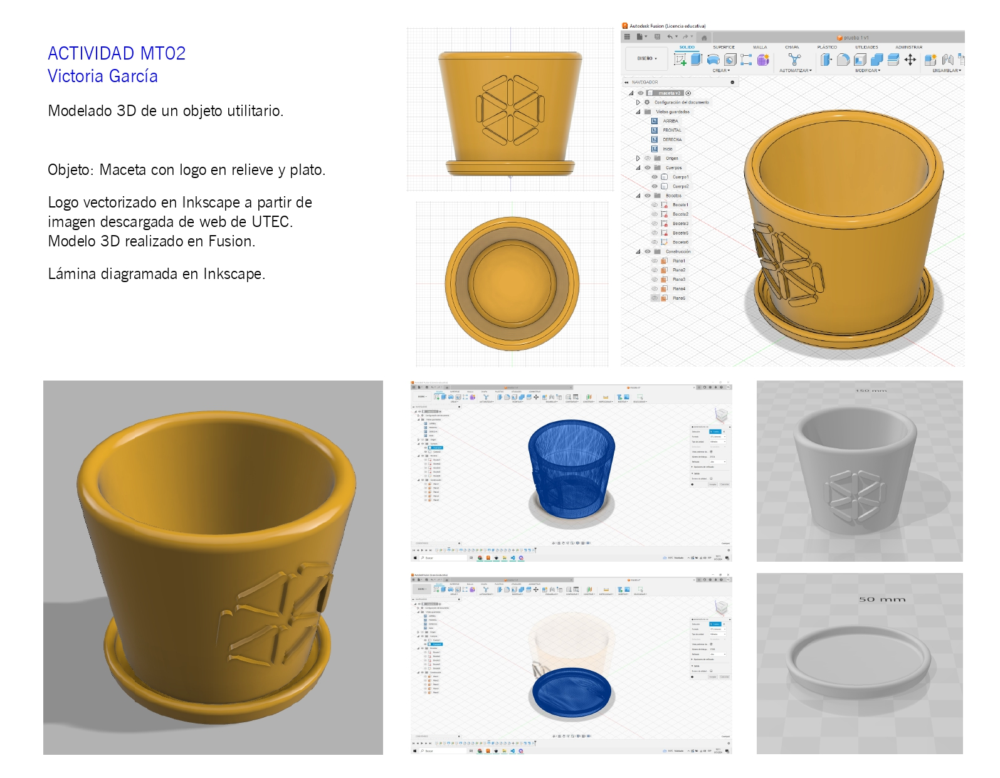

### MT02 Diseño 2D y Modelado 3D

## Actividad MT02

La consigna del ejercicio es: Diseñar un objeto utilitario compuesto por al menos dos piezas y contar con un logo en relieve. Se generará una lámina de presentación muy simple que contenga un título, la imagen del modelo y una breve descripción.

Si bien tengo experiencia con Sketch Up y Revit, los uso para visualización de arquitectura y no para diseño de objetos. 
De las herramientas que se mostraron en clase, me interesó probar Tinkercad y Fusion. 

Comencé probando Tinkercad y si bien es bastante intuitivo me resultó difícil trabajar con las medidas exactas para mover los objetos, por lo que descarté seguir con esta herramienta.
Descargué e instalé Fusion con licencia de estudiante, usando los datos que Joaquín envío a través de Discord.

Decidí modelar una maceta con plato, y aplicar un logo en relieve sobre la maceta.
Primero vi el video "Navigating the Fusion 360 User Interface" (**[Link a video](https://www.youtube.com/watch?v=sZwM87-nsYA&ab_channel=ProductDesignOnline)**).
También vi los tutoriales de Plataforma EDU.

El logo lo vectoricé en Inkscape a partir de una imagen que descargué de la web de UTEC. Con este programa estoy bastante familiarizada, lo uso diaramente para vectorizar y diagramar láminas. 

El modelo 3D lo hice en Fusion, es la primera vez que uso este programa, me apoyé mucho en las explicaciones del tutorial de EDU, y además fui probando herramientas.
Una herramienta que ecnontré probando es "Repujado", la usé para aplicar el logo sobre la superficie de la maceta, que tiene una geometría de cono truncado.
El programa Fusion me pareció súper completo y versátil.
La lámina final la diagramé en Inkscape.

**[Descargable en pdf](https://drive.google.com/file/d/1QAAufAM8uPNFJkQPlnSfu2RyomdnybqR/view?usp=sharing)**

