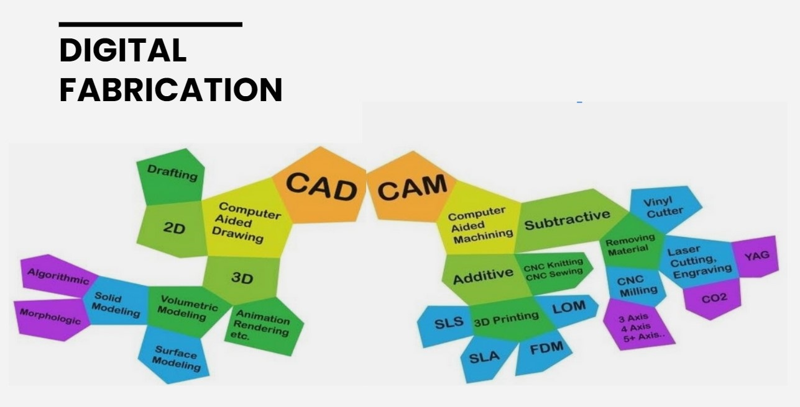

## MT02 Diseño 2D y Modelado 3D
En éste módulo aprendimos sobre software de diseño, para producir objetos físicos a partir de modelos digitales, y también diferentes herramientas de edición de archivos de imagen y vectoriales.

### Conceptos

**CAD:** proviene de las siglas en inglés *Computer Aided Design*, su traducción es *Diseño asistido por computadora*. Se refiere al software utilizado para realizar los diseños de forma digital, ya sea 2D o 3D.

**CAM:** de las siglas en inglés *Computer Aided Manufacturing*, su traducción es *Fabricación asistida por computadora*. Se refiere al software que genera el archivo (generalmente del tipo .gcode) con las instrucciones para que la máquina CNC pueda reproducir y materializar lo que se diseñó anteriormente en CAD, es el puente entre el diseño y la producción.

Las aplicaciones CAD/CAM se utilizan para diseñar un producto y programar los procedimientos para su fabricación. Ambos procesos (CAD y CAM) son interdependientes, dado que el diseño se ve determinado por la forma en la que se va a fabricar y a su vez, el proceso de fabricación y materialidad se ven determinados por la forma en la que se pensó el diseño. 

#### **[Formatos de imagen:](https://www.hostinger.es/tutoriales/formatos-de-imagen)**

Los **píxeles** (o "elementos de imagen") son la unidad controlable más pequeña de una imagen digital. 

Las imágenes de **mapa de bits** se componen de bits mapeados. Esto significa que la información de la imagen se almacena como una serie de valores que son ceros o unos.

Los **mapas de píxeles** pueden almacenar más de un bit (color) por píxel. En gráficos por computadora, los dos términos a menudo se usan indistintamente.

El término **"raster"** se utiliza para describir mapas de bits y mapas de píxeles e indica que estos gráficos dependen de la resolución. 

Los gráficos **vectoriales** son independientes de la resolución. Se basan en expresiones matemáticas y utilizan puntos, líneas, curvas y polígonos para representar imágenes. Se pueden cambiar de tamaño, doblar y estirar sin perder resolución.

[Más información](https://pub.fabcloud.io/tutorials/week02_computer_aided_design/2d_tools.html)

Formatos de imagen más comunes:

- GIF
- JPG
- PNG
- TIFF
- PSD
- RAW-NEF

#### **Programas pixelares:**:

- [GIMP](https://www.gimp.org/)
- [KRITA](https://krita.org/es/)
- [PHOTOPEA](https://www.photopea.com/)
- [PHOTOSHOP](https://www.adobe.com/la/products/photoshop.html)
- [PIXLR](https://pixlr.com/es/)

#### **Programas vectoriales:**

- [INKSCAPE](https://inkscape.org/)
- [ILLUSTRATOR](https://www.adobe.com/es/products/illustrator.html)
- [CORELDRAW](https://www.corel.com/la/)

#### **Modelado 3D**

Es el proceso de desarrollo de una representación matemática de cualquier objeto tridimensional a través de un software especializado. Al producto se le llama **modelo 3D**. Se puede visualizar como una imagen bidimensional mediante un proceso llamado renderizado 3D o utilizar en una simulación por computadora de fenómenos físicos. 

Los modelos 3D representan un objeto tridimensional usando una colección de puntos en el espacio dentro de un espacio 3D, conectados por varias entidades geométricas tales como triángulos, líneas, superficies curvas, etc. 

Los modelos 3D tienen una amplia variedad de aplicaciones en campos como la medicina, el cine, los videojuegos, la arquitectura, la ingeniería y las ciencias de la tierra. También pueden servir como base para la fabricación de objetos físicos mediante impresión 3D o máquinas CNC.

Casi todos los modelos 3D pueden ser divididos en dos categorías:

- Sólidos: definen el volumen del objeto que representan. 
- Carcasa/contorno (Shell or boundary): Estos modelos representan la superficie.

Hay 3 formas populares de representar un modelo:

- Modelado Poligonal (MESH) - Son puntos en un espacio 3D, llamados vértices, están conectados para formar un malla poligonal. 
- Modelado de curvas (NURBS) - Las superficies están definidas por curvas, las cuales son influenciadas por la ponderación del control de puntos. 
- Escultura digital 

#### **Diseño Paramétrico**

Es un proceso basado en el pensamiento algorítmico que permite la expresión de parámetros y reglas que en conjunto, definen, codifican y aclaran la relación entre la intención del diseño y la respuesta del diseño.

 

#### **Diseño Generativo**

Se trata de diseñar el sistema que que diseña.
La **optimización de topología** evalúa las iteraciones de diseño generativo individuales. El objetivo de la optimización es conseguir el mejor diseño posible en relación al conjunto de criterios y restricciones definidos. Estas iteraciones generativas se evalúan localmente en el ordenador, optimizando el esquema de material dentro del espacio de diseño especificado, en función del conjunto de cargas y restricciones definidas para el sistema. 

 

#### **Operaciones booleanas**

Las [operaciones booleanas](https://mvblog.me/apuntes/autocad3d/acad3d_modelado/operacionesbooleanas/) (pertenecientes al algebra boleana o algebra de boole) en diseño gráfico, hacen referencia al proceso de creación de un elemento a partir de la combinación de dos o más formas geométricas. Estas tienen tres características principales que determinan la forma de creación:

- Intersección
- Unión
- Exclusión

#### **Software para modelado 3D**

- [TINKERCAD](https://www.tinkercad.com/)
- [RHINOCEROS](https://www.rhino3d.com/)
- [BLENDER](https://www.blender.org/)
- [FUSION](https://www.autodesk.com/latam/products/fusion-360/overview?term=1-YEAR&tab=subscription)
- [OPENSCAD](https://openscad.org/)

### **Router CNC**

El [Router CNC](https://youtu.be/SHFWggfwHbw?si=2D3D_CmG-wIHjoVF), es la aplicación de comando numérico al proceso de routeado mediante control numérico.

Como con una fresadora manual, las máquinas disponen de una fresa que actúa a alta velocidad sobre el material, pudiendo desbastar o cortarlo dependiendo de la profundidad en la que se desee trabajar.

A partir de un dibujo bidimensional, se pueden establecer cuáles serán las líneas para cortar y cuales para desbastar. La ventaja de este sistema en relación a otros es que a su vez permite el cambio de cabezales, por lo que puede genera piezas de alta complejidad.

### **Corte Láser**

El [Corte Láser](https://youtu.be/Mt5U-ARuBHY?si=MzoSZ0W6QMQbxUKG), es realizado por un láser concentrado en un punto, asistido por un gas, elevando altamente la temperatura sobre las superficies que pasa.

Normalmente se utiliza para el corte de materiales que no generen efectos de reflejo en el láser, de forma que no lo puedan dañar.

La principal ventaja de este tipo de corte es la velocidad con la que se puede realizar.

### **Plotter de vinilo**

Un [Plotter de vinilo](https://www.youtube.com/live/zbEaF1gxQVE?si=7TW1qmjTvbppTGi5) es una herramienta de corte electrónica controlada por una computadora, que a través de un software, permite crear diseños para luego mandarlos a cortar en papel, vinilo, cartulina, tela, etc.

## Actividad MT02

La consigna del ejercicio es: 
- Diseñar un objeto utilitario compuesto por al menos dos piezas y contar con un logo en relieve. 
- Se generará una lámina de presentación muy simple que contenga un título, la imagen del modelo y una breve descripción.

Si bien tengo experiencia con Sketch Up y Revit, los uso para visualización de arquitectura y no para diseño de objetos. 
De las herramientas que se mostraron en clase, me interesó probar Tinkercad y Fusion. 

Comencé probando **Tinkercad** y si bien es bastante intuitivo me resultó difícil trabajar con las medidas exactas para mover los objetos, por lo que descarté seguir con esta herramienta.
Descargué e instalé **Fusion** con licencia de estudiante, usando los datos que Joaquín envío a través de Discord.

Decidí modelar una maceta con plato, y aplicar un logo en relieve sobre la maceta.
Primero vi el video ["Navigating the Fusion 360 User Interface"](https://www.youtube.com/watch?v=sZwM87-nsYA&ab_channel=ProductDesignOnline).
También vi los tutoriales de Plataforma EDU.

El logo lo vectoricé en **Inkscape** a partir de una imagen que descargué de la web de UTEC. Con este programa estoy bastante familiarizada, lo uso diaramente para vectorizar y diagramar láminas. 

El modelo 3D lo hice en Fusion, es la primera vez que uso este programa, me apoyé mucho en las explicaciones del tutorial de EDU, y además fui probando herramientas.
Una herramienta que ecnontré probando es *"Repujado"*, la usé para aplicar el logo sobre la superficie de la maceta, que tiene una geometría de cono truncado.

La lámina final la diagramé en Inkscape.

**[Descargable en pdf](https://drive.google.com/file/d/1QAAufAM8uPNFJkQPlnSfu2RyomdnybqR/view?usp=sharing)**

*Imagen: modelado en Fusion 360*

*Imagen: render en Fusion 360*

*Imágenes: objetos a mallas en Fusion 360*

*Imagen: lámina de entrega diagramada en Inkscape*

*Captura del proceso en Fusion 360*

## **Reflexiones**

*El programa Fusion me pareció súper completo y versátil. Si bien usé pocas herramientas, veo que Fusion 360 tiene muchísimas posibilidades, y una interfaz bastante amigable. Me sorprendió la calidad y rapidez del render. Seguramente volveré a usar este programa para modelado.*