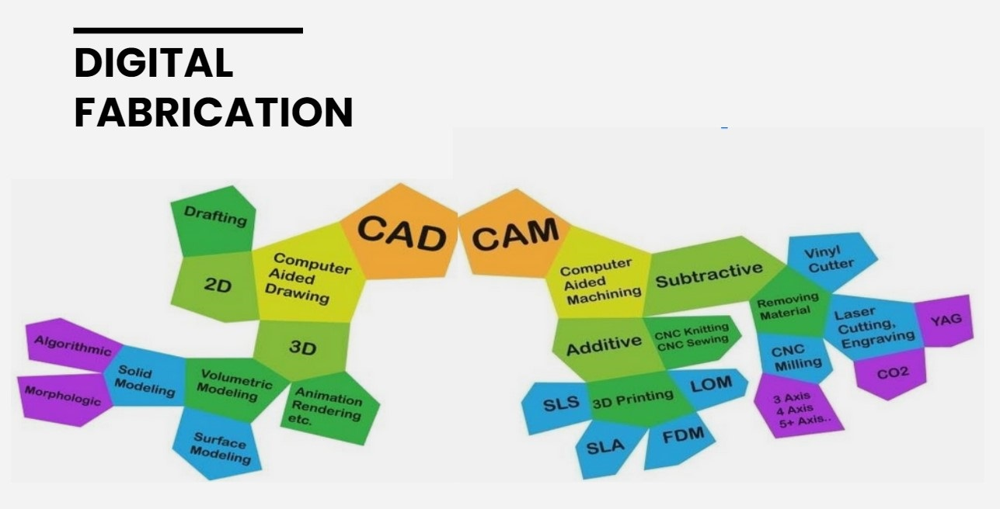
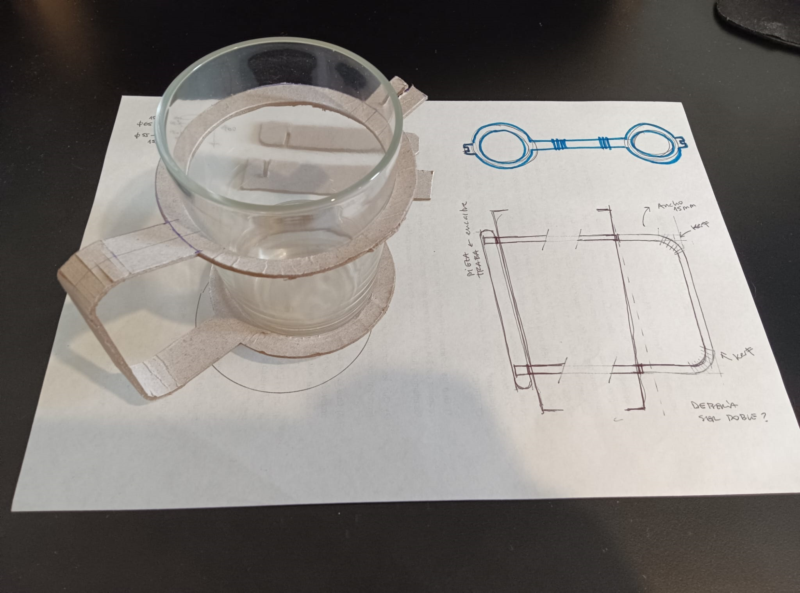
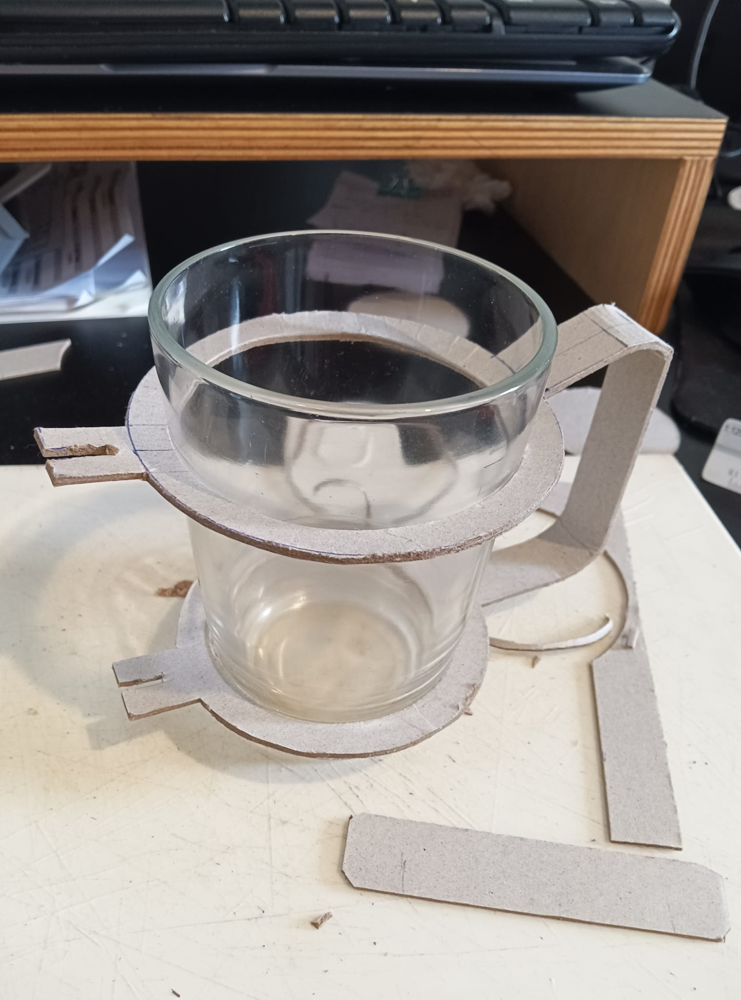
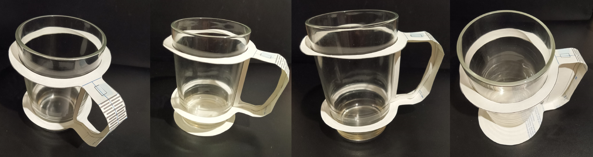

# MI03 Tecnología y Fabricación

## Conceptos
En este módulo técnico, trabajamos sobre corte láser controlado por computadora y diseño paramétrico.

**CAD:** proviene de las siglas en inglés *Computer Aided Design*, su traducción es *Diseño asistido por computadora*. Se refiere al software utilizado para realizar los diseños de forma digital, ya sea 2D o 3D.

**CAM:** de las siglas en inglés *Computer Aided Manufacturing*, su traducción es *Fabricación asistida por computadora*. Se refiere al software que genera el archivo (generalmente del tipo .gcode) con las instrucciones para que la máquina CNC pueda reproducir y materializar lo que se diseñó anteriormente en CAD, es el puente entre el diseño y la producción.

Las aplicaciones CAD/CAM se utilizan para diseñar un producto y programar los procedimientos para su fabricación. Ambos procesos (CAD y CAM) son interdependientes, dado que el diseño se ve determinado por la forma en la que se va a fabricar y a su vez, el proceso de fabricación y materialidad se ven determinados por la forma en la que se pensó el diseño. 

**LASER:** son las siglas del inglés *Light Amplification by Stimulated Emission of Radiation*, lo que se traduce en *Amplificación de luz mediante emisión estimulada de radiación*. 

## Corte o mecanizado con Láser

Es un proceso de índole térmica, que no genera viruta, en el que la eliminación del material se provoca por la fusión y vaporización del mismo al concentrar en zonas localizadas elevadas temperaturas. Una vez que el rayo láser ha penetrado completamente el material en un punto, comienza el proceso de corte real. El sistema láser sigue la geometría seleccionada y separa el material en el proceso. 
Se obtiene precisión en el corte y buen acabado superficial; se pueden obtener formas complejas no obtenibles por procesos convencionales, y se pueden mecanizar materiales muy duros.

El uso de la tecnología láser en el mecanizado de materiales ha sido estudiado durante la última década y hoy es una tecnología ampliamente insertada en el mundo industrial.

La tecnología láser comenzó con Albert Einstein a comienzos del siglo XX, y evolucionó aún más en 1960 cuando se construyó el primer láser en Hughes Research Laboratories.

**[Cómo funciona un láser](https://www.youtube.com/watch?v=sXHf9Jx99vQ&ab_channel=TrotecLaserEspa%C3%B1a)**

Existen diferentes tecnologías en máquinas de corte láser:

- **[Cortadora láser de CO2](https://www.youtube.com/watch?v=Mt5U-ARuBHY&ab_channel=hacedorescom)** Son máquinas de bajo consumo de energía, bajo precio y alta eficiencia en comparación con otras tecnologías láser. El rayo láser se genera a partir de una mezcla de gases que está compuesta principalmente de dióxido de carbono.

- **[Láser de Fibra de vidrio u óptica](https://www.youtube.com/watch?v=3gSNjsUO8E8&ab_channel=FeiyangMaquinaria)** Este tipo de corte con láser es potenciado a través de fibras de vidrio especiales. Este rayo láser tiene una alta intensidad y requiere de procesos simples de mantenimiento debido a la forma en la que está creado. Produce un corte muy liso, conveniente para cualquier metal.

- **[Láser de Neodimio](https://www.youtube.com/watch?v=om164bWBGp8&ab_channel=MCLANEInternacionalS.AdeC.V)** Creado con cristales dopados con neodimio, este láser tiene una longitud de onda mucho más reducida y una intensidad más alta en comparación con los láseres de CO2. Esto permite el corte con láser a través de materiales más gruesos y robustos como los metales y algunas cerámicas. 

**Métodos**

- **[Corte](https://www.youtube.com/watch?v=SIjUVCho_xU&ab_channel=TrotecLaser)**

- **[Grabado Ráster](https://www.youtube.com/watch?v=BiIeXWPRO0I&ab_channel=TrotecLaser)**

- **[Grabado Vectorial](https://www.youtube.com/watch?v=p7OmRY5d3vs&ab_channel=TrotecLaser)**

**Tolerancias y Holguras**

**Kerfing**

**Nesting:** es el termino que se suele utilizar para describir la acción de ubicar de forma eficiente las piezas a cortar en la lámina de material.

**Aplicaciones y materiales:**
Acrílico https://www.youtube.com/watch?v=vTGhzOgXgG0&ab_channel=WorkSpecial-Solu%C3%A7%C3%B5esemLaser
Madera https://www.youtube.com/watch?v=XNvPugTjv_A&ab_channel=TrotecLaser
Textiles https://www.youtube.com/watch?v=1b6IHKtriSo&ab_channel=TrotecL%C3%A1serEspa%C3%B1ol

## Diseño Paramétrico

## Herramientas Digitales

- **[Slicer for Fusion 360](https://youtu.be/puh35b5SX3Q?si=bo3qxhOXyu-vPn8O)**
- **[SVGnest](https://svgnest.com/)**
- **[Deepnest.io](https://deepnest.io/)**
- **[Flatfab](http://flatfab.com/)**
- **[Inkscape](https://www.youtube.com/watch?v=V8Q0GsMM-dg&t=72s&ab_channel=AlienTux)**
- **[Fusion 360](https://www.youtube.com/watch?v=ZrcqauNvt0M&t=343s&ab_channel=WhatMakeArt)**
- **[RDWorks](https://www.youtube.com/watch?v=IrxTlp8NuWU&t=1s&ab_channel=laserarte)**
- **[Grasshopper](https://www.grasshopper3d.com/)**
- **[BeeGraphy](https://beegraphy.com/)**
- **[Openscad](https://openscad.org/)**
- **[Origami Simulator](https://origamisimulator.org/)**
- **[Tinkercad - block programming design](https://www.tinkercad.com/)**
- **[Rhino](https://www.rhino3d.com/es/)**

## Plotter de Corte

Una cortadora de vinilo, también conocida como plotter de corte, es una máquina que utiliza cuchillas afiladas para cortar diseños a partir de láminas de vinilo adhesivo. Se utilizan para crear una amplia variedad de productos, como:

- Calcomanías
- Letreros
- Plantillas
- Tarjetas
- Invitaciones
- Ropa personalizada

**[¿Cómo funciona una cortadora de vinilo?](https://youtu.be/AEoddlOu-5E?si=YniY6iU7IxTeiiBD)** 

*Diseño:* El primer paso es crear un diseño digital utilizando un software de diseño como Adobe Illustrator o Silhouette Studio.

*Conexión:* El diseño se envía a la cortadora de vinilo a través de un cable USB o Bluetooth.

*Corte:* La cortadora de vinilo utiliza una cuchilla afilada para cortar el diseño del vinilo adhesivo.

*Pelado:* El vinilo sobrante se retira, dejando solo el diseño.

*Aplicación:* El diseño de vinilo se aplica a la superficie deseada.

Existen dos tipos principales :

**Cortadoras de pasadas únicas:** Estas cortadoras solo pueden cortar una vez por pasada, lo que significa que los diseños complejos pueden requerir varias pasadas. Son generalmente más económicas que las cortadoras de arrastre.

**Cortadoras de arrastre:** Estas cortadoras pueden cortar diseños complejos en una sola pasada, ya que la cuchilla se mueve a lo largo del diseño junto con un rodillo. Son generalmente más caras que las cortadoras de pasadas únicas.

## Actividad MT03

La consigna del ejercicio es: Diseñar un objeto para ser fabricado con corte láser. El objeto debe tener cómo mínimo 3 piezas que lo compongan y ser parametrizable. Las piezas se deben de poder ensamblar mediante encastres, y contemplar las 3 operaciones básicas: grabado ráster, marcado sobre vector y corte sobre vector.

Mi idea es hacer un asa para poder usar el vaso de requesón como taza. 
El vaso de requesón es un ejemplo local de **[diseño para economía circular aplicado al envase](https://www.elobservador.com.uy/nota/julieta-venegas-descubrio-los-vasos-de-requeson-2018221570)**. 

### Diseño y prototipos
Realicé prototipos en cartón y papel:

### Consideraciones previas a instancia práctica

Materiales admitidos para trabajar con las máquinas láser de CO2 de los Laboratorios Abiertos - IDEI

### Registro de instancia práctica y resultados

### Reflexiones