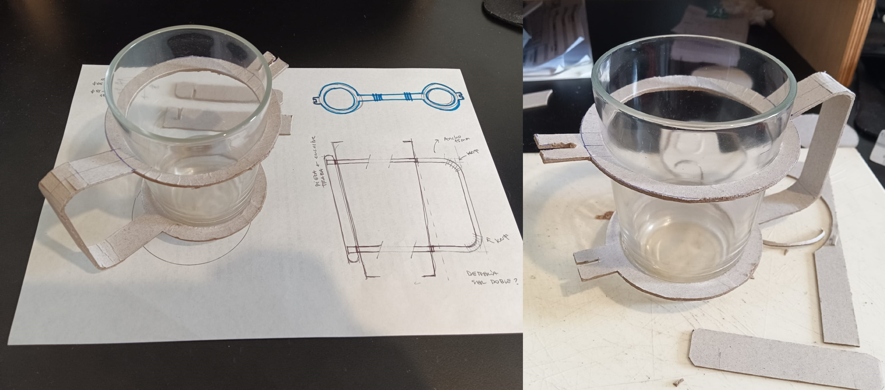
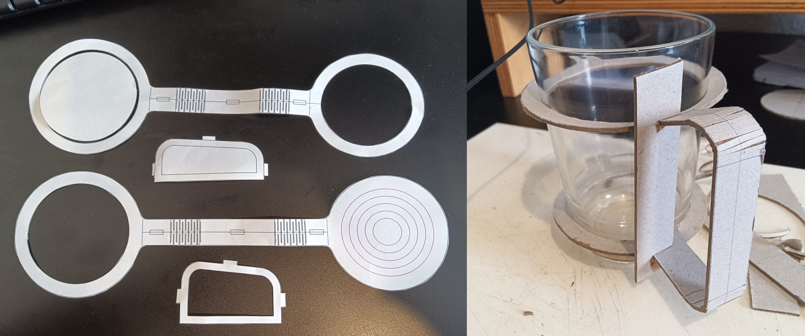

# MI03 Tecnología y Fabricación

## Conceptos
En este módulo técnico, trabajamos sobre corte láser controlado por computadora y diseño paramétrico.

**CAD:** proviene de las siglas en inglés *Computer Aided Design*, su traducción es *Diseño asistido por computadora*. Se refiere al software utilizado para realizar los diseños de forma digital, ya sea 2D o 3D.

**CAM:** de las siglas en inglés *Computer Aided Manufacturing*, su traducción es *Fabricación asistida por computadora*. Se refiere al software que genera el archivo (generalmente del tipo .gcode) con las instrucciones para que la máquina CNC pueda reproducir y materializar lo que se diseñó anteriormente en CAD, es el puente entre el diseño y la producción.

Las aplicaciones CAD/CAM se utilizan para diseñar un producto y programar los procedimientos para su fabricación. Ambos procesos (CAD y CAM) son interdependientes, dado que el diseño se ve determinado por la forma en la que se va a fabricar y a su vez, el proceso de fabricación y materialidad se ven determinados por la forma en la que se pensó el diseño. 

**LASER:** son las siglas del inglés 'Light Amplification by Stimulated Emission of Radiation', lo que en castellano significa Amplificación de luz mediante emisión estimulada de radiación. 

**Corte o mecanizado con Láser:** es un proceso de índole térmica, que no genera viruta, en el que la eliminación del material se provoca por la fusión y vaporización del mismo al concentrar en zonas localizadas elevadas temperaturas. Una vez que el rayo láser ha penetrado completamente el material en un punto, comienza el proceso de corte real. El sistema láser sigue la geometría seleccionada y separa el material en el proceso. 
Se obtiene precisión en el corte y buen acabado superficial; se pueden obtener formas complejas no obtenibles por procesos convencionales, y se pueden mecanizar materiales muy duros.

El uso de la tecnología láser en el mecanizado de materiales ha sido estudiado durante la última década y se presenta, a día de hoy, como una tecnología ampliamente insertada en el mundo industrial.
La tecnología láser comenzó con Albert Einstein a comienzos del siglo XX. La tecnología evolucionó aún más en 1960 cuando se construyó el primer láser en Hughes Research Laboratories.

**[Cómo funciona un láser](https://www.youtube.com/watch?v=sXHf9Jx99vQ&ab_channel=TrotecLaserEspa%C3%B1a)**

Existen diferentes tecnologías en máquinas de corte láser:

- **CO2:** Son máquinas de bajo consumo de energía, bajo precio y alta eficiencia en comparación con otras tecnologías láser. El rayo láser se genera a partir de una mezcla de gases que está compuesta principalmente de dióxido de carbono.

**[Cómo funciona una cortadora láser de CO2](https://www.youtube.com/watch?v=Mt5U-ARuBHY&ab_channel=hacedorescom)**

- **Fibra de vidrio u óptica:** Este tipo de corte con láser es potenciado a través de fibras de vidrio especiales. Este rayo láser tiene una alta intensidad y requiere de procesos simples de mantenimiento debido a la forma en la que está creado. Produce un corte muy liso, conveniente para cualquier metal.

**[Cómo funciona un láser de fibra](https://www.youtube.com/watch?v=3gSNjsUO8E8&ab_channel=FeiyangMaquinaria)**

- **Láser de Neodimio:** Creado con cristales dopados con neodimio, este láser tiene una longitud de onda mucho más reducida y una intensidad más alta en comparación con los láseres de CO2. Esto permite el corte con láser a través de materiales más gruesos y robustos como los metales y algunas cerámicas. 

**[Cómo funciona un láser de neodimio](https://www.youtube.com/watch?v=om164bWBGp8&ab_channel=MCLANEInternacionalS.AdeC.V)**

**Métodos**

- Corte

- Grabado Ráster

- Grabado vectorial

**Kerfing**

**Nesting**

**Diseño Paramétrico**

## Actividad MT03

La consigna del ejercicio es: Diseñar un objeto para ser fabricado con corte láser.

Mi idea es hacer un asa para poder usar el vaso de requesón como taza. 
Realicé un prototipo en cartón:

## Reflexiones