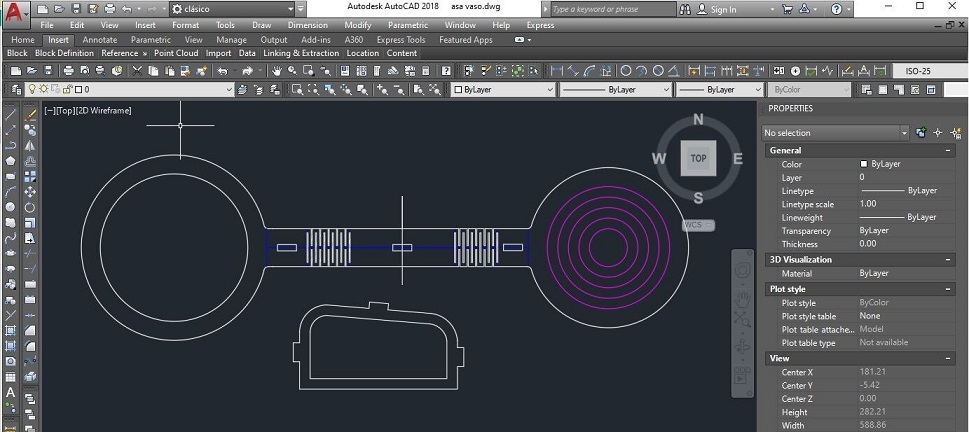
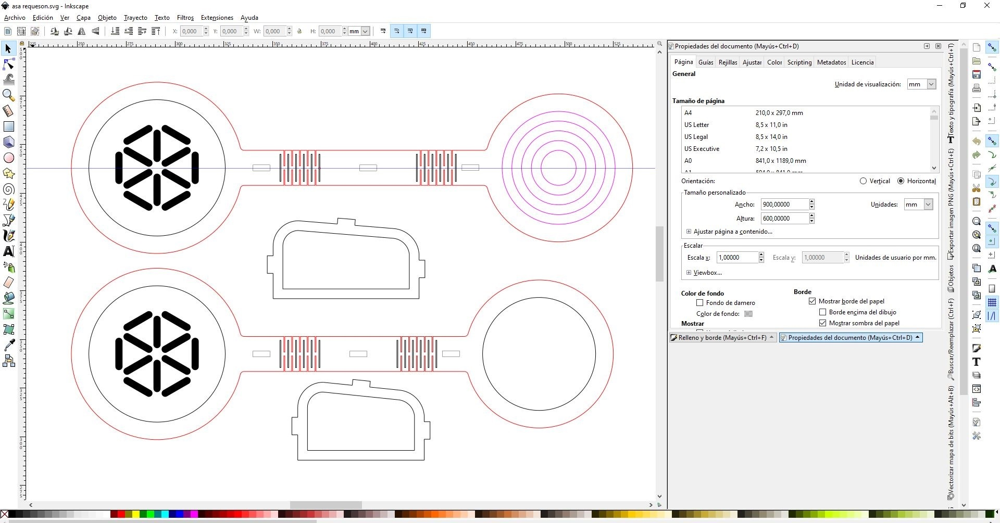

## MT03 Corte láser controlado por computadora
En este módulo técnico, trabajamos sobre corte láser controlado por computadora y diseño paramétrico.

## Conceptos

**CAD:** proviene de las siglas en inglés *Computer Aided Design*, su traducción es *Diseño asistido por computadora*. Se refiere al software utilizado para realizar los diseños de forma digital, ya sea 2D o 3D.

**CAM:** de las siglas en inglés *Computer Aided Manufacturing*, su traducción es *Fabricación asistida por computadora*. Se refiere al software que genera el archivo (generalmente del tipo .gcode) con las instrucciones para que la máquina CNC pueda reproducir y materializar lo que se diseñó anteriormente en CAD, es el puente entre el diseño y la producción.

Las aplicaciones CAD/CAM se utilizan para diseñar un producto y programar los procedimientos para su fabricación. Ambos procesos (CAD y CAM) son interdependientes, dado que el diseño se ve determinado por la forma en la que se va a fabricar y a su vez, el proceso de fabricación y materialidad se ven determinados por la forma en la que se pensó el diseño. 

**LASER:** son las siglas del inglés *Light Amplification by Stimulated Emission of Radiation*, lo que se traduce en *Amplificación de luz mediante emisión estimulada de radiación*. 

## Corte o mecanizado con Láser

Es un proceso de índole térmica, que no genera viruta, en el que la eliminación del material se provoca por la fusión y vaporización del mismo al concentrar en zonas localizadas elevadas temperaturas. Una vez que el rayo láser ha penetrado completamente el material en un punto, comienza el proceso de corte real. El sistema láser sigue la geometría seleccionada y separa el material en el proceso. 
Se obtiene precisión en el corte y buen acabado superficial; se pueden obtener formas complejas no obtenibles por procesos convencionales, y se pueden mecanizar materiales muy duros.

El uso de la tecnología láser en el mecanizado de materiales ha sido estudiado durante la última década y hoy es una tecnología ampliamente insertada en el mundo industrial.

La tecnología láser comenzó con Albert Einstein a comienzos del siglo XX, y evolucionó aún más en 1960 cuando se construyó el primer láser en Hughes Research Laboratories.

**[Cómo funciona un láser](https://www.youtube.com/watch?v=sXHf9Jx99vQ&ab_channel=TrotecLaserEspa%C3%B1a)**

Existen diferentes tecnologías en máquinas de corte láser:

- **[Cortadora láser de CO2](https://www.youtube.com/watch?v=Mt5U-ARuBHY&ab_channel=hacedorescom)** Son máquinas de bajo consumo de energía, bajo precio y alta eficiencia en comparación con otras tecnologías láser. El rayo láser se genera a partir de una mezcla de gases que está compuesta principalmente de dióxido de carbono.

- **[Láser de Fibra de vidrio u óptica](https://www.youtube.com/watch?v=3gSNjsUO8E8&ab_channel=FeiyangMaquinaria)** Este tipo de corte con láser es potenciado a través de fibras de vidrio especiales. Este rayo láser tiene una alta intensidad y requiere de procesos simples de mantenimiento debido a la forma en la que está creado. Produce un corte muy liso, conveniente para cualquier metal.

- **[Láser de Neodimio](https://www.youtube.com/watch?v=om164bWBGp8&ab_channel=MCLANEInternacionalS.AdeC.V)** Creado con cristales dopados con neodimio, este láser tiene una longitud de onda mucho más reducida y una intensidad más alta en comparación con los láseres de CO2. Esto permite el corte con láser a través de materiales más gruesos y robustos como los metales y algunas cerámicas. 

**Métodos**

- **[Corte](https://www.youtube.com/watch?v=SIjUVCho_xU&ab_channel=TrotecLaser)**

- **[Grabado Ráster](https://www.youtube.com/watch?v=BiIeXWPRO0I&ab_channel=TrotecLaser)**

- **[Grabado Vectorial](https://www.youtube.com/watch?v=p7OmRY5d3vs&ab_channel=TrotecLaser)**

**Tolerancias y Holguras:** En el diseño de piezas funcionales, nos referimos a *tolerancia* como la variación esperable de la dimensión de una pieza respecto al diseño original. Nos referimos a *holgura* como ese espacio que debemos dejar libre para que dos piezas encastren. La holgura depende directamente del grado de error esperable de la técnica de fabricación que vayamos a utilizar. A mayores rangos de tolerancia, mayor holgura será requerida.
Si estamos diseñando una pieza donde este tipo de aspectos es muy importante, lo mejor siempre es realizar pruebas previas.

**Kerf:** Se refiere al ancho de un corte o al ancho de un material eliminado mediante un proceso de corte.
**[Kerfing](https://youtu.be/QvcpBnxsQws?si=YlPCucFiTaL_FVlc)** o kerf bending es la técnica de generar patrones de corte en un material rígido y plano con el fin de debilitarlo de forma controlada para lograr que se pueda doblar. Es una técnica tradicional, que puede ser aplicada para el corte láser y en fresadora CNC.

**Nesting:** es el termino que se suele utilizar para describir la acción de ubicar de forma eficiente las piezas a cortar en la lámina de material.

**Aplicaciones y materiales:**

- **[Acrílico](https://www.youtube.com/watch?v=vTGhzOgXgG0&ab_channel=WorkSpecial-Solu%C3%A7%C3%B5esemLaser)**

- **[Madera](https://www.youtube.com/watch?v=XNvPugTjv_A&ab_channel=TrotecLaser)**

- **[Textiles](https://www.youtube.com/watch?v=1b6IHKtriSo&ab_channel=TrotecL%C3%A1serEspa%C3%B1ol)**

## Diseño Paramétrico
El diseño paramétrico es un proceso basado en el pensamiento algorítmico que permite la expresión de parámetros y reglas que en conjunto, definen, codifican y aclaran la relación entre la intención del diseño y la respuesta del diseño.

 

### Ejercicio de Warm-up: *Parametrización de un croissant*
En este ejercicio los realizamos en la plataforma **[Miró](https://miro.com/app/board/uXjVKFa2qt0=/)**. Buscamos definir las reglas o restricciones que podrían permitir representar un croissant de forma digital.

## Diseño Generativo

Se trata de diseñar el sistema que que diseña.
La **optimización de topología** evalúa las iteraciones de diseño generativo individuales. El objetivo de la optimización es conseguir el mejor diseño posible en relación al conjunto de criterios y restricciones definidos. Estas iteraciones generativas se evalúan localmente en el ordenador, optimizando el esquema de material dentro del espacio de diseño especificado, en función del conjunto de cargas y restricciones definidas para el sistema. 

 

## Herramientas Digitales

- **[Slicer for Fusion 360](https://youtu.be/puh35b5SX3Q?si=bo3qxhOXyu-vPn8O)**
- **[SVGnest](https://svgnest.com/)**
- **[Deepnest.io](https://deepnest.io/)**
- **[Flatfab](http://flatfab.com/)**
- **[Inkscape](https://www.youtube.com/watch?v=V8Q0GsMM-dg&t=72s&ab_channel=AlienTux)**
- **[Fusion 360](https://www.youtube.com/watch?v=ZrcqauNvt0M&t=343s&ab_channel=WhatMakeArt)**
- **[RDWorks](https://www.youtube.com/watch?v=IrxTlp8NuWU&t=1s&ab_channel=laserarte)**
- **[Grasshopper](https://www.grasshopper3d.com/)**
- **[BeeGraphy](https://beegraphy.com/)**
- **[Openscad](https://openscad.org/)**
- **[Origami Simulator](https://origamisimulator.org/)**
- **[Tinkercad - block programming design](https://www.tinkercad.com/)**
- **[Rhino](https://www.rhino3d.com/es/)**
- **[AutoCAD](https://www.autodesk.com/latam/products/autocad/overview?term=1-YEAR&tab=subscription)**
- **[Solidworks](https://www.solidworks.com/es)**
- **[Autodesk Inventor](https://www.autodesk.com/latam/products/inventor/overview?term=1-YEAR&tab=subscription)**

## Plotter de Corte

Una cortadora de vinilo, también conocida como plotter de corte, es una máquina que utiliza cuchillas afiladas para cortar diseños a partir de láminas de vinilo adhesivo. Se utilizan para crear una amplia variedad de productos, como calcomanías, letreros, plantillas, tarjetas, invitaciones, ropa personalizada, etc.

**[¿Cómo funciona una cortadora de vinilo?](https://youtu.be/AEoddlOu-5E?si=YniY6iU7IxTeiiBD)** 

*Diseño:* El primer paso es crear un diseño digital utilizando un software de diseño como Adobe Illustrator o Silhouette Studio.

*Conexión:* El diseño se envía a la cortadora de vinilo a través de un cable USB o Bluetooth.

*Corte:* La cortadora de vinilo utiliza una cuchilla afilada para cortar el diseño del vinilo adhesivo.

*Pelado:* El vinilo sobrante se retira, dejando solo el diseño.

*Aplicación:* El diseño de vinilo se aplica a la superficie deseada.

Existen dos tipos principales :

**Cortadoras de pasadas únicas:** Estas cortadoras solo pueden cortar una vez por pasada, lo que significa que los diseños complejos pueden requerir varias pasadas. Son generalmente más económicas que las cortadoras de arrastre.

**Cortadoras de arrastre:** Estas cortadoras pueden cortar diseños complejos en una sola pasada, ya que la cuchilla se mueve a lo largo del diseño junto con un rodillo. Son generalmente más caras que las cortadoras de pasadas únicas.

## Actividad MT03

La consigna del ejercicio es diseñar un objeto para ser fabricado con corte láser. 
El objeto debe tener cómo mínimo 3 piezas que lo compongan y ser parametrizable. 
Las piezas se deben de poder ensamblar mediante encastres, y contemplar las 3 operaciones básicas: grabado ráster, marcado sobre vector y corte sobre vector.

Mi idea es hacer un asa para poder usar el vaso de requesón como taza. 
El vaso de requesón es un ejemplo local de **[diseño para economía circular aplicado al envase](https://www.elobservador.com.uy/nota/julieta-venegas-descubrio-los-vasos-de-requeson-2018221570)**. 

### Diseño y prototipos

- Realicé prototipos en cartón y papel:

- El dibujo lineal (2D) de las piezas lo hice en Autocad, y lo guardé como dxf.

- Luego importé el dxf a Fusion, y lo usé como boceto para el modelado 3D. Parametricé los valores de espesor de la pieza, y los encastres, siguiendo el **[tutorial](de Joaquín https://drive.google.com/file/d/1Gjqy9DcNRly6eg7CgItz0eMrFXfsJj_X/view?usp=sharing)** disponible en plataforma EDU.

- Utilicé Inkscape para agrear el logo y obtener un archivo vectorial. En *propiedades del documento*, puse mm en *unidad de visualización* y en *unidades* de la página. También cambié el tamaño de la página a 900x600mm, que corresponde al área de trabajo de la láser a usar.

- Siguiendo el **[tutorial](https://drive.google.com/file/d/1fdJgw5k_LrlIsklnu9RmiR91i_yGWoKX/view?t=366)** de Joaquín en la plataforma EDU, utilicé RDWorks para generar el archivo g-code. Los parámetros de velocidad y potencia para el corte que programé fueron los recomendados en el tutorial.

### Consideraciones previas a instancia práctica

- Materiales admitidos para trabajar con las máquinas láser de CO2 de los Laboratorios Abiertos - IDEI

- **[Parámetros](https://drive.google.com/file/d/110HuEOOLLmijf7nRPe393I-VQ9zhlQlB/view?usp=sharing)**

- **[Operación de Máquina y Medidas de Seguridad](https://edu2.utec.edu.uy/assets/courseware/v1/68d65542210b63aa42bda997e07f5e78/asset-v1:UTEC+EFDI+2023+type@asset+block/Unidad_6_-_Operacion_de_Maquina_y_Medidas_de_Seguridad.pdf)**

- **[Uso del panel de control](https://youtu.be/A68CWyjT16I?si=ehpgWOxWX2vUiEjJ)**

- **[Librería de materiales](https://youtu.be/yWXlHZlfx3Q?si=oJpui3ZxfjUnRD8u)**

- **[Manual de referencias para tubo de 100W](https://edu2.utec.edu.uy/assets/courseware/v1/6c7372579344b304a3812686982a17d5/asset-v1:UTEC+EFDI+2023+type@asset+block/parameters-for-different-materials-100watt.pdf)**

### Registro de instancia práctica y resultados

El miércoles 5 de junio fue la jornada práctica en el LabA de UTEC Durazno.

Nos recibieron Facundo, Martina y Joaquín, docentes de UTEC, que nos enseñaron el funcionamiento de la cortadora de láser y del laboratorio en general, así como pruebas y proyectos en los que trabajan.

La cortadora Láser que tiene el laboratorio es el modelo SKL-6090, con 100W de potencia y un área de trabajo de 90x60cm.

- Trabajamos con mdf de 3mm para las pruebas.

- Prendimos la máquina con la perilla On/Off.

- Usando el panel de control, con la tecla **File**, copiamos el archivo g-code desde un pendrive a la memoria de la cortadora.

- Luego, con la tecla **Z/U** calibramos la ubicación del cabezal en el eje z para el ajuste del punto focal.

- Marcamos el punto 0,0 de los ejes x e y, usando la tecla **Origin**.

- Con la tecla **Frame** verificamos que el área de corte que necesita nuestro diseño esté disponible en el material.

Realicé varias pruebas en mdf haciendo ajustes de diseño entre una y otra:

Finalmente, este es el prototipo con mejor resultado. Todavía quedan varios ajustes por realizar, e incluso pruebas de diferentes encastres que me sugirieron mis compañerxs.

#### Descarga de Archivos

**[Carpeta con los archivos finales](https://drive.google.com/file/d/1SAyiMOu0I14Z-x_AfAeApyxWNw8rWU00/view?usp=drive_link)**

### Reflexiones

*Este módulo práctico me resultó muy motivador, en especial por poder compartir una jornada presencial con compañerxs y docentxs. Ya había estado en el LabA de visita, pero poder estar compartiendo y aprendiendo juntxs fue una experiencia mucho más rica.* 

*Nunca había usado corte láser, y me pareció una tecnología muy versátil y sobre todo rápida para prototipar y hacer ajustes de diseño. Me gustaría seguir probando en diferentes materiales.*

