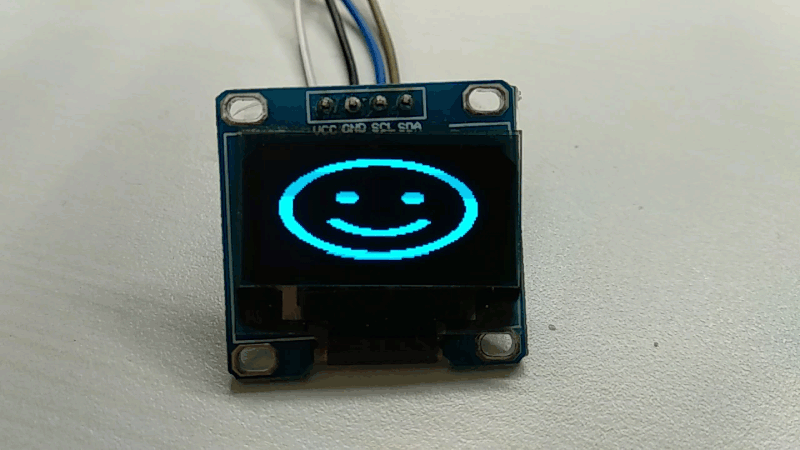
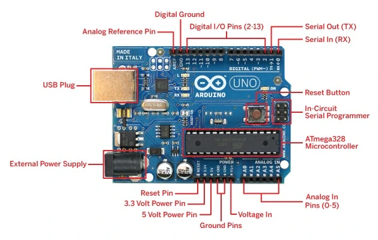
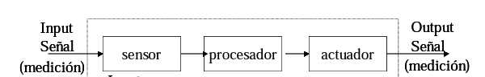
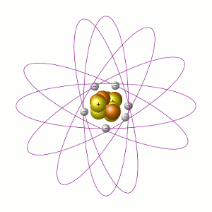
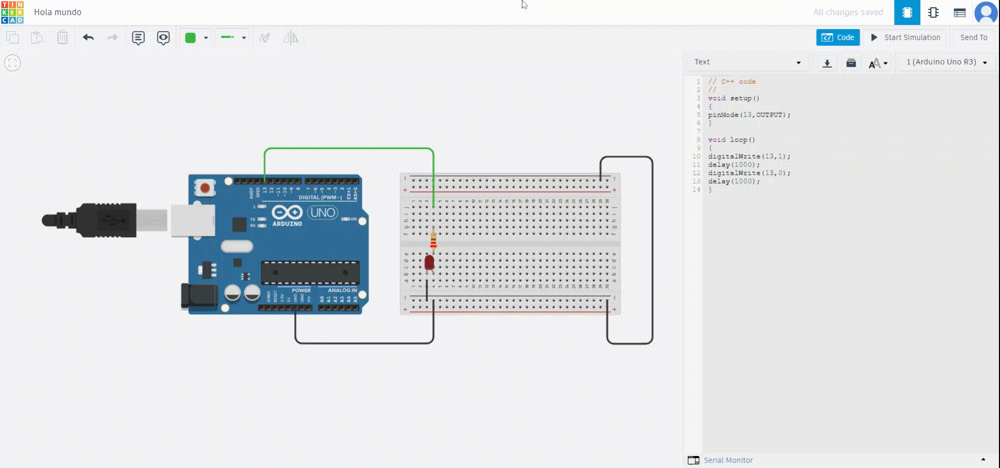
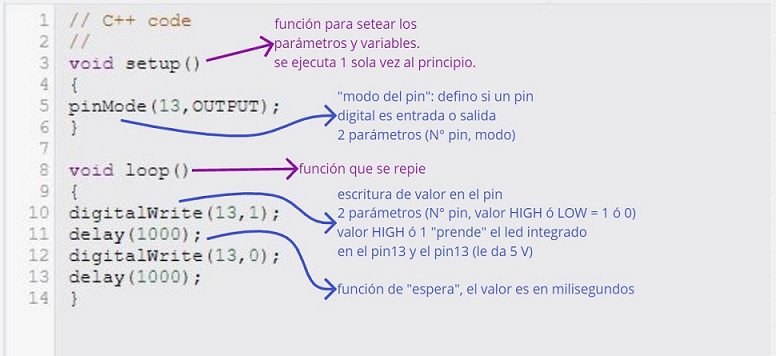
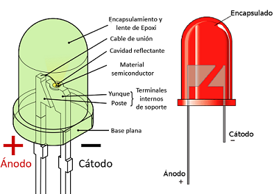
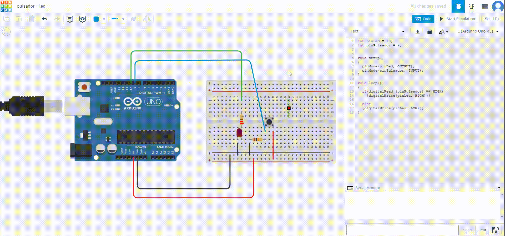
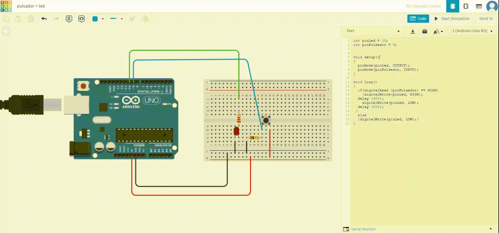
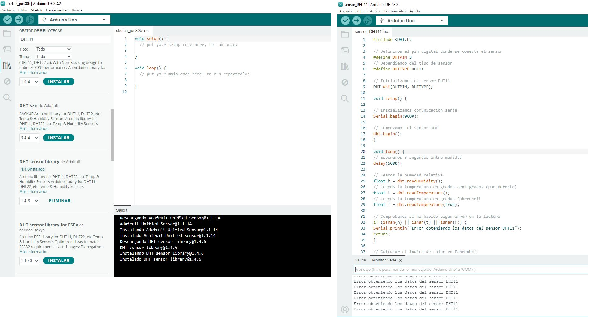

## MT04 Introducción a electrónica y programación
El objetivo de este módulo es introducirnos en los principios de programación y electrónica aplicada en microcontroladores, utilizando la plataforma de desarrollo Arduino IDE.

### **Conceptos Generales**

**[Arduino](https://arduino.cl/que-es-arduino/):** es una plataforma para **[informática física](https://es.wikipedia.org/wiki/Inform%C3%A1tica_f%C3%ADsica)** de código abierto basada en hardware (placa electrónica) y software (Arduino IDE), fácil de usar.

La **[placa Arduino](https://es.wikipedia.org/wiki/Arduino)** se basa en una placa electrónica de hardware libre que incorpora un **[microcontrolador](https://www.estudioelectronica.com/que-es-un-microcontrolador/)** re-programable y una serie de pines hembra. Estos permiten establecer conexiones entre el microcontrolador y los diferentes sensores y actuadores de una manera muy sencilla, principalmente con **[cables dupont](https://es.wikipedia.org/wiki/Cable_puente)**.

Mediante estas conexiones la placa Arduino puede leer **entradas** (luz en un sensor, un dedo en un botón o un mensaje de Twitter) y convertirlo en una **salida**, activando un motor, encendiendo un LED, o publicando algo en línea. 

Para realizar estas acciones se le debe enviar un **conjunto de instrucciones (programa)** al microcontrolador en la placa. Para hacerlo, se utiliza el **lenguaje de programación Arduino** (basado en Wiring) y el **Software Arduino (IDE)**, basado en Processing.

 **Más sobre Arduino**:

**[Web de Arduino](https://www.arduino.cc/)**

**[Getting Started with Arduino](https://www.esc19.net/cms/lib011/TX01933775/Centricity/Domain/110/make_gettingstartedwitharduino_3rdedition.pdf)**

**[Arduino The Documentary](https://vimeo.com/18390711)**

**Interaction Design o Diseño de Interacción:** es el diseño de cualquier experiencia interactiva. Se ocupa de la creación de experiencias significativas entre nosotros (los seres humanos) y los objetos. Fomenta el diseño a través de un proceso iterativo basado en prototipos de fidelidad cada vez mayor. 
Este enfoque, que también forma parte de algunos tipos de diseño convencional, se puede ampliar para incluir la creación de prototipos con tecnología; en particular, la creación de prototipos con electrónica. El campo específico del Diseño de Interacción involucrado con Arduino es la informática física (o Diseño de Interacción Física).

**Informática física:** (en inglés physical computing) consiste en construir sistemas físicos interactivos empleando software y hardware que puede captar información y responder al mundo analógico. 

**[Tinkercad Circuits](https://www.tinkercad.com/circuits):** esta plataforma online nos permite diseñar y simular circuitos electrónicos de manera virtual. Para comenzar a utilizar Tinkercad debes registrarte con una cuenta de correo electrónico.
Incluye una variedad de componentes electrónicos que se pueden arrastrar y soltar en un espacio de trabajo virtual. Tinkercad Circuits también permite la integración de microcontroladores como el Arduino, permitiendo a los usuarios escribir y simular código en un entorno seguro y controlado.

**[Más sobre Tinkercad Circuits](https://formacion.intef.es/mod/book/view.php?id=2625&chapterid=2413)** 

### **Entradas y Salidas en Arduino**

Arduino dispone de una serie de entradas (inputs) y salidas (outputs) digitales y analógicas programables que es la base de manejo de Arduino.
En todas las placas los pines son multifunción o multipropósito, es decir en función de la configuración tienen una funcionalidad u otra.

**Input (Entrada):** Los pines configurados como entrada se utilizan para recibir información del mundo exterior hacia la placa Arduino. Estos pines leen señales eléctricas que provienen de diversos sensores o dispositivos, y luego el microcontrolador las procesa.

**Output (Salida):** Los pines configurados como salida se utilizan para enviar señales eléctricas desde la placa Arduino hacia otros dispositivos o componentes del proyecto. Esto permite que el Arduino controle el comportamiento de actuadores y otros elementos.

En Arduino UNO la disposición de los pines de entrada y salida son:

 

**[Cómo funcionan los pins digitales y cómo se configuran](https://docs.arduino.cc/learn/microcontrollers/digital-pins/)**

**[Cómo funcionan los pins analógicos](https://docs.arduino.cc/learn/microcontrollers/analog-input/)**

Relación entre Arduino, entradas/salidas y sensores/actuadores: 
 

### **Sensores**
Un sensor es todo aquello que tiene una propiedad sensible a una magnitud del medio, y al variar esta magnitud también varía con cierta intensidad la propiedad, es decir, manifiesta la presencia de dicha magnitud, y también su medida.
Los sensores son el primer eslabón de la cadena de IoT (Internet of Things o **[Internet de las cosas](https://es.wikipedia.org/wiki/Internet_de_las_cosas)**).

Los sensores se pueden clasificar en función de los datos de salida en:

- Digitales
- Analógicos

Dependiendo del tipo de sensor, deberemos conectarlo a una entrada digital o analógica.

**[Más información](http://es.wikipedia.org/wiki/Sensor#Caracter.C3.ADsticas_de_un_sensor)** 

**[Tipos de sensores](http://es.wikipedia.org/wiki/Sensor#Tipos_de_sensores)**

**[Sensores Arduino](https://aprendiendoarduino.wordpress.com/2018/04/14/sensores-arduino-3/)**

### **Actuadores**

Un actuador es un dispositivo capaz de transformar energía hidráulica, neumática o eléctrica en la activación de un proceso con la finalidad de generar un efecto sobre un elemento externo. Este recibe la orden de un regulador, controlador o en nuestro caso, un Arduino; y en función a ella genera la orden para activar un elemento final de control como, por ejemplo, una válvula.

Existen varios tipos de actuadores, como son:

- Electrónicos
- Hidráulicos
- Neumáticos
- Eléctricos
- Motores
- Bombas

**[Actuadores y periféricos Arduino](https://aprendiendoarduino.wordpress.com/2015/03/31/actuadores-y-perifericos-de-salida/)**

### **Software Arduino IDE** 

El entorno de desarrollo integrado Arduino, o **[software Arduino (IDE)](https://es.wikipedia.org/wiki/Arduino_IDE)** , contiene un editor de texto para escribir código, un área de mensajes, una consola de texto, una barra de herramientas con botones para funciones comunes y una serie de menús. Se conecta al hardware Arduino (placa electrónica) para cargar programas y comunicarse con ellos.

Los programas escritos con el software Arduino (IDE) se denominan bocetos (Sketches). Estos bocetos se escriben en el editor de texto y se guardan con la extensión de archivo *.ino.*

**[Descarga de Arduino IDE 2.3.2](https://www.arduino.cc/en/software)**

**[Tutorial Primeros Pasos](https://youtu.be/GUuWgk3dXd0?si=NwE1WRAA2muDEKgM)**

**Librerías o bibliotecas:** son trozos de código hechas por terceros que usamos en nuestro sketch. Esto nos facilita mucho la programación y permite la abstracción haciendo que nuestro programa sea más sencillo de hacer y de entender. En este apartado también veremos cómo escribir o modificar librerías.

**[Lista de librerías](https://www.arduino.cc/reference/en/libraries/)** 

**[Instalar librerías](https://docs.arduino.cc/software/ide-v1/tutorials/installing-libraries/)** 

**[Escribir tu propia librería](https://docs.arduino.cc/learn/contributions/arduino-creating-library-guide/)** 

### **Conceptos básicos de electricidad**

**[Tutorial de Referencia](https://fablabbcn-projects.gitlab.io/learning/precourse/#electronics_coding/volts_waterfalls/)** 

En un átomo, el núcleo mantiene unidos a los protones y neutrones, mientras que los electrones orbitan alrededor de ellos:

 

**Voltaje:** Cuando forzamos a los electrones a agruparse en un área determinada, dejando otra área sin electrones, creamos una diferencia de voltaje. Este voltaje es la relación entre la energía que aplicamos y la carga eléctrica:

**E = V x carga**

Cuando dos objetos tienen una diferencia de voltaje, podemos decir que sus electrones intentarán saltar entre sí creando un flujo de corriente, para equilibrar la situación y estabilizarse. El voltaje se expresa en voltios (V). Este voltaje puede ser constante en el tiempo o alterno.

**Unidades:** La energía se mide en Jules (J), el voltaje en Voltios (V) y la Carga en Coulombs (C). 

**Corriente:** Cuando dos objetos están sujetos a una diferencia de voltaje, los electrones intentarán volver a su posición. Al hacerlo, decimos que hay una corriente eléctrica o simplemente corriente. Este movimiento de electrones dentro de un material se mide en amperios (A) o simplemente amperios. Si tenemos tensión alterna, también tendremos corriente alterna (AC), y lo mismo con tensión constante, en cuyo caso tendremos DC.

 

**Ley de Ohm:** Para que los electrones pasen de un punto a otro cuando estén sujetos a voltaje, tendrán dificultad de atravesar. Esa dificultad se llama **resistencia** y se mide en ohmios (Ω). Georg Ohm descubrió que el voltaje (V), la resistencia (R) y la corriente (I) van con la siguiente fórmula:

**V = I x R**

Significa que cuando la resistencia es muy alta, casi no hay corriente (y cuando la corriente es 0, significa que tenemos un circuito abierto). Cuando la resistencia es casi 0, la corriente puede ser muy grande, lo que lleva a lo que llamamos un corto.

**[Multímetro](https://www.sciencebuddies.org/science-fair-projects/references/how-to-use-a-multimeteres):** es un dispositivo que combina varias funciones de medición en una sola unidad. Como mínimo, puede medir voltaje, resistencia y corriente. También sirve como una herramienta de depuración para verificar la continuidad entre puntos en el circuito, ya sea intencional o no.

**[Breadboard o Placa de Pruebas](https://learn.sparkfun.com/tutorials/how-to-use-a-breadboard):** es una herramienta de creación de prototipos que utilizamos para hacer que los circuitos sean rápidos y se repitan fácilmente.

## Actividad MT04

Objetivos: 

- Leer mínimo 2 inputs (módulo sensor de distancia SRF05 / pulsador + fotoresistencias)
- Actuar mínimo 2 outputs (recomendamos servomotor + leds)
- Utilizar Tinkercad Electronics y Kit de Arduino
- Documentar proceso 

### **Materiales**

**[Kit Arduino](https://arduino.cl/kits-arduino/)** / En este curso nos centramos en Kits con la **[placa Arduino Uno](https://es.wikipedia.org/wiki/Arduino_Uno)**.

Los **componentes** son dispositivos físicos, mientras que los **elementos** son modelos o abstracciones idealizadas que constituyen la base para el estudio teórico de los mencionados componentes.

Un componente electrónico es un dispositivo que forma parte de un **circuito electrónico**. Se suelen encapsular, generalmente en un material cerámico, metálico o plástico, y terminar en dos o más terminales o patillas metálicas. Se diseñan para ser conectados entre ellos, normalmente mediante soldadura, a un circuito impreso.

**[Libro de proyectos](https://candy-ho.com/Drivers/librodeproyectosdearduinostarterkit-151212174250.pdf)**

### **Proceso**

#### **1. Hola Mundo**

Comencé con un ejercicio muy sencillo para probar la simulación en Tinkercad. Se trata de conectar un LED y hacerlo parpadear.

**[Tutorial de Referencia](https://youtu.be/axUACNSQSYM?si=iCYa7qJsho_49dgK)** 

Simulación en Tinkercad:

Componentes:

- 1 Resistencia 220 ohms
- 1 LED 
- 1 placa Arduino UNO conectada a PC

Notas:

Sobre la conexión del LED:

#### **2. Led + Pulsador**

En este ejercicio configuré una entrada digital con un pulsador + LED, y la programé.

**[Tutorial de Referencia](https://youtu.be/ny9392ul9-w?si=z94Ff2MaMn_iSRwI)** 

Simulación en Tinkercad:

solo pulsador

pulsador con delay

Componentes:

- 1 Resistencia 220 ohms
- 1 Resistencia 10K ohms
- 1 LED 
- 1 Pulsador
- 1 placa Arduino UNO conectada a PC

Notas:

Conexión de componentes físicos:

**[Descarga de Archivo .ino](https://drive.google.com/file/d/1qd2laPK6eWsGbBF0sny_ef88SGvKgk1L/view?usp=drive_link)**

#### **3. Lectura de Sensor Ultrasónico (Distancia)**

**[Tutorial de Referencia](https://youtu.be/09i9Zp9z81E?si=kkNb_NJQsb48K-qO)** 

Simulación en Tinkercad:

Componentes:

Notas:

Conexión de componentes físicos:

**[Descarga de Archivo .ino]()**

#### **4. Servomotor**

**[Tutorial de Referencia]()** 

Simulación en Tinkercad:

Componentes:

Notas:

Conexión de componentes físicos:

**[Descarga de Archivo .ino]()**

#### **4. Lectura de Sensor DHT11 (Temperatura y Humedad)**

**[Tutorial de Referencia](https://programarfacil.com/blog/arduino-blog/sensor-dht11-temperatura-humedad-arduino/#Conectando_el_DHT11_a_Arduino)** 

El módulo DHT11 que viene en el kit, está integrado dentro de un PCB y viene con la resistencia pull-up integrada.
No pude hacer la simulación en Tinkercad, porque no encontré el módulo DHT11 dentro de los componentes.

Conexión de la placa Arduino Uno y los elementos en la breadboard:

Incluir biblioteca, copia y edición de código en IDE:

Si bien al verificar el código no me arrojó error, al Cargar no pude obtener lectura del sensor.
**[Descarga de Archivo .ino](https://drive.google.com/file/d/1YjuLG3MJcR9NmDdTFjieiRVemp7Iyh1-/view?usp=drive_link)**

## **Reflexiones**

*Este módulo me resultó muy desafiante, por ser mi primer acercamiento a la electrónica. Me sentí bastante abrumada por la cantidad de información que hay disponible online, por lo que primero intenté armar circuitos sencillos para familiarizarme con los componentes del kit, y después pasé a la programación y el uso de Tinkercad. Fue un camino un poco inverso a lo que se planteó en las clases, pero me sirvió para enfocarme y buscar ejemplos para completar las actividades planteadas.*

*Me gustaría que este módulo cuente con una instancia práctica, para poder resolver uno o varios ejercicios en grupo.*