## MT05 Impresión y escaneo 3D
Las clases teóricas fueron dictadas por Julia Leirado y Eduardo Chamorro de FAB LAB Barcelona, y Maximiliano Torres, docente encargado de fabricación digital en UTEC.

En este módulo trabajamos sobre fabricación asistida por computadora para **[Impresión 3D](https://es.wikipedia.org/wiki/Impresi%C3%B3n_3D)**.

## Conceptos Generales
Volvemos sobre los conceptos CAD y CAM trabajados en el módulo **[MT03](https://mvicogarcia.github.io/Victoria_Garcia/tecnicos/mt03/#conceptos)**.

La **[Impresión 3D](https://formlabs.com/latam/3d-printers/)** es el proceso de creación de objetos mediante el depósito de capas de material unas sobre otras. 
Se denomina **[fabricación aditiva (AM)](https://markforged.com/es/resources/blog/additive-manufacturing-101-guide-the-basics)**.

**Ventajas:**

- ELABORACIÓN BAJO DEMANDA, sin costos por matricería
- FABRICACIÓN COMPACTA Y PORTÁTIL
- PRECISIÓN EN LA REPRODUCCIÓN FÍSICA
- BAJO COSTO, con respecto a la fabricación tradicional. 

**[Más sobre impresión 3D](https://markforged.com/es/resources/learn/3d-printing-basics)**

**[Tips de diseño para impresión 3D](https://drive.google.com/file/d/11Nce-aVuR1dgwe6BxVlwFwvVHbqlMqwE/view?usp=sharing)**

### **Impresión 3D FDM** 

*Imagen: Principio de funcionamiento de una Impresora FDM*

La **[impresión 3D FDM](https://youtu.be/rkUILe3zv98?si=tSJY_1L5mnho3RW5)** (fused deposition modeling) es un proceso de impresión 3D por extrusión de material. Un carrete alimenta filamento termoplástico a través de un extrusor que calienta, funde y extrude el plástico a través de una boquilla fina. 

El extrusor y la boquilla componen el cabezal de impresión, que se mueve a lo largo de la placa de construcción para ir dibujando cada capa, una después de otra. Sigue un conjunto de instrucciones de un archivo concreto, generalmente en formato GCODE, que, dicho de forma sencilla, contiene las secciones de una maqueta 3D.

Cuando el cabezal de impresión deposita el filamento, el plástico se funde en la capa anterior y se endurece, con ayuda de ventiladores de refrigeración montados en el cabezal de impresión y/o dentro de la cámara de construcción.

Las piezas impresas mediante FDM son anisotrópicas, es decir, son más sólidas en un sentido que en otro. Sus capas suelen verse a simple vista y pueden requerir un posprocesamiento, como el enarenado, centrifugado, pulido por vapor, etc.

Las piezas impresas en 3D por FDM suelen ser menos precisas y menos duraderas que las piezas que se elaboran con otros métodos de fabricación aditiva, como SLS , SLA o DLP. 

Dentro de la tecnología FDM, existen diferentes **[tipos de impresoras](https://www.3dnatives.com/es/tipos-impresoras-3d-fdm-190620172/)**, de acuerdo a su estructura: 

- Impresoras Cartesianas
- Impresoras CoreXY
- Impresoras Delta
- Impresoras polares

### **Impresión 3D SLA / DLP** 

**[Impresión 3D SLA](https://youtu.be/yW4EbCWaJHE?si=C_pWxHq2C_nRKT96)** (stereolithography) 

**[Impresión 3D DLP](https://youtu.be/97ARLiTHjX0?si=uhAPOfCFONdzJ8gN)** (procesamiento digital de luz)

*Imagen: Principio de funcionamiento de una Impresora SLA*

El principio básico es un tanque que contiene líquido fotosensible (resina) que se cura capa por capa mediante una fuente de calor para fabricar el objeto.

Los objetos impresos son casi perfectamente lisos, muye detallados y las capas son casi invisibles para el ojo humano. Las desventajas de esta tecnología son una superficie de impresión más pequeña, el costo de los materiales y la toxicidad de las resinas líquidas. 

Los objetos impresos no son aptos para el uso inmediato una vez finalizado el trabajo de impresión. Es necesario lavar el objeto con alcohol isopropílico y curarlo con luz ultravioleta.

El DLP (procesamiento digital de luz), es muy similar a la SLA con una diferencia significativa: mientras que las máquinas de SLA utilizan un láser que traza una capa, una máquina de DLP utiliza una fuente de luz proyectada para curar toda la capa a la vez. La pieza se forma capa a capa. Al curar toda la capa a la vez, es mucho más rápida que la SLA.

*Imagen: Comparativo Funcionamiento SLA y DLP*

En todos los procesos de impresión 3D de resina, es necesario el **[posprocesamiento de las piezas](https://www.3dnatives.com/es/postratamiento-de-piezas-impresas-en-3d-210320192/)**. 

### **Impresión 3D SLS** 

*Imagen: Principios y características principales de la impresión 3D SLS*

El **[sinterizado selectivo por láser](https://youtu.be/FiMQ8kG7394?si=FsthAvShzDhfweR5)** (selective laser sintering) es una tecnología de fabricación aditiva que utiliza un láser de alta potencia para **[sinterizar](https://es.wikipedia.org/wiki/Sinterizaci%C3%B3n)** pequeñas partículas de polímero en polvo y convertirlo en una estructura sólida basada en un modelo 3D. 
Requiere un alto nivel de precisión y un control estricto a lo largo de todo el proceso de impresión. La temperatura del polvo y la de las piezas (sin terminar) no debe variar más de 2 ºC durante las tres fases del precalentado, sinterizado y almacenamiento antes de retirar la pieza, de forma que se minimice la posibilidad de que se produzca deformación, esfuerzos o distorsión provocada por el calor.

### **Altura de Capa y Resolución**

En impresión 3D, la altura de capas es sinónimo de **[resolución](https://formlabs.com/latam/blog/significado-resolucion-impresora-3d/)** o definición, e influye en el tiempo de impresión, cantidad de material a utilizar y costo de la pieza. Se requiere mejor resolución en objetos curvos y/o sinuosos. 

Ejemplo: 

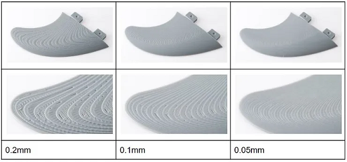

- 0.2mm, se tiene un modelo que tiene una curvatura o superficie muy suave que requiere muchas capas para que sea continua y tenga un acabado liso como se necesita.
- 0.1mm. Ya podemos ver una superficie más suave en que las capas o "escalones" se ven menos pronunciados
- 0.05mm. Se obtiene una superficie mucho más refinada y lisa. En cambio las horas de impresión aumentan exponencialmente.

### **Paredes**

El **[grosor de las paredes](https://formlabs.com/latam/blog/grosor-minimo-pared-impresion-3d/)** es importante para garantizar no sólo las cualidades estéticas, sino también la resistencia y la durabilidad, y para dar una buena base para el postratamiento. 
Una de las principales ventajas de tener el grosor de pared correcto al imprimir en 3D es que ayudará a reducir la tensión interna y por lo tanto el *warping*, pero con algunos materiales (los metales, por ejemplo) un exceso de material también puede provocar más tensión interna.

Por otro lado, si las paredes son demasiado gruesas, se desperdicia material y dinero, y la impresión tardará más en completarse. 
En piezas de plástico, puede generar grietas y causar problemas de disipación del calor en la pieza. Además, cuanto más gruesas sean las paredes, mayor será la contracción del material de la impresión, lo que también provoca deformaciones.

*¿Cómo determinar el grosor de las paredes?*

Hay que tener en cuenta que el grosor está ligado al material más que al proceso.

En esta caso nos centramos en impresión 3D FDM:
Un determinante común del grosor de la pared es un múltiplo del diámetro de la boquilla.

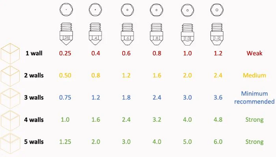

La mayoría de las boquillas para impresión FDM rondan los 0,4 mm, para la que se recomienda un grosor de pared de al menos 0,8 mm (el doble de la boquilla). Para una pieza más resistente, se puede aumentar el múltiplo hasta tres o cuatro veces (entre 1,2 mm y 1,6 mm). No se recomienda sobrepasar ese grosor, el “rango mágico” oscila entre 0,8 y 1,6 mm para los materiales plásticos comunes.
Mantener los múltiplos a números enteros de la boquilla, un grosor de pared que sea 1,5 veces la boquilla puede causar superposición en las capas de las paredes exteriores y ralentizar la impresión.

### **Relleno**

El **[relleno](https://www.3dnatives.com/es/guia-patrones-relleno-impresion-3d-170720232//)** para impresión 3D es la estructura interna de una pieza. 
El objetivo del relleno es optimizar el peso, la resistencia y el tiempo de impresión de la pieza. Existen muchos patrones diferentes.
La impresión de piezas completamente densas suele ser innecesaria y supone un desperdicio de material. El relleno puede colocarse estratégicamente para proporcionar resistencia allí donde las cargas en servicio de la pieza son mayores. Una mayor densidad de relleno significa un mayor porcentaje de relleno.

Distintos patrones de relleno en Impresión 3D FDM:

- Rectilíneo
- Concéntrico
- Giroide
- Rejilla
- Octetos

### **Soportes**

Los **[soportes](https://www.3dnatives.com/es/guia-soportes-de-impresion-3d-200920222/)** son estructuras que se imprimen junto a nuestro modelo pero que no son parte de la pieza. Sirven para soportar las partes que sobresalen y exceden 45º. 

Por lo general, los voladizos de hasta 45 grados pueden imprimirse sin perder calidad, esto se debe a que cada nueva capa tiene suficiente soporte para permanecer intacta y hacer posible la impresión. 

Una buena forma de evitar los soportes es usar la regla de los 45 grados: si mantenemos las partes voladas de nuestro diseño por debajo de 45º de inclinación, eliminaremos la necesidad de usar material de soporte y conseguiremos que nuestra impresión sea limpia y uniforme. Por encima de esa inclinación, será necesario el uso de soportes, perjudicando el resultado final.

### **Plataforma de Adherencia**

Es muy común que al imprimir piezas que ocupan mucha superficie, las esquinas tiendan a levantarse, a este efecto se le llama **[warping](https://www.3dnatives.com/es/warping-impresion-3d-que-hacer-100120232/#!)**.

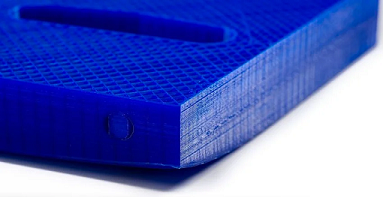

Esto es debido a la contracción: el material sale del extrusor a más de 200° C, choca con la plataforma que está a unos 60°, o en ocasiones a temperatura ambiente, y se enfría, creando una contracción. El material del centro tira del de las esquinas, provocando que las esquinas se levanten.

**[¿Cómo evitar el warping?](https://support.makerbot.com/s/article/1667337577679)**

- Utilizar siempre impresoras con la base calefactada. 
- Usar la base caliente incluso con filamentos que no la necesite (como el filamento PLA, sin llegar a la deformación del material).
- Añadir soportes circulares a las esquinas de la pieza. Estos soportes se cortarán al sacar la pieza.
- Es vital que la impresora esté bien calibrada. 
- Adhesivo para impresora 3D: ayudará a mantener la pieza bien pegada a la base calefactada

**[Tipos de Plataforma de Adherencia](https://filament2print.com/es/blog/23_skirt-brim-raft.html)**.

### **Reparación de errores en Archivos .STL**

Existen programas de reparación que permiten a los usuarios evitar los defectos no imprimibles en sus archivos STL. Estos programas permiten reparar el archivo STL antes de enviar el modelo a imprimir en 3D. Este es uno de los últimos pasos en su flujo de trabajo de impresión 3D, después del modelado y el corte.

**[NetFabb (Instalación y uso)](https://youtu.be/GZArmZUk8cU?si=Ui3i0DODroweNpwA)**.

### **Materiales FDM**

La mayoría de las impresoras 3D utilizan un filamento de material termoplástico, que durante la impresión sale derretido del extrusor y luego se endurece a medida que se enfría.

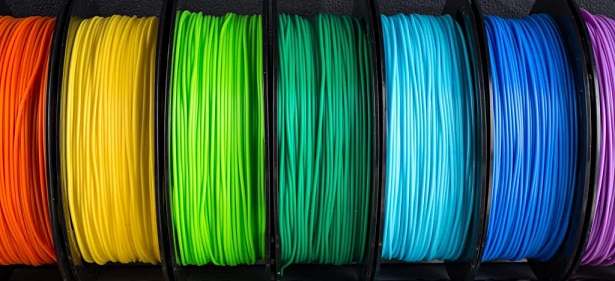

Desde el comienzo de la tecnología se han utilizado 3 tipos diferentes de diámetro de filamento:  1.75mm , 2.85mm y 3mm (Hoy en día el 80% de las impresoras 3D FDM utilizan la medida de 1.75mm)

**[Materiales más comunes](https://www.impresoras3d.com/la-guia-definitiva-sobre-los-distintos-filamentos-para-impresoras-3d/)**:

- PLA (Ácido Poliláctico)
- ABS (Acrilonitrilo Butadieno Estireno)
- PET-G (Tereftalato de Polietileno Glicolizado) 
- TPU (Poliuretano Termoplástico)
- PVA (Alcohol Polivinílico)
- PP (Polipropileno)
- PA (Poliamida o Nylon)
- Materiales con cargas de fibras de vidrio y de carbono

### **Software Slicer**

El software slicer o de corte es la herramienta que traduce un modelo 3D a un lenguaje que la impresora 3D puede interpretar: Toma un modelo 3D, generalmente en forma de archivo STL u OBJ, y lo divide en capas. Luego genera comandos de código G para cada capa, indicando a la impresora dónde mover y extruir el filamento.

**[Cura](https://ultimaker.com/es/software/ultimaker-cura/)**
**[Cura plugins](https://marketplace.ultimaker.com/app/cura/plugins)**

**[OrcaSlicer](https://github.com/SoftFever/OrcaSlicer/releases)**

**[PrusaSlicer](https://www.prusa3d.com/es/pagina/prusaslicer_424/)**

**[ideaMaker](https://www.raise3d.eu/?my_region=Spain )**

En los laboratorios de UTEC, se cuenta con Impresoras 3D del tipo RAISE, modelo PRO2 PLUS.

### **Escaneo 3D**

El **[escaneo 3D](https://youtu.be/L6ax4_hAc0E?si=PClVgeJosRSt9a3C)** es la recolección de datos del mundo físico, los cuales, por ejemplo, se pueden usar para reconstruirlos en un modelo 3D digital. La forma en cómo se da el escaneo 3D depende del tipo de tecnología que integre el escáner y el tipo de datos que queremos capturar.

**Escaneo por luz estructurada**
Se basa principalmente en la proyección de unos patrones de luz dirigidos al objeto a escanear y la observación de la deformidad de la misma sobre el objeto. Este tipo de escáneres se componen de un proyector que genera esos patrones de luz de forma estables y unas cámaras que captan la distancia entre cada punto dentro del campo de visión que tiene.

Dentro de esta tecnología, podemos dividir la fuente de luz en dos: escaneo con luz visible, en este caso hablaremos de LEDs, y, por otro lado, luz no visible que correspondería a escaneo por luz infrarroja.

**Escaneo por triangulación láser**
Crea una imagen 3D a través de la triangulación: funciona mediante la proyección de un punto o línea láser en el objeto y un sensor mide la distancia que lo separa de la superficie del objeto. Este tipo de escáneres pueden capturar con exactitud un objeto 3D en forma de millones de puntos.

## Actividad MT05

**Objetivos:**

- Generar un archivo .gcode a partir de un modelo 3D siguiendo los tutoriales y las instrucciones, para imprimir en la semana de fabricación FP02.
- Documentar el proceso y publicarlo en el repositorio de github.

**Pasos realizados siguiendo el tutorial disponible en la plataforma EDU:**

**1** Descargar el archivo5.f3d  

**2** Abrirlo en FUSION 360 y exportarlo como .STL (binario)

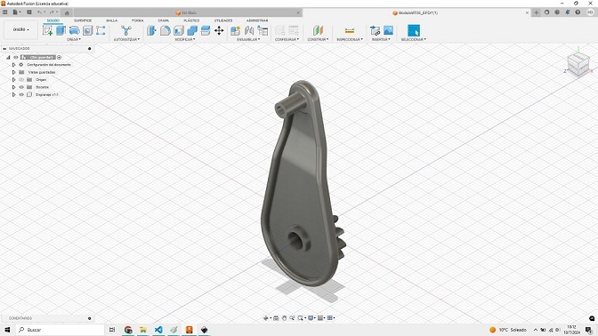
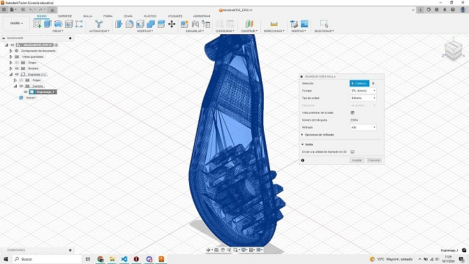

*Imagen 1: Modelo en Fusion 360 / Imagen 2: Exportación de modelo 3D a malla poligonal (.stl)*

**Valores para la exportación:**

- Formato: STL (binario)
- Tipo de unidad: milimetro
- Vista preliminar: ok
- Refinado: alto

**3** Importar el archivo .STL generado previamente en el software de Impresión 3D IDEAMAKER

**4** Seleccionar el extrusor (pico) IZQUIERDO para realizar el código.

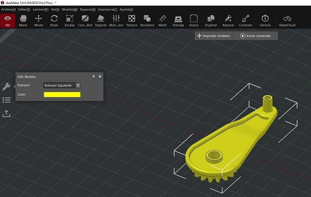

*Imagen: Archivo .stl en IdeaMaker y elección de extrusor izquierdo*

**5** Ubicar la pieza en la posición que crea más conveniente para su fabricación mediante tecnlogía FDM (Utilizar los comandos de MOVER Y ROTAR)

**6** Escalar y aumentar tamaño (manteniendo proporciones) a un 150% 

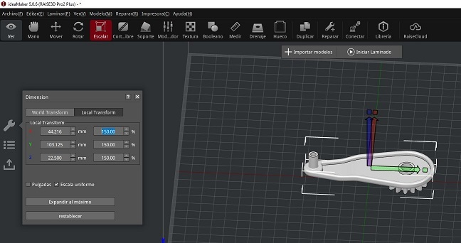

*Imagen: Escala uniforme a 150%*

**7** Generar soportes y base de construcción del tipo BALSA

**8** Seleccionar altura de capa de 0.2mm y 2 perímetros de pared para el modelo

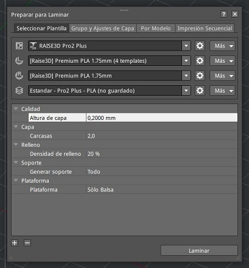
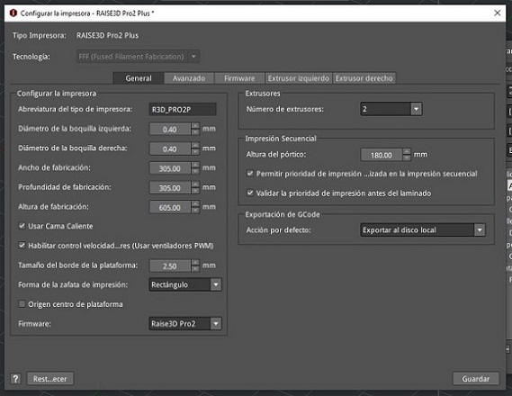

*Imagen1: Configuración de laminado (o corte) del modelo / Imagen2: Configuración de la impresora 3D*

**Valores para el laminado:**

- Tipo de impresora: RAISE3D Pro2 Plus
- Extrusor izq.: Premium PLA 1.75mm (4 templates)
- Extrusor dcho.: Premium PLA 1.75mm 
- Plantilla: Estandar - Pro2 Plus - PLA
- Altura de capa: 0.2mm
- Carcasa: 2.0
- Relleno: 20%
- Soporte: Todo
- Plataforma: Sólo Balsa

**Valores para la impresora:**

- Tipo de impresora: RAISE3D Pro2 Plus
- Diámetro boquilla izq.: 0.40mm
- Diámetro boquilla dcha.: 0.40mm
- Ancho fabricación: 305mm
- Prof. fabricación: 305mm
- Altura fabricación: 605mm
- Cama caliente: ok
- Control velocidad: ok
- Tamaño borde plataf.: 2.50mm
- Forma zafata impr.: Rectángulo
- N° de extrusore: 2
- Altura del pórtico: 180mm
- Permitir prioridad de impresión: ok
- Validar la prioridad de impresión: ok
- Exportación de GCode: al disco local

Nota: previo al laminado, en la configuración del perfil de impresión, verifiqué que la temperatura de la cama estaba en 60°C y la temperatura de los extrusores en 205°C.

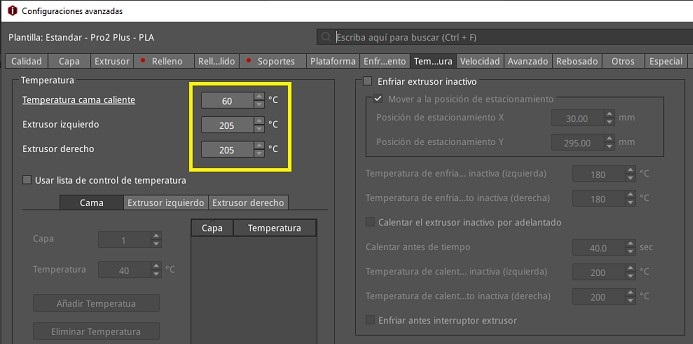

**9** Generar el feteo o corte del modelo , previsualizarlo , analizar la construcción en todas sus capas (visualmente)

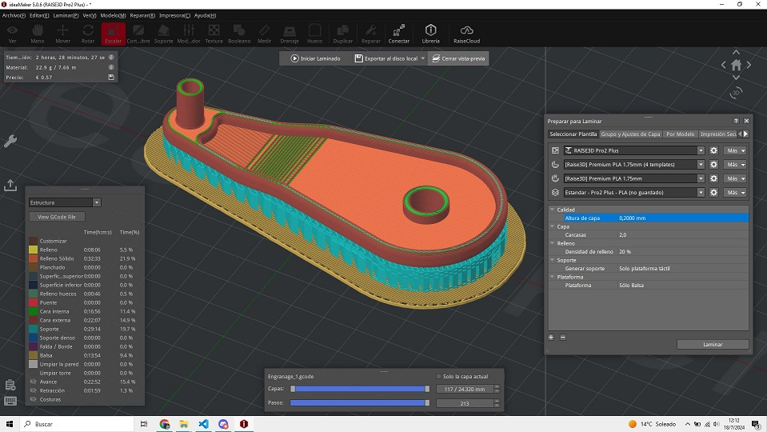

*Imagen: Vista previa de laminado (o corte) del modelo*

*Captura de visualización de las capas*

**10** Exportar el CódigoG (archivo .gcode)

**[Link de descarga](https://drive.google.com/file/d/1spaUE2ObPKEGUUoCLZg8aHEnh9E039yL/view?usp=sharing)** 

### **Práctica FP02**

**Operación de Máquina y Medidas de Seguridad**

La seguridad personal es una consideración importante al trabajar con impresoras 3D.

Utiliza equipo de protección personal, como guantes y gafas de seguridad, al manipular materiales y limpiar la impresora.

Evita tocar partes calientes de la impresora durante o después del proceso de impresión.

**[Artículo de la NANOTECHNOLOGY RESEARCH CENTER](https://edu2.utec.edu.uy/asset-v1:UTEC+EFDI+2023+type@asset+block@3D-Printing-with-Filaments-Health-and-Safety-Questions-to-Ask.pdf)**

**Visita a LabA Durazno**

El día de visita y práctica fue el 8 de agosto. Nos reciberon Joaquín, Facundo y Martina.
Pudimos comparar la pieza del ejercicio impresa con diferente orientación en FDM, un tema que era parte del ejercicio y que hablamos en clase. En este caso, como se ve en las imágenes se logra un mejor acabado de la pieza con el engranaje hacia arriba (que por su uso es la parte de la pieza que necesita quedar con mejor terminación).

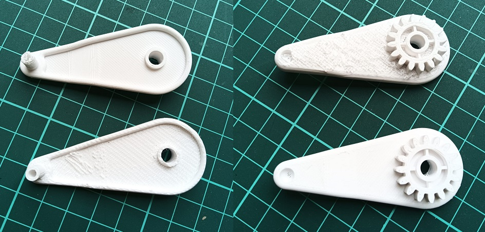

También observamos el proceso de impresión de 3 tipos de impresoras: FDM (Modelado por Deposición Fundida), SLS (Sinterizado Selectivo por Láser) y SLA (Estereolitografía). 

Otras piezas impresas en el LabA:

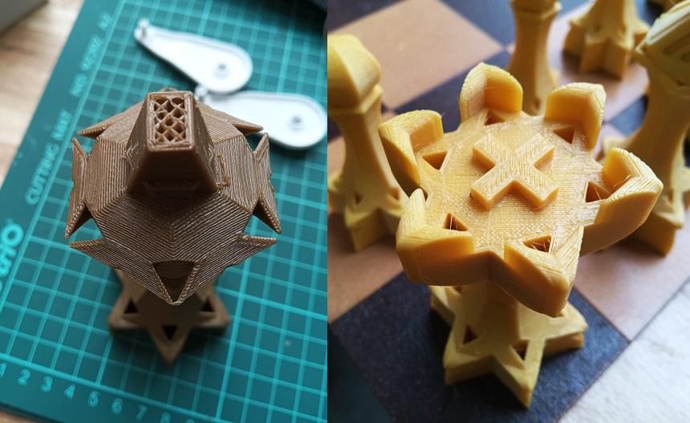

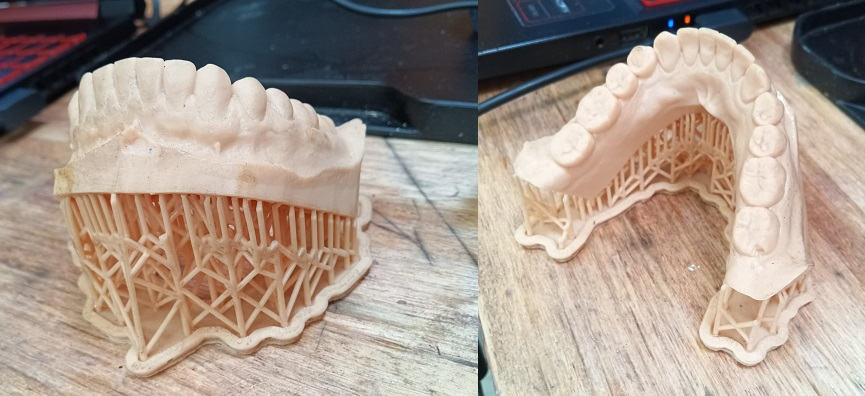

## Reflexiones

*En este módulo pude acercarme a la impresión 3D y las diferentes tecnologías disponibles, que no conocía. La práctica en el LabA fue fundamental para entender el funcionamiento y las dificultades que puede tener el uso de cada tipo de impresora. Me entusiasma poder seguir aprendiendo sobre impresión 3D para aplicarla en futuros proyectos, especialmente como herramienta de prototipado.* 
