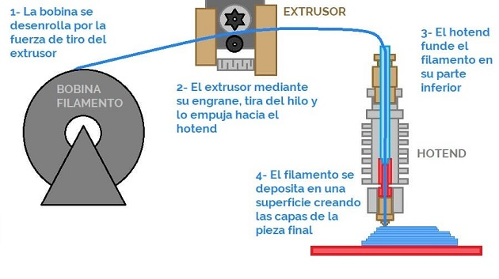
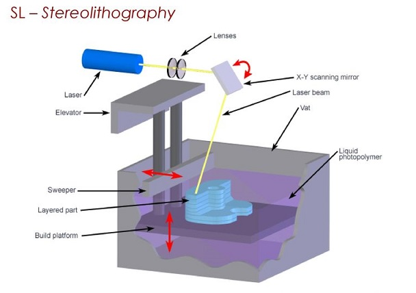
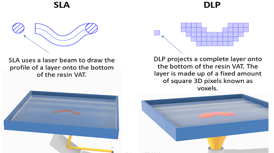
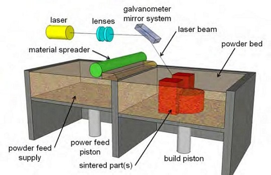

## MT05 Impresión y escaneo 3D
Las clases teóricas fueron dictadas por Julia Leirado y Eduardo Chamorro de FAB LAB Barcelona, y Maximiliano Torres, docente encargado de fabricación digital en UTEC.

En este módulo  trabajamos sobre manufactura asistida por computadora para **[Impresión 3D](https://es.wikipedia.org/wiki/Impresi%C3%B3n_3D)**.

## Conceptos Generales
Volvemos sobre los conceptos CAD y CAM trabajados en el módulo **[MT03](https://mvicogarcia.github.io/Victoria_Garcia/tecnicos/mt03/#conceptos)**.

La **[Impresión 3D](https://formlabs.com/latam/3d-printers/)** es el proceso de creación de objetos mediante el depósito de capas de material unas sobre otras. 
Se denomina **[fabricación aditiva (AM)](https://markforged.com/es/resources/blog/additive-manufacturing-101-guide-the-basics)**.

**Ventajas:**

- ELABORACIÓN BAJO DEMANDA, sin costos por matricería
- FABRICACIÓN COMPACTA Y PORTÁTIL
- PRECISIÓN EN LA REPRODUCCIÓN FÍSICA
- BAJO COSTO, con respecto a la fabricación tradicional. 

**[Más sobre impresión 3D](https://markforged.com/es/resources/learn/3d-printing-basics)**

### Impresión 3D FDM 

*Imagen: Principio de funcionamiento de una Impresora FDM*

La **[impresión 3D FDM](https://youtu.be/rkUILe3zv98?si=tSJY_1L5mnho3RW5)** (fused deposition modeling) es un proceso de impresión 3D por extrusión de material. Un carrete alimenta filamento termoplástico a través de un extrusor que calienta, funde y extrude el plástico a través de una boquilla fina. 

El extrusor y la boquilla componen el cabezal de impresión, que se mueve a lo largo de la placa de construcción para ir dibujando cada capa, una después de otra. Sigue un conjunto de instrucciones de un archivo concreto, generalmente en formato GCODE, que, dicho de forma sencilla, contiene las secciones de una maqueta 3D.

Cuando el cabezal de impresión deposita el filamento, el plástico se funde en la capa anterior y se endurece, con ayuda de ventiladores de refrigeración montados en el cabezal de impresión y/o dentro de la cámara de construcción.

Las piezas impresas mediante FDM son anisotrópicas, es decir, son más sólidas en un sentido que en otro. Sus capas suelen verse a simple vista y pueden requerir un posprocesamiento, como el enarenado, centrifugado, pulido por vapor, etc.

Las piezas impresas en 3D por FDM suelen ser menos precisas y menos duraderas que las piezas que se elaboran con otros métodos de fabricación aditiva, como SLS , SLA o DLP. 

Dentro de la tecnología FDM, existen diferentes **[tipos de impresoras](https://www.3dnatives.com/es/tipos-impresoras-3d-fdm-190620172/)**, de acuerdo a su estructura: 

- Impresoras Cartesianas
- Impresoras CoreXY
- Impresoras Delta
- Impresoras polares

### Impresión 3D SLA / DLP 

**[Impresión 3D SLA](https://youtu.be/yW4EbCWaJHE?si=C_pWxHq2C_nRKT96)** (stereolithography) 

**[Impresión 3D DLP](https://youtu.be/97ARLiTHjX0?si=uhAPOfCFONdzJ8gN)** (procesamiento digital de luz)

*Imagen: Principio de funcionamiento de una Impresora SLA*

El principio básico es un tanque que contiene líquido fotosensible (resina) que se cura capa por capa mediante una fuente de calor para fabricar el objeto.

Los objetos impresos son casi perfectamente lisos, muye detallados y las capas son casi invisibles para el ojo humano. Las desventajas de esta tecnología son una superficie de impresión más pequeña, el costo de los materiales y la toxicidad de las resinas líquidas. 

Los objetos impresos no son aptos para el uso inmediato una vez finalizado el trabajo de impresión. Es necesario lavar el objeto con alcohol isopropílico y curarlo con luz ultravioleta.

El DLP (procesamiento digital de luz), es muy similar a la SLA con una diferencia significativa: mientras que las máquinas de SLA utilizan un láser que traza una capa, una máquina de DLP utiliza una fuente de luz proyectada para curar toda la capa a la vez. La pieza se forma capa a capa. Al curar toda la capa a la vez, es mucho más rápida que la SLA.

*Imagen: Comparativo Funcionamiento SLA y DLP*

En todos los procesos de impresión 3D de resina, es necesario el **[posprocesamiento de las piezas](https://www.3dnatives.com/es/postratamiento-de-piezas-impresas-en-3d-210320192/)**. 

### Impresión 3D SLS 

*Imagen: Principios y características principales de la impresión 3D SLS*

El **[sinterizado selectivo por láser](https://youtu.be/FiMQ8kG7394?si=FsthAvShzDhfweR5)** (selective laser sintering) es una tecnología de fabricación aditiva que utiliza un láser de alta potencia para **[sinterizar](https://es.wikipedia.org/wiki/Sinterizaci%C3%B3n)** pequeñas partículas de polímero en polvo y convertirlo en una estructura sólida basada en un modelo 3D. 
Requiere un alto nivel de precisión y un control estricto a lo largo de todo el proceso de impresión. La temperatura del polvo y la de las piezas (sin terminar) no debe variar más de 2 ºC durante las tres fases del precalentado, sinterizado y almacenamiento antes de retirar la pieza, de forma que se minimice la posibilidad de que se produzca deformación, esfuerzos o distorsión provocada por el calor.

### Altura de Capa y Resolución

### Paredes

### Soportes

### Plataforma de Adherencia

### Reparación de errores en Archivos .STL

### Materiales FDM

### Software Slicer

### Escaneo 3D

## Actividad MT05

Objetivos:

- Generar un archivo .gcode a partir de un modelo 3D siguiendo los tutoriales y las instrucciones, para imprimir en la semana de fabricación FP02.
- Documentar el proceso y publicarlo en el repositorio de github.

### Práctica FP02

## Referencias

## Reflexiones

*...* 
