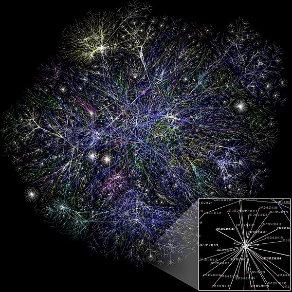
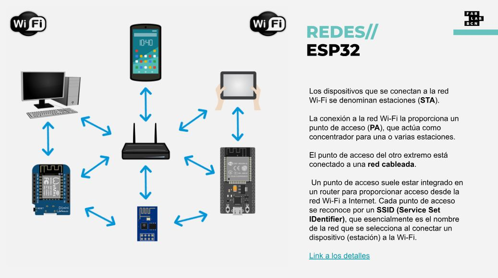
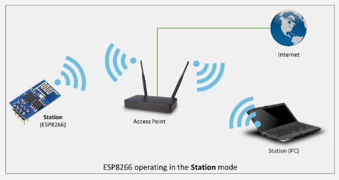
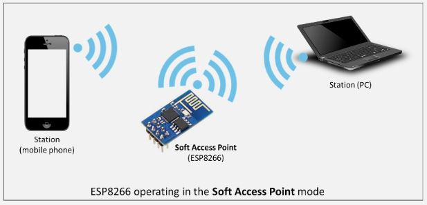
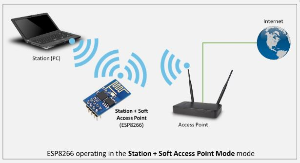
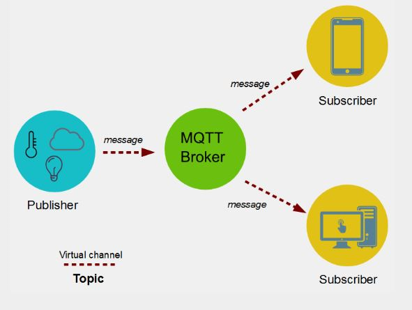
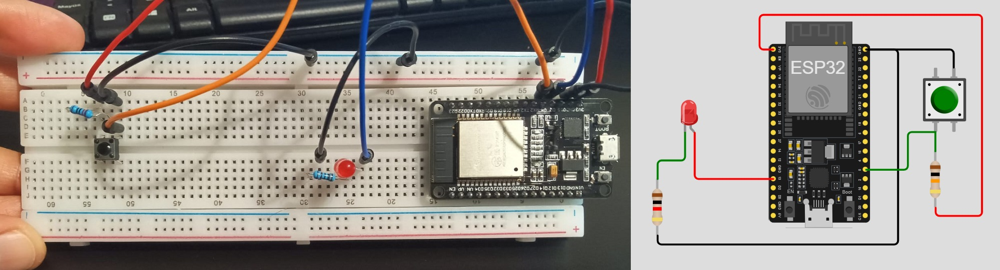
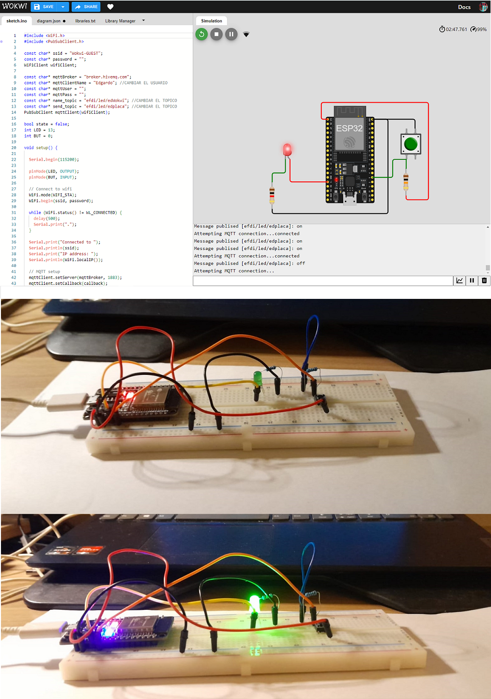
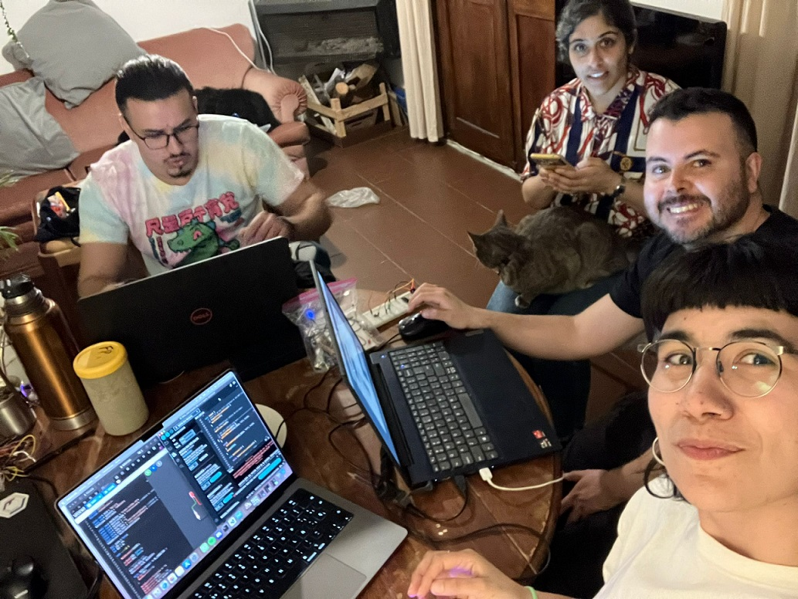

## MT06 Networking  

Las clases teóricas fueron dictadas por Josep, docente de Fab Lab Barcelona.

*Mapa parcial de Internet basado en la información obtenida del sitio opte.org el 15 de enero de 2005. Cada línea dibujada entre dos nodos representa el enlace entre dos direcciones IP.*

## Conceptos 

**Internet**: es un *conjunto descentralizado de redes de comunicaciones interconectadas*, que utilizan la familia de protocolos TCP/IP, lo cual garantiza que las redes físicas heterogéneas que la componen constituyen una red lógica única de alcance mundial.1​ Sus orígenes se remontan a 1969, cuando se estableció la primera conexión de computadoras, conocida como ARPANET, entre tres universidades en California (Estados Unidos).

**World Wide Web**: conjunto de *protocolos* que permite, de forma sencilla, la consulta remota de archivos de hipertexto. Esta fue un desarrollo posterior (1990) y utiliza internet como medio de transmisión.

**Acceso a Internet**:  es el sistema de enlace con que el computador, dispositivo móvil o red de computadoras cuenta para conectarse a Internet. Se puede acceder desde una conexión por línea conmutada, banda ancha fija (a través de cable coaxial, cables de fibra óptica o cobre), vía satélite, banda ancha móvil y teléfonos celulares o móviles con tecnología 2G/3G/4G/5G.

**Internet de las Cosas (IoT)**: describe objetos físicos (o grupos de estos) con sensores, capacidad de procesamiento, software y otras que se conectan e intercambian datos con otros dispositivos y sistemas a través de internet u otras redes de comunicación. Los dispositivos no necesitan estar conectados a la Internet pública. Sólo necesitan estar conectadas a una red y ser direccionables individualmente.

**Redes / Protocolos**

Una *Red* es un conjunto de ordenadores conectados entre si a través de líneas de comunicación.
Los *Protocolos* son conjuntos de normas sobre formatos de mensajes y procedimientos que permiten a máquinas y programas de aplicación intercambiar información.

El uso de Redes y Protocolos de comunicación se basa en la idea de distribuir y conectar sistemas or motivos de:

- Ubicación
- Paralelismo
- Modularidad
- Interferencia

**Redes por cable**: la transmisión de información se realiza por uno o más cables. 

**Comunicación Asíncrona / Protocolo Serial o RX/TX**: la información se envía a baja velocidad, ambos finales de comunicación tienen que usar la misma velocidad de transmisión.

**Comunicación Síncrona / Protocolos I2C, SPI, LIN**: se envía una señal de reloj que sincroniza ambas partes, permite una comunicación más rápida. Suelen tener una estructura  donde un "maestro" gestiona el resto de la red.

**Comunicación en Paralelo**: transmite muchos bits a la vez, en 8, 16 o más cables (se envían muchos datos con muchos cables). 

**Comunicación en Serie**: se envían los datos con una señal de referencia, un bit a la vez, en serie. No suelen tener más de 4 cables.

**Redes inalámbricas**: la *frecuencia* de la onda utilizada para la comunicación es el factor más importante para su implantación y clasificación. 
Dependiendo de la *frecuencia* y de la *potencia* de la señal tendremos más o menos penetración y con ello, más o menos alcance.

Las *antenas* cambian cómo se radía la señal, pueden ser:

- Monopole, Dipole
- Helical
- Patch

**Modulación**: La codificación viene dada por cómo realizamos la modulación de una señal, lo que genera muchos tipos.

**Protocolos de Redes inalámbricas**: 

- Radiofrecuencia
    - WiFi
    - ZigBee
    - Bluetooth, BLE
    - RFID, NFC

- Óptico
    - Infrarrojo
    - LiFi

- Acústico
    - AFSK

### Placa ESP32

Se trata de un microcontrolador que integra tecnologías WiFi y Bluetooth, que le proporcionan conectividad con internet u otros dispositivos.

**[Funciones útiles](https://randomnerdtutorials.com/esp32-useful-wi-fi-functions-arduino/)**

**Modo Estación**: (STA) se utiliza para que el módulo ESP se conecte a una red Wi-Fi establecida por el punto de acceso.

**Soft-AP**: La placa ESP puede funcionar similar a un AP, excepto que no tiene interfaz a una red cableada.

Otra aplicación es la creación de redes malladas, funcionando tanto en modo Soft-AP como en modo Estación.

### MQTT

Es un **protocolo** que utiliza un modelo de **publicación/suscripción** basado en eventos para poder enviar mensajes a los clientes.

La comunicación pasa por un punto central llamado **broker** que gestiona el envío de mensajes entre emisores y receptores.

El **topic** es una forma de categorizar los mensajes. Cada cliente, el enviar un mensaje lo hace incluyendo un topic, y para recibir mensajes se suscribe a un topic.

### Lecture

Tuvimos una clase inspiracional con Oscar González, que nos presentó el proyecto **[Smart Citizen](https://smartcitizen.me/)**, que focaliza en el rol del ciudadano como agente de cambio de su entorno, mediante herramientas de monitoreo y medición para generar datos y posteriores acciones. Destacó la importancia de utilizar herramientas y software de código abierto en el desarrollo de proyectos, enfatizando la colaboración. Además, discutió los desafíos técnicos y sociales de los proyectos de monitorización ambiental, así como las posibles vías de explotación comercial.

## Actividad MT06

**Objetivos:**

- Leer un input 
- Publicarlo por MQTT
- Suscribirse a la publicación del input de un compañero y usarlo para controlar actuador

**Recursos utilizados:**

- Arduino IDE
- Conexión WiFi
- Wokwi
- Placa ESP32 
- Kit de electrónica (protoboard, LED, resistencias, interruptor, cables)
- Multímetro

**1**  Instalar la placa ESP32 en Arduino IDE

Instalé la placa ESP32 siguiendo los pasos de este **[tutorial](https://randomnerdtutorials.com/installing-the-esp32-board-in-arduino-ide-windows-instructions/)**, compartido por el docente. 

En el menú *Preferencias*, se abre un cuadro de diálogo. En el campo *URL de Administrador de placas adicionales*, debemos agregar: *https://raw.githubusercontent.com/espressif/arduino-esp32/gh-pages/package_esp32_index.json*

Luego elegimos la placa "ESP32 Dev Module" y el puerto que corresponda en nuestra computadora.

**2** Armado de la placa de prueba

Armé la placa de acuerdo al esquema de Wokwi que nos compartió Josep, utilizando el módulo ESP32, 1 Resistencia de 1kΩ + led,  1 Resistencia de 10kΩ + interruptor.

**3** Ejercicio 1: Comunicación Serial

Para conectar la placa con la computadora por USB, es necesario un cable micro USB a USB que haga transferencia de datos.

Aquí está el **[Código](https://docs.google.com/document/d/1UMc_qvElfFw0MUEJ-5eqEtJEGUaGrUDGHLj8q1K5aBM/edit?usp=sharing)** que utilicé para este ejercicio, conecté el LED en el pin 2 y el interruptor en el pin 4.

Además, en mi caso, tuve que instalar un **[driver para el puerto USB](https://www.silabs.com/developers/usb-to-uart-bridge-vcp-drivers)**.

**4** Ejercicio 2: Conectarse con un compañero/a

Para este ejercicio, nos juntamos a trabajar con Lucía, Edgardo y Franco.
Hicimos varias pruebas con las computadoras y materiales de cada uno, repasando las clases grabadas, hasta que pudimos realizar el ejercicio.
Luego del encuentro presencial, volví a intentarlo por mi cuenta. Tuve que usar la conexión wifi de mi celular, porque la de mi casa es 5G, y Josep nos había advertido que el módulo no funcionaría con esa conexión. Pude volver a hacerlo funcionar, pero con una respuesta muy lenta desde el simulador a la placa y viceversa. Llegué a la conclusión de que puede ser un tema de la conexión.
Otro error que encontré y no supe resolver, es en el monitor serie de Arduino, que no me mostraba correctamente los mensajes.

Aquí está el **[Código](https://docs.google.com/document/d/1CsM0c7ySZivnFYKbRN0Cm0JNbJxmrPOhX3HlvLOeLHM/edit?usp=sharing)** que utilicé para este ejercicio.

En Arduino, se deben instalar 2 bibliotecas: PubSubClient, que nos permite comunicarnos por el protocolo MQTT, y la biblioteca WiFi.
Para ello seleccionamos dentro del menú *Herramientas*, *Administrar Bibliotecas…*. Con esto se abrirá la pestaña del Gestor de Librerías, allí podemos filtrar por tipo, tema o buscar directamente la que necesitemos.

**[Link al ejercicicio en el simulador de Wokwi](https://wokwi.com/projects/409772788566161409)**. Corroborar los tópicos en cada uno para que envíe y reciba los mensajes correctamente.

También probé prender el LED de la placa de Edgardo desde el simulador:

## Reflexiones

*Fue un módulo que me costó bastante entender, y me dí cuenta que todavía me faltaba asentar algunos conceptos que vimos en el módulo anterior de electrónica. Gracias a los compañeros que me dieron una mano pude resolver los ejercicios y comprender mejor lo que vimos en clase.* 

