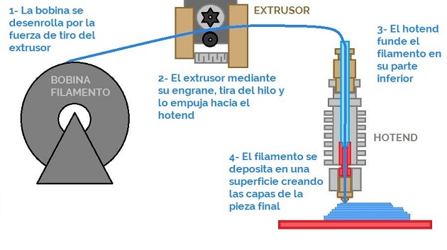

## MT08 Networkin  *DOCUMENTACIÓN EN PROCESO*

Las clases teóricas fueron dictadas por Josep, docente de Fab Lab Barcelona.

## Conceptos 

## Actividad MT06

**Objetivos:**

- Leer un input 
- Publicarlo por MQTT
- Suscribirse a la publicación del input de un compañero y usarlo para controlar actuador

**Recursos utilizados:**

- Arduino IDE
- Wokwi
- Kit de electrónica
- Multímetro 

**1**  Instalar la placa ESP32 en Arduino IDE
Instalé la placa ESP32 siguiendo los pasos de este **[tutorial](https://randomnerdtutorials.com/installing-the-esp32-board-in-arduino-ide-windows-instructions/)**, compartido por el docente. 

En el menú *Preferencias*, se abre un cuadro de diálogo. En el campo *URL de Administrador de placas adicionales*, debemos agregar: *https://raw.githubusercontent.com/espressif/arduino-esp32/gh-pages/package_esp32_index.json*

Luego elegimos la placa "ESP32 Dev Module" y el puerto que corresponda en nuestra computadora.

**2** Armado de la placa de prueba
Armé la placa de acuerdo al esquema de Wokwi que nos compartió Josep, utilizando el módulo ESP32, 1 Resistencia de 1kΩ + led,  1 Resistencia de 10kΩ + interruptor.

**3** Ejercicio 1: Comunicación Serial

Para conectar la placa con la computadora por USB, es necesario un cable micro USB a USB que haga transferencia de datos.

Aquí está el **[Código](https://docs.google.com/document/d/1UMc_qvElfFw0MUEJ-5eqEtJEGUaGrUDGHLj8q1K5aBM/edit?usp=sharing)** que utilicé para este ejercicio, conecté el LED en el pin 2 y el interruptor en el pin 4.

Además, en mi caso, tuve que instalar un **[driver para el puerto USB](https://www.silabs.com/developers/usb-to-uart-bridge-vcp-drivers)**.

**4** Ejercicio 2: Conectarse con un compañero/a

Para este ejercicio, nos juntamos a trabajar con Lucía, Edgardo y Franco.
Hicimos varias pruebas con las computadoras y materiales de cada uno, repasando las clases grabadas, hasta que pudimos realizar el ejercicio.
Luego del encuentro presencial, volví a intentarlo por mi cuenta. Tuve que usar la conexión wifi de mi celular, porque la de mi casa es 5G, y Josep nos había advertido que el módulo no funcionaría con esa conexión. Pude volver a hacerlo funcionar, pero con una respuesta muy lenta desde el simulador a la placa y viceversa. Llegué a la conclusión de que puede ser un tema de la conexión.
Otro error que encontré y no supe resolver, es en el monitor serie de Arduino, que no me mostraba correctamente los mensajes.

Aquí está el **[Código](https://docs.google.com/document/d/1CsM0c7ySZivnFYKbRN0Cm0JNbJxmrPOhX3HlvLOeLHM/edit?usp=sharing)** que utilicé para este ejercicio.
**[Link al simulador de Wokwi](https://wokwi.com/projects/409772788566161409)**. Tener el cuenta los tópicos en cada uno para que envié y reciba los mensajes correctamente.

También intenté prender el LED de la placa de Edgardo desde el simulador:

## Reflexiones

*...* 
