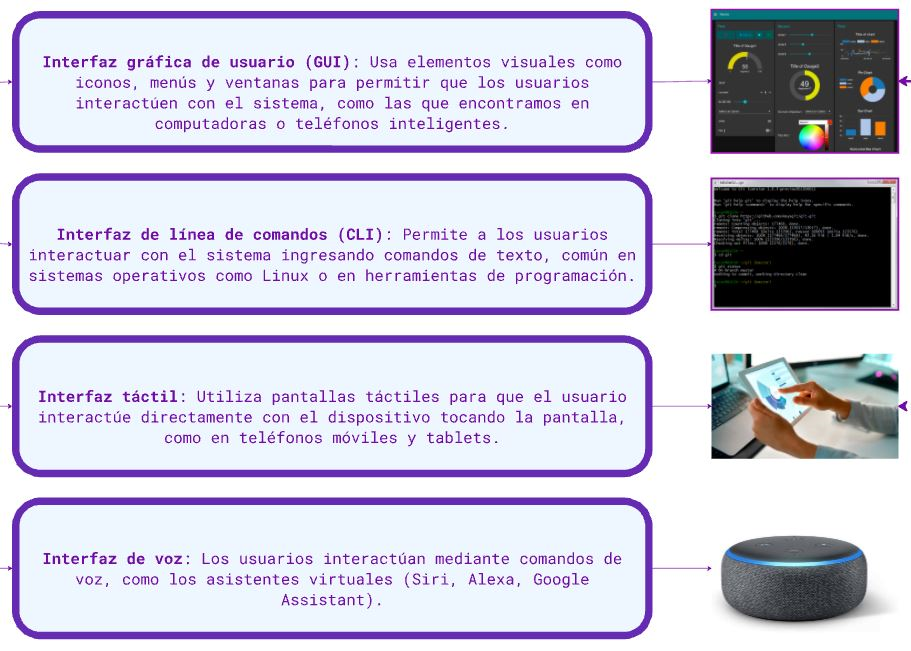
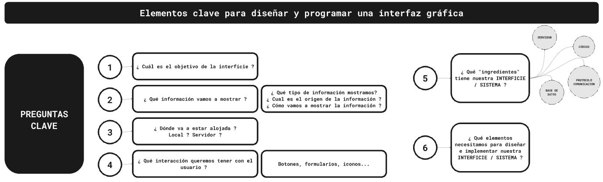

## MT07 Interfaces y aplicaciones

Las clases teóricas fueron dictadas por Xavi, docente de Fab Lab Barcelona.

## Conceptos

**¿Qué es una interfície digital?**

Una interfaz digital es el medio o punto de interacción entre un usuario y un sistema digital, ya sea un software o hardware. 

A través de esta interfaz, los usuarios pueden comunicarse, controlar, recibir o visualizar información de un sistema.

**Elementos clave para diseñarla y programarla**

**Ejemplos de Lenguaje de Programación:**

- Processing
- P5.js
- ARDUINO
- NODE-RED
- PYTHON / HTTPREQUEST / MIRO + OPENAI

**Interfaz con dispositivos:**

- Comunicación Serial
- Websocket
- MQTT
- Solicitud HTTP
- [VR / AR / MR / XR](https://www.unocero.com/vida-digital/vr-ar-mr-xr-diferencias/), ejemplo [A-Frame](https://aframe.io/)

**[Link a Tablero de Miro](https://miro.com/app/board/uXjVKGRsnZ4=/) utilizado en la clase.**

## Referencias y Tutoriales

**[Documentación y ejemplos](https://hackmd.io/s/BJqQMmJL9)**

**[Tutorial App Inventor](https://fablabbcn-projects.gitlab.io/learning/educational-docs/material/extras/week12/appinventor/)**

**[Documentación de Processing](https://fablabbcn-projects.gitlab.io/learning/educational-docs/material/extras/week12/processing/)**

**[Documentación de Blender](https://fablabbcn-projects.gitlab.io/learning/educational-docs/material/extras/week12/blender/)**

## Actividad MT07

**Objetivos:**

Diseña y desarrolla una interfície digital que interaccione (input/output) con el usuario.

Extra: que muestre información de algún sensor, servicio externo, base de datos o cualquier otra fuente de datos.

**Recursos utilizados:**

- Arduino IDE
- Conexión WiFi
- Celular
- Placa ESP32 
- Kit de electrónica (protoboard, LED, resistencias, potenciómetro, cables)
- Multímetro

**Control de led y lectura de potenciómetro a través de web**

Utilicé **[este tutorial](https://www.youtube.com/watch?v=UGh6jUriq-c)** como base para el ejercicio.

*Conexiones de los diferentes elementos en la protoboard.*

1. Abrimos Arduino IDE, y conectamos la el módulo ESP32 con un cable USB.
2. En Herramientas elegimos la placa "ESP32 Dev Module" y el Puerto en el que conectamos (en mi caso COM3).
3. Cargamos el código. **[Descarga de código de Arduino que usé en este ejercicio](https://drive.google.com/file/d/1h4kn-ldO5lpvAOx--186CxKoNQadbmoE/view?usp=drive_link)**.
4. Editamos el ssid y password (líneas 30 y 31), con los datos de la red wifi a la que se conectará la placa ESP32.
5. Editamos el pin de salida donde tenemos conectado el LED (línea 38), en mi caso es el pin 32.
6. Editamos la ubicación del LED en el digitalWrite (líneas 128 y 132).
7. Editamos el pin de entrada donde tenemos conectado el potenciómetro (línea 108), en mi caso es el pin 34.
8. Damos click en verificar para compilar el proyecto y luego en cargar para cargarlo en la placa.
9. Luego de que el código se carga en la placa, abrir el monitor serie para ver los mensajes. Verificar que la velocidad de transferencia de datos de la placa está a 115200 baud en el monitor serie. Si no aparecen mensajes, reiniciamos la placa desde el botón EN.
10. En el Monitor Serie veremos un mensaje mostrando que la placa se conectó al wifi que definimos en el código.
11. Copiar la dirección IP que nos muestra el Monitor Serie, en mi caso: 192.168.1.8. Abrimos esta IP en un navegador web y podemos controlar el LED y el potenciómetro desde cualquier dipositivo conectado al wifi.
12. La interfaz web está generada dentro del código Arduino con lenguaje html. Podemos hacer cambios modificando el código, por ej. yo hice un cambio en la fuente y colores que se muestran (línea 92).

*Controlando el LED desde el celular y la computadora.*

*Controlando el LED y leyendo el potenciómetro desde la computadora.*

## Reflexiones

*Siguiendo el tutorial pude cumplir con el objetivo del ejercicio. Resolví algunos problemas de conexión que ya se me habían presentado en módulos anteriores. Me faltó tiempo para poder experimentar con otras formas de generar la interfaz visual, por ejemplo Processing. Pienso que avancé bastante desde los primeros ejercicios considerando que no tenía experiencia, pero aún me falta mucho por aprender y ejercitar.*
