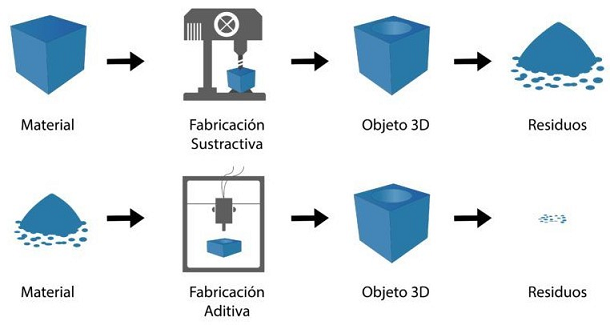
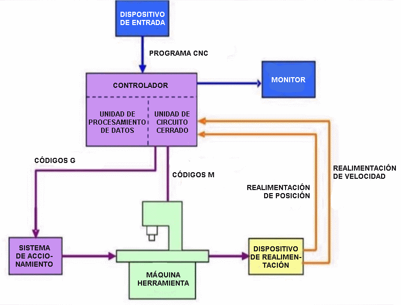
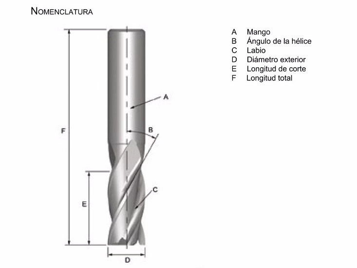
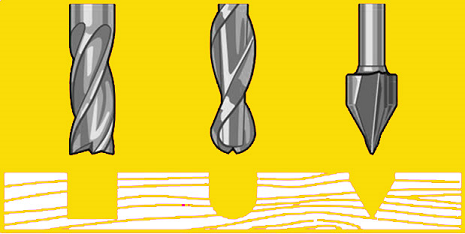
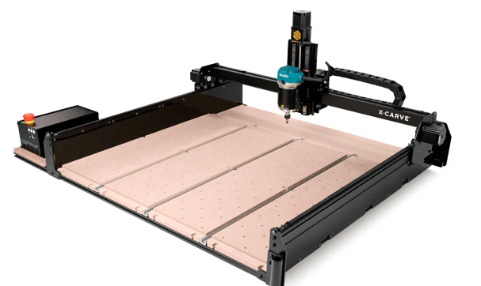

## MT08 Control numérico computarizado (CNC)  

Las clases teóricas fueron dictadas por Maximiliano Torres, docente encargado de fabricación digital en UTEC.

En este módulo aprendimos sobre fabricación con **[Control Numérico Computarizado](https://es.wikipedia.org/wiki/Control_num%C3%A9rico)**.

## Conceptos Generales
Volvemos sobre los conceptos CAD y CAM trabajados en el módulo **[MT03](https://mvicogarcia.github.io/Victoria_Garcia/tecnicos/mt03/#conceptos)**.

*¿Qué es la fabricación sustractiva?*
 
  

Es una técnica utilizada en la fabricación, donde las piezas se consiguen a partir de un bloque sólido al que se le va eliminando el material sobrante, hasta conseguir el resultado deseado. Es el método más recurrente, sobre todo, al trabajar con materiales como el metal o la madera. Y puede realizarse deforma manual o por medio del mecanizado CNC, siendo esta última opción la más eficiente.

El **Control Numérico Computarizado**, también llamado **CNC**, es todo aquel dispositivo que posee la capacidad de controlar la posición y velocidad de los motores que accionan los ejes de la máquina para realizar movimientos.
Entre esas máquinas o herramienta, tanto estáticas como portátiles, podemos mencionar: [fresadora](https://www.demaquinasyherramientas.com/mecanizado/fresadoras-cnc), [torno](https://www.demaquinasyherramientas.com/mecanizado/torno-cnc), [rectificadora](https://www.demaquinasyherramientas.com/maquinas/rectificadoras-tipos-y-usos), máquina de [corte por láser](https://www.demaquinasyherramientas.com/soldadura/comparacion-de-tecnologias-de-corte-termico-mecanizado), por [chorro de agua](https://www.demaquinasyherramientas.com/herramientas-de-corte/corte-con-agua) o por [electroerosión](https://www.demaquinasyherramientas.com/maquinas/maquinas-para-electroerosion), [plegadora](https://www.demaquinasyherramientas.com/maquinas/plegadoras-de-chapas), [brazo robotizado](https://www.demaquinasyherramientas.com/videos/brazo-robotizado), etc.

Sus objetivos son:

- Incrementar la productividad.
- Disminuir el uso de talento humano.
- Generar una mayor autonomía para el uso de máquinas y herramientas.

El sistema de CNC utiliza una serie de órdenes, generadas por un software de control, que serán simuladas, identificadas y codificadas y puestas en marcha para luego ser asumidas por la máquina, utilizando movimientos en un sistema de coordenadas de referencia que especificarán el movimiento del dispositivo o de la herramienta que hace la operación.

Generalmente el Control Numérico Computarizado es utilizado en operaciones específicas de maquinado como son las de torneado y de fresado.

**[Aquí](https://www.amgmetalmecanica.com/evolucion-del-mecanizado-cnc-a-lo-largo-de-la-historia/)** algo de historia sobre las máquinas CNC.

### [¿Cómo funciona una máquina CNC?](https://roboticsandcnccenter.com/cnc-basico-los-3-movimientos-basicos-en-una-maquina-cnc/)

*Diagrama de una máquina CNC típica y sus elementos principales.*

El controlador de las máquinas CNC recibe instrucciones de la computadora (en forma de códigos G y códigos M) y mediante su propio software convierte esas instrucciones en señales eléctricas destinadas a activar los motores que, a su vez, pondrán en marcha el sistema de accionamiento.

Tienen dos o más direcciones programables de movimiento llamadas **ejes**. Un eje de movimiento puede ser lineal (en línea recta) o rotatorio (en una trayectoria circular). 

Se denominan con letras. Los nombres más comunes de los ejes lineales son X, Y y Z, mientras que los más comunes de los ejes giratorios son A, B y C.

El control de movimiento puede realizarse mediante dos sistemas, que pueden funcionar individualmente o combinados entre sí:

- **Valores absolutos (código G90)**, donde las coordenadas del punto de destino son referidas al punto de origen de coordenadas. Se usan las variables X (medida del diámetro final) y Z (medida en dirección paralela al eje de giro del husillo).

- **Valores incrementales (código G91)**, donde las coordenadas del punto de destino son referidas al punto actual. Se usan las variables U (distancia radial) y W (medida en dirección paralela al eje de giro del husillo).

El programa CNC está escrito en un lenguaje de bajo nivel, compuesto por instrucciones **[Generales (código G) y Misceláneas (código M)](https://www.madearia.com/es/blog/g-and-m-codes/)**.

### Fresadora 

Es una máquina diseñada para realizar trabajos de mecanizado por arranque de viruta, mediante el movimiento de una herramienta rotativa de varios filos de corte, denominada **fresa**.

 Mediante el fresado se pueden mecanizar los más diversos materiales, como madera, acero, fundición de hierro, metales no férricos y materiales sintéticos, superficies planas o curvas, de entalladura, de ranuras, de dentado, etc.

Además, las piezas fresadas pueden ser desbastadas o afinadas. En las fresadoras tradicionales, la pieza se desplaza acercando las zonas a mecanizar a la herramienta, permitiendo obtener formas diversas, desde superficies planas a otras más complejas.

**[Fresadora o router CNC](https://www.metalmecanica.com/es/noticias/fresadoras-cnc-cual-es-su-importancia-en-la-metalmecanica).**

Componentes:

- Estructura o Chasis
- Controladora
- Guías lineales y rodamientos
- Motores PAP (paso a paso)
- Mesa de trabajo
- Finales de Carrera o Endstops
- Husillo o Spindler

**Tipos de Router CNC:**

- Router CNC 3 ejes 
<iframe width="560" height="315" src="https://www.youtube.com/embed/lcWn4VEjaio?si=5PklD2XV7dAtpi_k" title="YouTube video player" frameborder="0" allow="accelerometer; autoplay; clipboard-write; encrypted-media; gyroscope; picture-in-picture; web-share" referrerpolicy="strict-origin-when-cross-origin" allowfullscreen></iframe>
- Router CNC 4 ejes 
<iframe width="1080" height="607" src="https://www.youtube.com/embed/QC90mruG-bY" title="Affordable CNC router machine with 4 axis rotary for 3D woodworking" frameborder="0" allow="accelerometer; autoplay; clipboard-write; encrypted-media; gyroscope; picture-in-picture; web-share" referrerpolicy="strict-origin-when-cross-origin" allowfullscreen></iframe>
- Router CNC 5 ejes 
<iframe width="1080" height="607" src="https://www.youtube.com/embed/3VzSk1iOE8Q" title="5axismaker Advanced Digital Replication Scan to CAM" frameborder="0" allow="accelerometer; autoplay; clipboard-write; encrypted-media; gyroscope; picture-in-picture; web-share" referrerpolicy="strict-origin-when-cross-origin" allowfullscreen></iframe>

### Fresas

Importante: Mechas  no son fresas, y fresas no son mechas. Las mechas están diseñadas para sumergirse directamente en el material, cortando axialmente y creando agujeros cilíndricos. Las fresas se utilizan normalmente para tallar horizontalmente y cortar lateralmente.

Son herramientas afiladas, con diferentes formas y tipos de metal, diseñadas para realizar trabajos de corte, desbaste, tallado y grabado de materiales como madera, metal, y plásticos.

Anatomía de una fresa:

**Tipos de Fresas para Router CNC**

<iframe width="1080" height="607" src="https://www.youtube.com/embed/gmlu9BZR3YE" title="STARCAM CNC - Introducción a las herramientas CNC" frameborder="0" allow="accelerometer; autoplay; clipboard-write; encrypted-media; gyroscope; picture-in-picture; web-share" referrerpolicy="strict-origin-when-cross-origin" allowfullscreen></iframe>

Para este módulo, vamos a hacer foco en 3 tipos básicos de herramientas:

- **Fresas planas y helicoidales para ranurado recto:** Son las más comunes, se utilizan para hacer ranuras y cortes planos. El sentido de giro depende del material que se desee trabajar. Por lo general vienen de 2 filos. 

- **Fresas de Bolilla para ranurado o relieve 3D:** Vienen en diseño helicoidal y suelen tener 2 filos. Permiten hacer ranurados y desbastes con forma de semiesfera.  
Se utilizan para hacer ranuras en "U" y operaciones de acabado superficial , o tallado de superficies. Su usan para dar terminación "suave" a las superficies complejas , como los modelos 3D. No son indicadas para corte.

- **Fresas en "V" para tallado y ranurado:** Se utilizan para hacer ranuras y grabados con gran precisión. Su punto de contacto con el material es mínimo, y dependiendo del diámetro y ángulo de su "V" es el grado de detalle que se puede lograr. No suelen tener más de 2 filos. No son indicadas para corte.

### Diseño de piezas para ser Mecanizadas en Router CNC

A la hora de trabajar el material y diseñar nuestros modelos debemos tener en consideración algunos aspectos:

- Ubicación del material, de acuerdo a la capacidad de corte en cada eje y la pieza a realizar
- Distancia de sujetadores y área útil de trabajo. Todo material que se coloque en la mesa de trabajo del Router CNC, debe ser sujetado, ya sea con tornillos a la mesa o por medio de sujetadores. Estos dispositivos ocupan un espacio en la placa y hacen que ésta quede reducida en área de trabajo.
- Estrategia de Corte 2D, que nos va a dar 3 diferentes resultados de mecanizado de contornos. 
    - Corte por fuera del vector
    - Corte por sobre el vector
    - Corte por dentro del vector
- Tolerancias, sobre todo cuando queremos que las diferentes piezas cortadas puedan encastrarse de manera correcta. Cada material requiere de una tolerancia distinta, y no existe una regla exacta. 
- [Encastre](https://www.fablabifurniture.org/50-digital-joints). Las fresas son herramientas circulares que al trabajar dejan un radio, debemos prever un espacio extra en el corte interno que permita ingresar la otra pieza , de manera tal que el encastre se produzca de forma exacta. Ejemplos:
    - Encastre de ¨Hueso en T¨ 

    

    - Encastre de ¨Hueso en H¨ 

    

- Profundidad de Mecanizado: Siempre debemos corroborar que el largo de la herramienta que estamos utilizando sea mayor a la profundidad del diseño a mecanizar. 
- Altura de modelo: tener siempre en cuenta la dimensión máxima en el eje Z.

### Proceso de Mecanizado

Es aquel en el que a través de una serie de operaciones de torno, mediante la eliminación de viruta o abrasión conseguimos el moldeado de una pieza destinada a una función específica.

**Principales estrategias de [Fusion 360](https://help.autodesk.com/view/fusion360/ESP/?guid=MFG-MILLING-OVERVIEW) para mecanizado de un modelo en Router CNC de 3 ejes:**

Estrategias 2D:

- Mecanizado de Cara
- Mecanizado de Contorno
- Mecanizado por Ranura
- Taladrado

Estrategias 3D:

- Mecanizado de Relieve por Planos
- Mecanizado de Relieve en Paralelo
- Mecanizado de Relieve en Espiral
- Mecanizado por Relieve en Espiral Transformada

**[Módulo Fabricación FUSION360](https://help.autodesk.com/view/fusion360/ESP/?guid=GUID-BEC5DEA9-AC3E-4FA8-998E-4AE8CD0D0B1E)**

### Router X Carve

Es el router de los LabA de UTEC. 

Dimensiones de trabajo (mesa de trabajo):

- Eje X 750 mm
- Eje Y 750 mm
- Eje Z 114 mm

## Actividad MT08

**Objetivos:**

- Generar un archivo .gcode para uso en router CNC, a partir de un modelo 3D siguiendo los tutoriales y las instrucciones.
- Documentar cada paso del proceso con capturas de pantalla, y descripciones de cada paso del mismo. 
- Subir todo el contenido a la página de documentación correspondiente al MT08. El archivo .NC debe poder descargarse desde tu sitio web. 

**Pasos realizados siguiendo el tutorial disponible en la plataforma EDU:**

**1** Descargar el archivo5.f3d  

**2** Abrirlo en FUSION 360 

**3** Dentro de la Interfaz de Fusion360 ingresar al módulo de FABRICACIÓN

*Imagen: Modelo descargado y abierto en Fusion 360*

**4** Configurar la máquina a utilizar como fresadora (dentro de la galería de máquinas disponibles) como Autodesk Generic 3-axis Router.

*Imagen: Elección de máquina en Fusion 360*

**5** Utilizando los menúes 2D y TALADRADO realizar las operaciones de mecanizado correspondientes para obtener (partiendo de una tabla de 200x200x10mm de madera multilaminada) la forma del modelo suministrado para ésta práctica. 

seleccionar para las operaciones necesarias la siguiente herramienta del menú de fresas: 1/8" Flat Endmill.

*Imagen: Elección de fresa en Fusion 360*

Todas las operaciones deberan respetar la profundidad de pasada igual a 1 mm.

las estrategias de mecanizado a utilizar son: 

- 2D CAJERAS
- TALADRADO
- CONTORNEADO

Utilizar CONEXIONES en el corte final para evitar que le pieza se desprenda antes de terminar la última pasada de corte.

El Punto de Origen debe ser tal cual se detalla en la imágen, para que quede lo más cerca posible al Origen de la máquina (Router CNC X-CARVE).

**6** Una vez generadas las 3 operaciones de mecanizado, deberá chequear que se cumplan los objetivos del mecanizado (ver si el material a mecanizar toma la forma de la pieza suministrada en el archivo adjunto: SIMULAR CADA UNA DE LAS OPERACIONES.

**7** Una vez simuladas las 3 operaciones, deberá generar el CÓDIGO G (en formato .NC) siguiendo las siguientes configuraciones:

*Imagen: Configuraciones y generación de código G*

Colocando NOMBRE Y APELLIDO en el nombre del archivo. NC (Ejemplo Juan_Perez.nc).

**8** Enviar la entrega al docente por mail.

**[Link de descarga](https://drive.google.com/file/d/1rUbhqTJvVMn94t-YtqGxQhRbtkZn1nPg/view?usp=sharing)** 

### **Práctica FP03**

Visita a LABA Durazno: *La visita estaba planificada para el 24 de octubre, pero se suspendió por alerta meteorológica de tormentas fuertes para la zona.*

## Reflexiones

*Ya tenía algo de experiencia con cncs de pequeño formato (30x18cm). En este módulo pude acercarme al Fusion 360 como herramienta para generación de archivos de corte. Lo veo muy completo para realizar corte complejos y tallados 3D; yo suelo usar un programa muy sencillo que me resulta muy rápido para resolver cortes simples, que es lo que hago normalmente. Con esta introducción podré seguir investigando para generar piezas de mayor complejidad.*