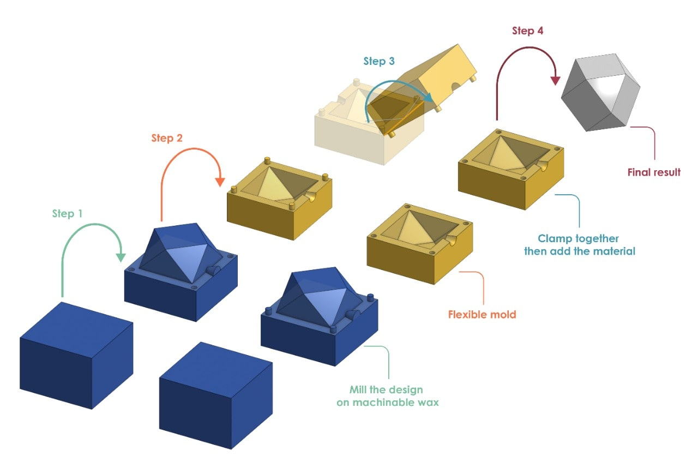

## MT09 Moldes 

Las clases teóricas fueron dictadas por Julia Leirado, docente de Fab Lab Barcelona.

## Conceptos 

Entendemos como molde el recipiente o estructura que da forma al producto principal mediante la maleabilidad de un material fluido. Estas estructuras se diseñan previamente, lo que conocemos como [diseño de moldes](https://formlabs.com/latam/blog/como-hacer-un-molde/)

Los moldes tienen como finalidad crear copias fieles de algún producto. Para su fabricación se pueden emplear diferentes materiales tales como metales, cerámicas, maderas, espumas, plásticos, etc.  Una vez que el molde ha sido terminado, se procede a vaciar la materia prima, para que esta se solidifique y adquiera la forma del molde.   

Aplicaciones comunes: para prototipos, odontológicos, para joyería, para autopartes, para cocina, etc.

Estructuralmente, podemos clasificar los moldes en dos tipos que son los moldes cóncavos o moldes negativos y los convexos o moldes positivos. Elegir uno u otro depende de lo que el fabricante desee lograr con el producto final. 

Cabe destacar que existen diferentes tipos de moldeo, que son técnicas de fabricación de productos en serie que implican el uso de moldes. Estos pueden variar dependiendo de la naturaleza del molde y del método de vertido de la materia prima. Dentro de estas técnicas podemos encontrar el termoformado, el moldeo por inyección, fundición, moldeo por compresión, moldeo por soplado, etc.  

**Tipos de moldes**

- moldes de una pieza
- moldes de dos piezas 
- moldes de varias piezas
- moldes multicavidad 

Según su índice de reutilizabilidad:

- Moldes de un solo uso o sacrificables
- Moldes reutilizables o permanentes

## Proceso de Diseño

## Actividad MT09

**Objetivos:**

**Recursos utilizados:**

## Reflexiones

*En este módulo vimos muchos criterios y ejemplos de diseño y materiales para fabricar moldes, para distintas aplicaciones. Es un tema que me resulta muy interesante y pude aplicar parte de lo visto en clase a una prueba de prototipo para mi proyecto.*
