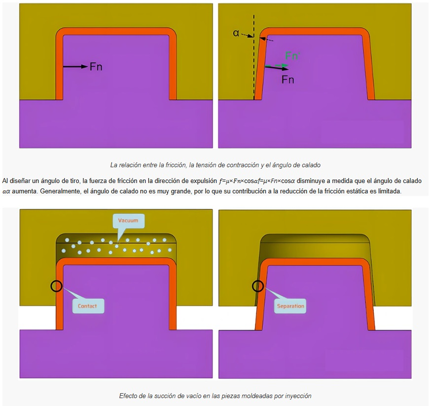
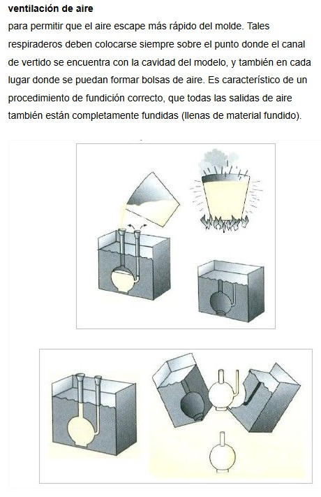
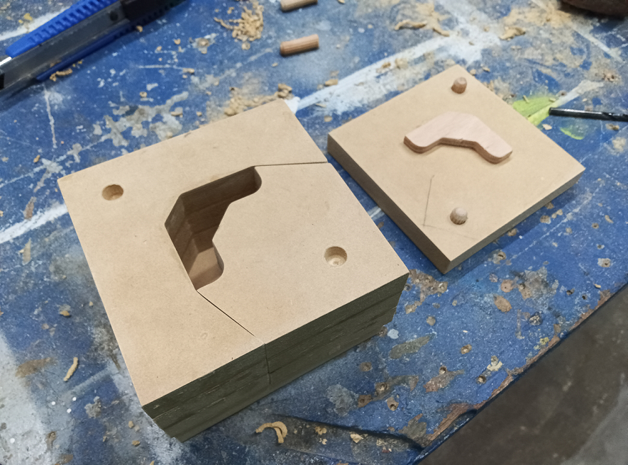

## MT09 Moldes 

Las clases teóricas fueron dictadas por Julia Leirado, docente de Fab Lab Barcelona.

## Conceptos 

Entendemos como molde el recipiente o estructura que da forma al producto principal mediante la maleabilidad de un material fluido. Estas estructuras se diseñan previamente, lo que conocemos como [diseño de moldes](https://formlabs.com/latam/blog/como-hacer-un-molde/).

Los moldes tienen como finalidad crear copias fieles de una pieza. Para su fabricación se pueden emplear diferentes materiales como metales, cerámicas, maderas, espumas, plásticos, etc.  Una vez que el molde ha sido terminado, se procede a vaciar la materia prima, para que esta se solidifique y adquiera la forma del molde.   

Aplicaciones comunes: para prototipos, odontológicos, para joyería, para autopartes, para cocina, etc.

Estructuralmente, podemos clasificar los moldes en dos tipos: los moldes cóncavos o moldes negativos y los convexos o moldes positivos. Elegir uno u otro depende de lo que se desee lograr como pieza final. 

Existen diferentes tipos de procesos de moldeo, que son técnicas de fabricación de piezas en serie que implican el uso de moldes. 

Estos pueden variar dependiendo de la naturaleza del molde y del método de vertido de la materia prima. Dentro de estas técnicas podemos encontrar el termoformado, el moldeo por inyección, fundición, moldeo por compresión, moldeo por soplado, etc.  

**Tipos de moldes**

- moldes de una pieza
- moldes de dos piezas 
- moldes de varias piezas
- moldes multicavidad 

Según su índice de reutilizabilidad:

- Moldes de un solo uso o sacrificables
- Moldes reutilizables o permanentes

## Proceso de Diseño

**Ángulo de desmolde:**

Un ligero ángulo de inclinación en un modelo permite que se separe del molde. Si los lados del modelo se moldearan hacia arriba y hacia abajo en un material de modelo rígido, la fricción no permitiría que el modelo se desmoldara.

Al garantizar que el molde y las piezas moldeadas no sean perfectamente paralelos, el ángulo de desmoldeo proporciona una ligera conicidad que facilita la extracción de las piezas. Este concepto se extiende a la mayoría de los procesos de fabricación en los que intervienen moldes.

Ventajas:

- Reduce la posibilidad de dañar las superficies de la pieza durante la expulsión.
- Garantiza la uniformidad e integridad de las texturas y acabados de las superficies.
- Minimizar la deformación de la pieza debida a la resistencia a la expulsión.
- Reducira el desgaste de las piezas moldeadas y disminuir la probabilidad de daños en el molde.
- Acortar el tiempo total de enfriamiento eliminando o reduciendo la necesidad de complejas configuraciones de eyección.
- Disminuir directa e indirectamente los costes globales de producción.

**Agujeros de vertido y ventilación:**

Estos orificios permiten que el material fluya uniformemente a través del molde en moldes cerrados con dos o más partes.

**Alineadores de Molde:**

Los alineadores/centradores son fomas geométricas que se colocan en las caras de cierre de un molde. Estos permiten alinear perfectamente las caras del molde, evitando desalineamentos al momento de verter el material dentro del molde. 

### Materiales de Moldeo

[Cera mecanizable](https://youtu.be/iO9pw_tLYBs)

[Espuma rígida de Poliuretano](https://youtu.be/O6TzFFbnFU4?si=ITGi8DNI9QHSydVr)

[Caucho Siliconado ](https://youtu.be/tQ8GrtDTggE)

Resina Epoxi

[Resina de Poliuretano](https://youtu.be/OuE3b1ra7VQ)

Resina de Poliéster 

### Medidas de Seguridad 

Los materiales mencionados en esta unidad requieren precaución y medidas de seguridad para su manipulación, para evitar reacciones alérgicas o daños a la salud.

- uso de guantes de nitrilo
- uso de mascarilla con filtro
- uso de gafas de protección
- ropa de trabajo que cubra todo el cuerpo y delantal de pvc o plástico
- buena ventilación en la zona de trabajo

## Actividad MT09

**Descripción de la actividad:**

1. Diseñar un modelo de maceta con las siguientes dimensiones máximas: Alto 10 cms x Diámetro 15 cms
2. Una vez diseñado el modelo de maceta, modelarlo en  FUSION 360 
3. Diseñar un molde para fabircar dicha maceta. 
El molde debe tener mínimo 1 cara, máximo 4 caras.
4. El molde debe contar con guias de encastre (en caso de tener 2 o más caras)
5. Una vez diseñado el molde, modelarlo en FUSION 360
6. Recordar incluir ángulo de desmolde.
8. Enviar el archivo generado (.f3d)  tanto del modelo de la maceta así como también el del molde (todo en el mismo archivo .f3d) a la casilla del docente.
9. Documentar cada paso del proceso con capturas de pantalla, y descripciones de cada paso del mismo. Subir todo el contenido a la página de documentación correspondiente al MT09. El archivo .F3D debe poder descargarse desde tu sitio web.

**Proceso:**

Diseñé una maceta de forma cilíndrica, con una relieve en la superficie. 
El perfil lo dibujé en Autocad y lo importé a Fusion como boceto.

El molde se compone de 3 partes: 

- Base + interior 
- Lateral 1 
- Lateral 2

La base tiene un pequeño escalón para el encastre las las piezas laterales.
Las piezas laterales cuentan con pestañas para poder cerrarlas con pinzas o clips apretapapel por fuera.

La idea es que la colada se haga de forma invertida, quedando la base de la maceta hacia arriba.
También agregué un pequeño cono para prever que la maceta tenga desagüe.

Tuve algunas dificultades para realizar el modelado 3D, algunas derivadas de la falta de práctica con la herramienta y otras del diseño de la maceta en sí.
No pude agregar ángulo de desmolde en la pieza interior, podría ser un problema al momento del desmolde. Tampoco estaba segura del espesor que deberían tener las paredes del molde.

**Video del proceso de modelado:**

**[Archivo de Fusion para descargar](https://drive.google.com/file/d/1JHKB95D8Go2z1lb4FocXRBIPgZ_tioCU/view?usp=drive_link)**

**Recursos utilizados:**

- FUSION 360

Tutoriales

<iframe width="560" height="315" src="https://www.youtube.com/embed/gVrJOnB1VHU?si=jTKKi9xGQ2PKj-Jz" title="YouTube video player" frameborder="0" allow="accelerometer; autoplay; clipboard-write; encrypted-media; gyroscope; picture-in-picture; web-share" referrerpolicy="strict-origin-when-cross-origin" allowfullscreen></iframe>

<iframe width="560" height="315" src="https://www.youtube.com/embed/owAhwdCc_YE?si=jqUnCXryzfz92kkS" title="YouTube video player" frameborder="0" allow="accelerometer; autoplay; clipboard-write; encrypted-media; gyroscope; picture-in-picture; web-share" referrerpolicy="strict-origin-when-cross-origin" allowfullscreen></iframe>

## Reflexiones

*En este módulo vimos muchos criterios y ejemplos de diseño y materiales para fabricar moldes, para distintas aplicaciones. Es un tema que me resulta muy interesante y pude aplicar parte de lo visto en clase a una prueba de prototipo para mi proyecto.*

*imagen de molde en mdf para prototipo de proyecto integrador*